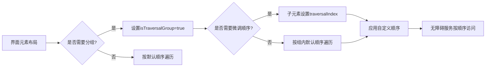

# 修改遍历顺序 - Jetpack Compose 无障碍开发指南  

[原文地址](https://developer.android.google.cn/develop/ui/compose/accessibility/traversal?hl=zh-cn)  

## 一、核心概念：遍历顺序与控制目标  

**遍历顺序** 是无障碍服务（如TalkBack）浏览界面元素的顺序，默认遵循“从左到右、从上到下”的视觉顺序。但在复杂布局（如分组卡片、环形表盘）中，需通过语义属性 **`isTraversalGroup`** 和 **`traversalIndex`** 手动调整，确保逻辑顺序与用户预期一致。  

## 二、关键属性：`isTraversalGroup` 分组控制  

### 1. 属性作用  

- **`isTraversalGroup: Boolean`**  
  - 标记父节点为“遍历组”，强制无障碍服务先访问组内所有子节点，再移动到组外元素。  
  - 适用于非聚焦容器（如`Row`、`Column`、`Box`），作为子元素的遍历边界。  

### 2. 典型场景：分组卡片的顺序问题  

**问题描述**：  

```kotlin
// 未设置分组时的错误顺序（TalkBack读取顺序混乱）
Row {
    CardBox("片段1", "片段2") // 左卡片
    CardBox("片段3", "片段4") // 右卡片
}
// 默认读取顺序：片段1 → 片段3 → 片段2 → 片段4（跨组交叉读取）
```

**解决方案**：  

```kotlin
// 设置isTraversalGroup=true，强制组内优先
CardBox(
    "片段1", "片段2",
    Modifier.semantics { isTraversalGroup = true } // 左卡片分组
)
CardBox(
    "片段3", "片段4",
    Modifier.semantics { isTraversalGroup = true } // 右卡片分组
)
// 正确读取顺序：片段1 → 片段2 → 片段3 → 片段4（组内优先）
```

### 3. 注意事项  

- **滚动容器默认分组**：`LazyColumn`、`Material Surface` 等组件默认 `isTraversalGroup=true`，如需恢复默认顺序可显式设置 `false`。  
- **分组边界**：分组仅影响组内子节点与组外元素的顺序，组内子节点仍按默认顺序（或`traversalIndex`）排列。  

## 三、深度定制：`traversalIndex` 顺序微调  

### 1. 属性作用  

- **`traversalIndex: Float`**  
  - 为子元素设置遍历优先级，数值越小越先访问（支持负数）。  
  - 需作用于**可聚焦组件**（如`Text`、`Button`），对纯容器（如未设置语义的`Column`）无效。  

### 2. 典型场景：环形表盘的顺序矫正  

**问题描述**：  
环形表盘按视觉顺时针排列，但默认遍历顺序为“从左到右、从上到下”，导致TalkBack乱序读取数字（如12 → 1 → 2 → ... → 11）。  

**解决方案**：  

```kotlin
CircularLayout(
    Modifier.semantics { isTraversalGroup = true } // 父容器分组
) {
    repeat(12) { hour -> // hour从0到11（对应12到11）
        Box(
            Modifier.semantics {
                traversalIndex = hour.toFloat() // 索引按0→11递增（对应12→11的逻辑顺序）
            }
        ) {
            Text((if (hour == 0) 12 else hour).toString())
        }
    }
}
// 读取顺序：12 → 1 → 2 → ... → 11（按索引递增顺序）
```

### 3. 规则与限制  

- **相对优先级**：索引仅在**同一分组内**有效，组间仍按默认顺序（或组的排列顺序）。  
- **默认值影响**：未设置索引的元素默认值为`0f`，若组内同时存在`0f`和自定义索引元素，自定义索引优先（如`-1f` → `0f` → `1f`）。  
- **非分组场景**：若父容器未分组（`isTraversalGroup=false`），自定义索引元素会被视为“全局低优先级”，排在所有默认`0f`元素之后。  

## 四、API 最佳实践  

| 场景                  | 操作步骤                                                                 | 代码示例                                                                 |  
|-----------------------|--------------------------------------------------------------------------|--------------------------------------------------------------------------|  
| **基础分组**          | 在父容器设置`isTraversalGroup=true`                                      | `Modifier.semantics { isTraversalGroup = true }`                         |  
| **自定义顺序**        | 在子元素设置`traversalIndex`（需与分组结合）                             | `Modifier.semantics { traversalIndex = 1.5f }`                           |  
| **停用默认分组**      | 在滚动容器等默认分组组件上设置`isTraversalGroup=false`                   | `LazyColumn(Modifier.semantics { isTraversalGroup = false })`            |  
| **跨组优先级控制**    | 通过父容器分组+子元素索引实现跨组顺序（谨慎使用，避免逻辑混乱）         | 组A（索引10）→ 组B（索引5）→ 组C（默认0） → 组B先于组A和C访问         |  

**注意事项**：  

1. **Z轴影响**：确保元素在同一`zIndex`层级，避免层级遮挡导致语义顺序异常。  
2. **语义合并**：避免不必要的合并（如`Modifier.semantics(mergeDescendants=true)`），以免子元素索引被父节点覆盖。  

## 五、流程图：遍历顺序调整逻辑  



## 六、总结  

通过`isTraversalGroup`和`traversalIndex`，可精准控制无障碍服务的遍历逻辑，解决复杂布局（如分组卡片、环形组件）的顺序问题。核心原则是：  

1. **先分组**：用`isTraversalGroup`定义逻辑边界，确保组内元素优先访问。  
2. **再排序**：通过`traversalIndex`微调组内顺序，数值越小优先级越高。  
3. **避免滥用**：仅在默认顺序无法满足需求时使用，保持与视觉顺序一致以降低认知成本。  

结合布局检查器（Layout Inspector）和TalkBack测试，可验证遍历顺序的正确性，确保所有用户能按预期导航界面。
