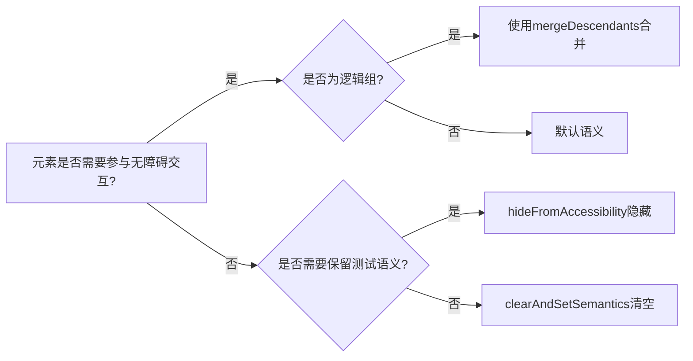

# 合并和清除 - Jetpack Compose 无障碍开发指南  

[原文地址](https://developer.android.google.cn/develop/ui/compose/accessibility/merging-clearing?hl=zh-cn)  

## 一、核心概念：语义操作的三大场景  

在无障碍服务中，界面元素的分组粒度至关重要：  

- **合并语义**：将多个子元素视为单一逻辑实体（如用户信息卡片）。  
- **清除语义**：移除原有语义并自定义（如自定义交互组件）。  
- **隐藏语义**：对无障碍服务隐藏装饰性元素（如水印、分隔符）。  

## 二、合并语义：逻辑分组与交互边界  

### 1. 自动合并与手动配置  

- **自动合并场景**：  
  - 当父组件应用 `clickable`、`toggleable` 等交互修饰符时，子元素默认合并（如 `Button` 内部的 `Icon` 和 `Text`）。  
- **手动合并**：  
  - 通过 `Modifier.semantics(mergeDescendants = true)` 强制合并子元素语义。  

### 2. 典型示例：用户信息卡片合并  

```kotlin
@Composable
fun PostMetadata(metadata: Metadata) {
    Row(
        modifier = Modifier.semantics(mergeDescendants = true) {} // 合并子元素
    ) {
        Image(/* 装饰性头像，无contentDescription */)
        Column {
            Text(metadata.author.name) // 合并文本语义
            Text("${metadata.date} • ${metadata.readTimeMinutes} min read")
        }
    }
}
```  

- **效果**：无障碍服务将整个 `Row` 视为单个焦点，合并显示所有文本（如“Romeo Montague April 02 -1 min read”）。  

### 3. 合并策略的局限性  

- **子组件交互冲突**：若子组件自身包含交互修饰符（如 `BookmarkButton` 的 `clickable`），则无法被父组件合并：  

  ```kotlin
  Row(Modifier.clickable {}) {
      Icon(/* 合并 */)
      ArticleDetails() /* 合并 */
      BookmarkButton(Modifier.clickable {}) // 自身可点击，不合并
  }
  ```  

  - **结果**：父 `Row` 合并前两个元素，`BookmarkButton` 作为独立节点存在。  

- **属性合并规则**：不同语义属性有不同合并策略（如 `ContentDescription` 合并为列表，`Role` 以父级为准），可通过 `SemanticsProperties.kt` 查看具体实现。  

## 三、清除语义：覆盖默认行为  

### 1. `clearAndSetSemantics` 的作用  

- **完全清除原有语义**：包括自身及所有子元素的语义。  
- **自定义新语义**：在 lambda 中设置符合组件逻辑的属性（如角色、状态、交互）。  

### 2. 典型示例：自定义切换开关  

```kotlin
@Composable
fun FavoriteToggle() {
    var checked by remember { mutableStateOf(true) }
    Row(
        modifier = Modifier
            .toggleable(checked, { checked = it })
            .clearAndSetSemantics { // 清除默认语义并设置新语义
                stateDescription = if (checked) "已收藏" else "未收藏"
                toggleableState = ToggleableState(checked)
                role = Role.Switch // 声明为开关角色
            }
    ) {
        Icon(Icons.Default.Favorite, contentDescription = null) // 装饰图标，语义被清除
        Text("收藏？") // 文本语义被清除
    }
}
```  

- **效果**：无障碍服务识别为可切换开关（TalkBack 读出“点按两次即可切换”），而非独立文本和图标。  

### 3. 使用注意事项  

- **修饰符顺序**：`clearAndSetSemantics` 需在交互修饰符之后应用，确保覆盖其语义。  
- **谨慎清除**：仅在必要时使用（如自定义组件），避免影响自动填充、测试等其他服务。  

## 四、隐藏语义：排除装饰性元素  

### 1. `hideFromAccessibility` 的适用场景  

- **装饰性内容**：如水印、分隔符（如“•”）、纯视觉元素（无交互逻辑）。  
- **保留测试语义**：隐藏仅针对无障碍服务，测试框架仍可访问（与 `clearAndSetSemantics` 空 lambda 不同）。  

### 2. 代码示例：隐藏水印和分隔符  

```kotlin
@Composable
fun WatermarkExample(watermarkText: String, content: @Composable () -> Unit) {
    Box {
        content()
        // 隐藏水印文本
        Text(
            watermarkText,
            modifier = Modifier.align(Alignment.BottomEnd).semantics {
                hideFromAccessibility() // 对无障碍服务不可见
            }
        )
    }
}

@Composable
fun DecorativeExample() {
    Text("•", modifier = Modifier.semantics { hideFromAccessibility() }) // 隐藏装饰性符号
}
```  

## 五、API 对比与场景选择  

| 需求场景                          | 推荐 API                     | 核心作用                                                                 |  
|-----------------------------------|------------------------------|--------------------------------------------------------------------------|  
| 合并子元素为单一逻辑实体         | `mergeDescendants = true`    | 让无障碍服务将组件视为整体（如卡片、列表项）                           |  
| 清除原有语义并自定义             | `clearAndSetSemantics`       | 覆盖组件及其子元素的所有语义（如自定义开关、复杂交互组件）             |  
| 隐藏装饰性元素（保留测试语义）   | `hideFromAccessibility`      | 对无障碍服务不可见，但测试框架仍可访问（如水印、分隔符）               |  
| 完全移除所有语义（包括测试）     | `clearAndSetSemantics{}`     | 清空所有语义（谨慎使用，可能影响其他服务）                             |  

**决策流程图**：  



## 六、最佳实践建议  

1. **优先使用默认合并**：Material 组件（如 `Button`、`ListItem`）已内置合理合并策略，避免手动调整。  
2. **清除语义的最小化原则**：仅在自定义组件时覆盖必要属性，保留无关语义（如文本内容）。  
3. **隐藏 vs 清除的选择**：  
   - 装饰性元素用 `hideFromAccessibility`（如背景图案）。  
   - 交互组件重定义用 `clearAndSetSemantics`（如自定义滑动删除按钮）。  
4. **测试验证**：通过 TalkBack 或布局检查器（Layout Inspector）确认语义分组是否符合预期。  

通过合理运用合并、清除和隐藏语义，可优化无障碍服务的交互体验，确保界面元素以正确粒度呈现，同时避免冗余信息干扰用户。
