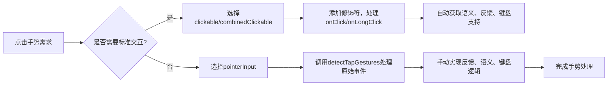

# 点按并按下 - Jetpack Compose 点击手势开发指南  

[原文地址](https://developer.android.google.cn/develop/ui/compose/touch-input/pointer-input/tap-and-press?hl=zh-cn)  

## 一、核心手势类型与场景  

| **手势类型**   | **触发条件**                     | **典型场景**                     | **关键API**               |  
|----------------|----------------------------------|----------------------------------|---------------------------|  
| 点按（点击）   | 指针按下后快速释放（Down→Up）    | 按钮提交、列表项选中             | `clickable`               |  
| 双击           | 两次连续点按（Down→Up→Down→Up）  | 图片缩放、文本选择               | `combinedClickable`       |  
| 长按           | 指针按下后停留一段时间           | 显示上下文菜单、拖拽开始         | `combinedClickable`       |  
| 按下（Press）  | 指针按下（仅Down事件）           | 按下状态视觉反馈（如按钮按压）   | `pointerInput`+原始事件   |  

## 二、高层抽象：`clickable` 与 `combinedClickable`  

### 1. `clickable` 修饰符：基础点击处理  

- **功能**：  
  - 处理单点触控点击事件，支持手指、鼠标、键盘（Enter键）和无障碍服务交互。  
  - 自动添加视觉反馈（涟漪效果）、焦点支持、悬停状态和语义信息（如`Role.Button`）。  
- **示例：图片网格点击放大**  

  ```kotlin
  ImageItem(
      photo,
      Modifier.clickable { activePhotoId = photo.id } // 点击切换选中图片
  )
  ```  

- **扩展功能**：  
  - `interactionSource`：自定义交互状态（如涟漪颜色）。  
  - `indication`：自定义视觉反馈（如无涟漪效果）。  

### 2. `combinedClickable` 修饰符：多手势支持  

- **功能**：  
  - 支持点击（`onClick`）、长按（`onLongClick`）、双击（`onDoubleClick`）事件。  
  - 内置语义标签（如`onLongClickLabel`），提升无障碍体验。  
- **示例：长按显示上下文菜单**  

  ```kotlin
  Modifier.combinedClickable(
      onClick = { openPhoto(photo.id) },
      onLongClick = { showContextMenu(photo.id) },
      onLongClickLabel = "打开上下文菜单" // TalkBack提示文本
  )
  ```  

- **最佳实践**：  
  - 长按操作建议添加触觉反馈（`LocalHapticFeedback.current.performHapticFeedback`）。  

## 三、底层抽象：`pointerInput` 自定义手势  

### 1. 场景：极简交互需求（无视觉反馈/焦点）  

- **需求**：点击半透明遮罩关闭弹窗，无需涟漪、焦点或键盘支持。  
- **实现**：直接使用`detectTapGestures`处理原始点击事件，手动设置语义和键盘监听。  

  ```kotlin
  Box(
      Modifier.pointerInput(onClose) { detectTapGestures { onClose() } } // 仅处理点击事件
      .semantics { // 手动设置无障碍语义
          contentDescription = "关闭"
          onClick { onClose(); true }
      }
      .onKeyEvent { if (it.key == Key.Escape) { onClose(); true } } // 手动处理键盘事件
  )
  ```  

### 2. 场景：基于点击位置的复杂逻辑（如双击缩放）  

- **需求**：双击图片时，以点击位置为中心缩放。  
- **实现**：通过`detectTapGestures`获取点击坐标（`tapOffset`），计算缩放偏移量。  

  ```kotlin
  Image(
      modifier = Modifier.pointerInput(Unit) {
          detectTapGestures(
              onDoubleTap = { tapOffset ->
                  // 根据点击位置计算缩放偏移量
                  zoomOffset = calculateOffset(tapOffset, size)
                  zoomed = !zoomed
              }
          )
      }
      .graphicsLayer { /* 应用缩放和位移 */ }
  )
  ```  

## 四、关键对比：高层 vs 底层抽象  

| **维度**         | `clickable`/`combinedClickable`       | `pointerInput`+`detectTapGestures`    |  
|------------------|----------------------------------------|----------------------------------------|  
| **交互反馈**     | 自动包含涟漪、悬停、焦点               | 需手动实现（如无反馈或自定义效果）     |  
| **无障碍支持**   | 自动设置语义（`Role.Button`等）        | 需手动设置`semantics`属性              |  
| **键盘支持**     | 自动支持（Enter键、方向键）            | 需手动处理`onKeyEvent`                 |  
| **适用场景**     | 标准按钮、列表项交互                   | 极简遮罩、复杂坐标计算、多手势组合     |  

## 五、流程图：手势处理决策流程  



## 六、最佳实践建议  

1. **优先使用高层抽象**：  
   - 标准按钮、列表项等场景首选`clickable`或`combinedClickable`，减少重复代码。  
2. **底层抽象的极简原则**：  
   - 仅在需要忽略默认反馈（如遮罩点击）或依赖坐标计算时使用`pointerInput`。  
3. **无障碍补充**：  
   - 使用底层API时，务必手动设置`semantics`（如`contentDescription`、`onClick`），确保TalkBack等服务正确识别。  
4. **触觉反馈**：  
   - 长按等操作建议通过`LocalHapticFeedback`添加触感，提升用户体验。  

通过合理选择手势处理的抽象级别，可在保证开发效率的同时，实现灵活的交互逻辑与无障碍支持。
