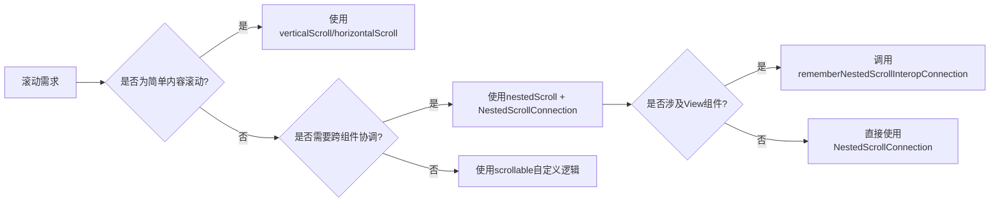

# 滚动 - Jetpack Compose 滚动处理指南  

[原文地址](https://developer.android.google.cn/develop/ui/compose/touch-input/pointer-input/scroll?hl=zh-cn)  

## 一、基础滚动修饰符  

### 1. `verticalScroll` 与 `horizontalScroll`  

- **功能**：当内容超出容器尺寸时启用滚动，自动处理内容偏移。  
- **核心参数**：  
  - `scrollState`：`ScrollState` 实例，控制滚动位置（如 `rememberScrollState()`）。  
  - `reverseDirection`：是否反向滚动（默认 `false`）。  
- **示例**：  

  ```kotlin
  Column(
      modifier = Modifier
          .size(100.dp)
          .verticalScroll(rememberScrollState()) // 垂直滚动
  ) {
      repeat(10) { Text("Item $it") }
  }
  ```  

- **高级用法**：平滑滚动  

  ```kotlin
  val state = rememberScrollState()
  LaunchedEffect(Unit) {
      state.animateScrollTo(100) // 初始化滚动到100px位置
  }
  ```

### 2. `scrollable` 修饰符  

- **功能**：自定义滚动逻辑，手动处理滚动增量（不自动偏移内容）。  
- **核心参数**：  
  - `orientation`：滚动方向（`Orientation.Vertical`/`Horizontal`）。  
  - `state`：`ScrollableState` 实例，通过 `consumeScrollDelta` 函数返回消耗的滚动距离。  
- **示例**：显示滚动偏移量（无实际滚动效果）  

  ```kotlin
  var offset by remember { mutableStateOf(0f) }
  Box(
      Modifier.scrollable(
          orientation = Orientation.Vertical,
          state = rememberScrollableState { delta ->
              offset += delta // 更新偏移量
              delta // 返回消耗的增量
          }
      )
  ) {
      Text(offset.toString()) // 显示滚动距离
  }
  ```

## 二、嵌套滚动（Nested Scroll）  

### 1. 自动嵌套滚动  

- **机制**：当子组件无法继续滚动时，事件自动传递给父组件（如多层 `verticalScroll` 嵌套）。  
- **支持组件**：`verticalScroll`、`horizontalScroll`、`LazyColumn`、`TextField` 等原生支持。  
- **示例**：多层滚动容器  

  ```kotlin
  Box(Modifier.verticalScroll(rememberScrollState())) {
      Column {
          repeat(6) {
              Box(Modifier.verticalScroll(rememberScrollState())) {
                  Text("Scroll here") // 子组件先滚动，到底后父组件滚动
              }
          }
      }
  }
  ```

### 2. 手动嵌套滚动：`nestedScroll` 修饰符  

- **功能**：通过 `NestedScrollConnection` 拦截滚动事件，实现跨组件协调（如滚动时动态调整布局）。  
- **核心接口**：  

  ```kotlin
  interface NestedScrollConnection {
      fun onPreScroll(available: Offset, source: NestedScrollSource): Offset // 滚动前处理
      fun onPostScroll(consumed: Offset, available: Offset, source: NestedScrollSource): Offset // 滚动后处理
  }
  ```  

- **三阶段事件流**：  
  1. **滚动前（Pre Scroll）**：事件从子→父向上分派，父组件可提前消耗增量。  
  2. **节点消耗（Node Consumption）**：子组件处理剩余增量，实际滚动发生。  
  3. **滚动后（Post Scroll）**：事件从父→子向下分派，父组件可处理未消耗的增量。  

- **示例：滚动时缩放图片**  

  ```kotlin
  var currentImageSize by remember { mutableStateOf(maxImageSize) }
  val nestedScrollConnection = remember {
      object : NestedScrollConnection {
          override fun onPreScroll(available: Offset, source: NestedScrollSource): Offset {
              currentImageSize = (currentImageSize + available.y).coerceIn(minImageSize, maxImageSize)
              return Offset(0f, currentImageSize - currentImageSize + available.y) // 返回消耗的y增量
          }
      }
  }
  
  Box(Modifier.nestedScroll(nestedScrollConnection)) {
      Image(
          Modifier.graphicsLayer {
              scaleX = currentImageSize / maxImageSize // 缩放比例
              translationY = -(maxImageSize - currentImageSize) / 2 // 垂直居中
          }
      )
  }
  ```

## 三、滚动互操作性（Compose 与 View 混合场景）  

### 1. 协作式父 View（如 CoordinatorLayout）  

- **场景**：父 View 实现 `NestedScrollingParent3`（如 `CoordinatorLayout`），子组件为 `ComposeView`。  
- **解决方案**：使用 `rememberNestedScrollInteropConnection` 桥接  

  ```kotlin
  // XML 布局中包含 CoordinatorLayout 和 ComposeView
  ComposeView.setContent {
      val interopConnection = rememberNestedScrollInteropConnection()
      LazyColumn(Modifier.nestedScroll(interopConnection)) { /* 内容 */ }
  }
  ```

### 2. 父 Compose 组件 + 子 AndroidView  

- **场景**：父组件为 Compose `Box`，子组件为 `RecyclerView`（AndroidView）。  
- **解决方案**：在 `AndroidView` 中启用嵌套滚动  

  ```kotlin
  AndroidView({ context ->
      val view = LayoutInflater.from(context).inflate(R.layout.list_item, null)
      ViewCompat.setNestedScrollingEnabled(view, true) // 启用嵌套滚动
      view
  })
  ```

### 3. 非协作式父 View（如 RecyclerView）  

- **限制**：未实现 `NestedScrollingParent3`，无法自动传递滚动事件。  
- **替代方案**：手动同步滚动状态（如通过 `ScrollState` 监听滚动位置并更新 View）。  

## 四、关键对比与适用场景  

| **修饰符/技术**       | **自动处理内容偏移** | **适用场景**                               | **典型案例**                     |  
|----------------------|----------------------|--------------------------------------------|----------------------------------|  
| `verticalScroll`     | 是                   | 简单列表/内容滚动                           | 聊天消息列表                     |  
| `scrollable`         | 否                   | 自定义滚动逻辑（如拖拽排序）                 | 可排序的网格项                   |  
| `nestedScroll`       | 否                   | 跨组件协调（如头部缩放、联动动画）           | 滚动时缩放标题栏                 |  
| 嵌套滚动互操作性     | 否                   | Compose 与 View 混合布局                    | CoordinatorLayout 嵌套 ComposeView |  

## 五、流程图：滚动处理决策路径  



## 六、最佳实践建议  

1. **优先高层抽象**：简单场景首选 `verticalScroll`，避免过早使用底层 API。  
2. **嵌套滚动的性能优化**：避免在 `onPreScroll`/`onPostScroll` 中执行复杂计算，使用 `remember` 缓存状态。  
3. **互操作性测试**：混合布局时需测试滚动边界情况（如子 View 滚到底后父 Compose 组件是否接管）。  
4. **无障碍支持**：滚动容器需配合语义属性（如 `collectionInfo`），确保 TalkBack 正确播报滚动内容。  

通过合理选择滚动修饰符和嵌套滚动策略，可在 Compose 中实现流畅的滚动体验，同时兼容传统 View 系统，满足复杂布局的交互需求。
