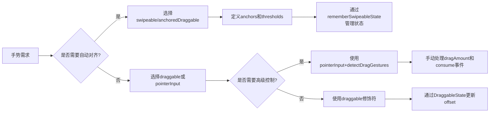

# 拖动、滑动和快速滑动 - Jetpack Compose 手势开发指南  

[原文地址](https://developer.android.google.cn/develop/ui/compose/touch-input/pointer-input/drag-swipe-fling?hl=zh-cn)  

## 一、拖动（Drag）：持续移动手势  

### 1. 高层抽象：`draggable` 修饰符  

- **功能**：处理单方向拖动手势，实时报告拖动距离（像素值）。  
- **核心参数**：  
  - `orientation`：拖动方向（`Horizontal`/`Vertical`）。  
  - `state`：`DraggableState` 实例，通过 lambda 接收拖动增量（`delta`）。  
- **实现要点**：需结合 `offset` 修饰符更新元素位置。  

  ```kotlin
  @Composable
  fun DraggableText() {
      var offsetX by remember { mutableStateOf(0f) }
      Text(
          modifier = Modifier
              .offset { IntOffset(offsetX.roundToInt(), 0) } // 应用偏移
              .draggable(
                  orientation = Orientation.Horizontal,
                  state = rememberDraggableState { delta ->
                      offsetX += delta // 累计拖动增量
                  }
              ),
          text = "Drag me!"
      )
  }
  ```

### 2. 底层实现：`pointerInput` + `detectDragGestures`  

- **适用场景**：需要多方向拖动或自定义逻辑（如惯性滑动）。  
- **核心方法**：  
  - `detectDragGestures`：监听拖动事件，返回拖动距离（`dragAmount`）。  
  - `consume()`：标记事件已处理，避免父组件响应。  

  ```kotlin
  @Composable
  fun DraggableTextLowLevel() {
      var offsetX by remember { mutableStateOf(0f) }
      var offsetY by remember { mutableStateOf(0f) }
      Box(
          modifier = Modifier
              .offset { IntOffset(offsetX.roundToInt(), offsetY.roundToInt()) }
              .background(Color.Blue)
              .size(50.dp)
              .pointerInput(Unit) {
                  detectDragGestures { change, dragAmount ->
                      change.consume() // 消耗事件
                      offsetX += dragAmount.x // 更新水平偏移
                      offsetY += dragAmount.y // 更新垂直偏移
                  }
              }
      )
  }
  ```

## 二、滑动（Swipe）：锚点对齐手势  

### 1. 基础用法：`swipeable` 修饰符（旧版 API）  

- **功能**：滑动后自动对齐到预设锚点（如“滑动删除”中的打开/关闭状态）。  
- **核心组件**：  
  - `rememberSwipeableState(initialValue)`：创建滑动状态，记录当前锚点索引。  
  - `anchors`：锚点映射（像素位置 → 状态值）。  
  - `thresholds`：滑动阈值（如达到30%距离则触发锚点切换）。  
- **示例：水平滑动切换状态**  

  ```kotlin
  @Composable
  fun SwipeableSample() {
      val squareSize = 48.dp
      val swipeableState = rememberSwipeableState(0) // 初始状态为0
      val sizePx = with(LocalDensity.current) { squareSize.toPx() }
      val anchors = mapOf(0f to 0, sizePx to 1) // 0px对应状态0，48px对应状态1

      Box(
          modifier = Modifier
              .width(96.dp)
              .swipeable(
                  state = swipeableState,
                  anchors = anchors,
                  thresholds = { _, _ -> FractionalThreshold(0.3f) }, // 滑动30%触发切换
                  orientation = Orientation.Horizontal
              )
              .background(Color.LightGray)
      ) {
          Box(
              modifier = Modifier
                  .offset { IntOffset(swipeableState.offset.value.roundToInt(), 0) } // 当前偏移
                  .size(squareSize)
                  .background(Color.DarkGray)
          )
      }
  }
  ```

### 2. 升级方案：`anchoredDraggable`（Compose 1.6+）  

- **替代原因**：`swipeable` 已被更灵活的 `anchoredDraggable` 取代，支持多锚点和复杂动画。  
- **关键参数**：  
  - `anchors`：定义锚点位置（如 `Anchors.Horizontal(0f to 0, sizePx to 1)`）。  
  - `modifier`：通过 `draggable` 修饰符结合 `snapToAnchors` 实现自动对齐。  

## 三、快速滑动（Fling）：惯性滑动处理  

### 1. 核心方法  

- **`performFling(velocity)`**：根据滑动速度（像素/秒）触发惯性滑动。  
- **`velocityThreshold`**：最小滑动速度阈值，超过则触发快速滑动动画。  
- **结合场景**：在 `swipeable` 或 `anchoredDraggable` 中，当用户滑动速度足够快时，自动滑动到最近锚点。  

### 2. 示例：添加惯性效果  

```kotlin
val swipeableState = rememberSwipeableState(0)
// 在拖动结束时检测速度并触发fling
swipeableState.performFling(velocity = flingVelocity)
```

## 四、关键对比：`draggable` vs `swipeable`  

| **维度**         | `draggable`                              | `swipeable`（`anchoredDraggable`）        |  
|------------------|------------------------------------------|------------------------------------------|  
| **交互模式**     | 持续拖动，无自动对齐                     | 滑动后自动对齐到锚点，带动画             |  
| **核心参数**     | `orientation`、`DraggableState`          | `anchors`、`thresholds`、`velocityThreshold` |  
| **适用场景**     | 自由拖动（如拖拽排序、调整位置）         | 状态切换（如滑动删除、选项卡切换）       |  
| **底层依赖**     | `pointerInput` + `detectDragGestures`     | `pointerInput` + 惯性动画引擎             |  

## 五、流程图：手势选择与实现流程  



## 六、最佳实践建议  

1. **优先使用高层抽象**：  
   - 简单拖动用 `draggable`，状态切换用 `anchoredDraggable`（替代旧版 `swipeable`）。  
2. **状态管理**：  
   - 始终通过 `remember` 系列函数保存拖动/滑动状态（如 `rememberDraggableState`），避免重组丢失数据。  
3. **性能优化**：  
   - 避免在拖动回调中执行复杂计算，优先使用 `offset` 或 `graphicsLayer` 进行轻量级动画。  
4. **无障碍支持**：  
   - 结合语义属性（如 `stateDescription`），确保屏幕阅读器正确播报滑动状态。  

通过合理选择拖动与滑动修饰符，可在 Compose 中实现流畅的手势交互，兼顾开发效率与用户体验。对于复杂场景，底层 `pointerInput` 提供了完全自定义的可能性，但需注意事件消耗和性能优化。
