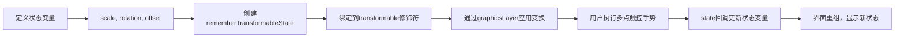

# 多点触控：平移、缩放、旋转 - Jetpack Compose 手势开发指南  

[原文地址](https://developer.android.google.cn/develop/ui/compose/touch-input/pointer-input/multi-touch?hl=zh-cn)  

## 一、核心概念：多点触控手势处理  

**多点触控** 指通过两个或多个指针（如双指）实现的交互，常见场景包括：  

- **平移（Pan）**：双指拖动元素移动。  
- **缩放（Zoom）**：双指张合调整元素大小。  
- **旋转（Rotate）**：双指旋转调整元素角度。  

Compose 提供 **`transformable` 修饰符** 作为高层抽象，用于检测多点触控手势并返回变换增量（缩放、偏移、旋转），配合 `graphicsLayer` 应用视觉变换。  

## 二、关键 API：`transformable` 修饰符  

### 1. 状态管理：`rememberTransformableState`  

- **作用**：保存多点触控的当前状态（缩放、偏移、旋转），并通过回调接收手势增量。  
- **参数**：  
  - `onGesture`：手势变化时的回调，接收三个参数：  
    - `zoomChange`：缩放增量（如双指张合的比例变化）。  
    - `offsetChange`：平移增量（双指拖动的像素偏移）。  
    - `rotationChange`：旋转增量（双指旋转的角度变化，单位：度）。  

**示例：初始化状态**  

```kotlin
var scale by remember { mutableStateOf(1f) } // 缩放比例
var rotation by remember { mutableStateOf(0f) } // 旋转角度（度）
var offset by remember { mutableStateOf(Offset.Zero) } // 平移偏移
val state = rememberTransformableState { zoom, offsetChange, rotation ->
    scale *= zoom // 累计缩放增量
    rotation += rotation // 累计旋转增量
    offset += offsetChange // 累计平移偏移
}
```

### 2. 应用修饰符与视觉变换  

- **`transformable` 修饰符**：绑定状态，检测手势。  
- **`graphicsLayer` 修饰符**：应用几何变换（缩放、旋转、平移）到元素。  

**完整示例：多点触控操作图片**  

```kotlin
Box(
    modifier = Modifier
        .fillMaxSize()
        .graphicsLayer(
            scaleX = scale, // 水平缩放
            scaleY = scale, // 垂直缩放
            rotationZ = rotation, // 旋转（Z轴，面向屏幕）
            translationX = offset.x, // 水平平移
            translationY = offset.y // 垂直平移
        )
        .transformable(state = state) // 绑定多点触控状态
        .background(Color.Blue)
) {
    Text("Pinch to zoom, rotate with two fingers", Modifier.align(Alignment.Center))
}
```

### 3. 底层检测器：`detectTransformGestures`  

- **作用**：手动处理原始多点触控事件，适用于需要自定义逻辑的场景（如限制缩放范围）。  
- **使用方式**：通过 `pointerInput` 修饰符调用检测器。  

**示例：限制缩放最小值为0.5倍**  

```kotlin
Box(Modifier.pointerInput(Unit) {
    detectTransformGestures { centroid, pan, zoom, rotation ->
        // 限制缩放不小于0.5
        scale = max(0.5f, scale * zoom)
        offset += pan
        rotation += rotation
    }
})
```

## 三、流程图：多点触控实现流程  



## 四、注意事项与最佳实践  

1. **性能优化**：  
   - `graphicsLayer` 的变换在渲染层执行，性能优于直接修改布局参数，适合动画场景。  
2. **交互逻辑限制**：  
   - 可在 `rememberTransformableState` 回调中添加逻辑限制（如缩放上限、旋转范围）。  
3. **手势冲突处理**：  
   - 若同时使用点击手势，需通过 `change.consume()` 明确消耗事件，避免冲突。  
4. **无障碍支持**：  
   - 复杂多点触控操作建议搭配辅助提示（如Toast），告知用户操作方式。  

## 五、总结  

通过 `transformable` 修饰符与 `graphicsLayer` 的结合，Compose 提供了简洁的多点触控解决方案。高层抽象 `transformable` 适用于大多数场景，而底层 `detectTransformGestures` 则为自定义逻辑提供了灵活性。开发时需注意状态管理的正确性和交互逻辑的边界限制，以实现流畅且稳定的多点触控体验。
