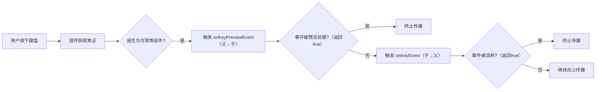

# 处理键盘操作

[原文地址](https://developer.android.google.cn/develop/ui/compose/touch-input/keyboard-input/commands?hl=zh-cn)  

## 一、默认键盘快捷键  

Compose 内置对文本编辑和滚动的键盘快捷键支持，以下是常见快捷键及其适用组件：  

| **快捷键**                          | **操作**                     | **支持组件**                          |  
|-------------------------------------|------------------------------|---------------------------------------|  
| Shift+Ctrl+←/→                      | 选择单词首尾                 | `BasicTextField`, `TextField`         |  
| Shift+Ctrl+↑/↓                      | 选择段落首尾                 | `BasicTextField`, `TextField`         |  
| Shift+Alt+↑/↓ 或 Shift+Meta+←/→     | 选择文本首尾                 | `BasicTextField`, `TextField`         |  
| Shift+←/→                           | 选择字符                     | `BasicTextField`, `TextField`         |  
| Ctrl+A                              | 全选                         | `BasicTextField`, `TextField`         |  
| Ctrl+C / Ctrl+X / Ctrl+V             | 复制/剪切/粘贴               | `BasicTextField`, `TextField`         |  
| Ctrl+Z / Ctrl+Shift+Z                | 撤销/重做                    | `BasicTextField`, `TextField`         |  
| PageDown / PageUp                   | 滚动                         | `LazyColumn`, `verticalScroll`修饰符   |  

**说明**：  

- **Meta 键**：不同系统对应不同按键（macOS：Command 键；Windows：Win 键；ChromeOS：搜索键）。  

## 二、自定义按键处理：`onKeyEvent` 修饰符  

### 1. 基础用法  

通过 `onKeyEvent` 监听按键事件，返回 `true` 表示消耗事件（阻止传播）。  

```kotlin
Box(
    modifier = Modifier.focusable() // 需先设置可聚焦
        .onKeyEvent { event ->
            // 检测按键释放事件（KeyUp）和具体按键（如 Key.S）
            if (event.type == KeyEventType.KeyUp && event.key == Key.S) {
                doSomething() // 执行自定义逻辑
                true // 消耗事件，阻止向上传播
            } else {
                false // 未消耗，允许事件继续传播
            }
        }
) {
    Text("Press S key")
}
```

### 2. 修饰键检测  

通过 `KeyEvent` 的属性判断修饰键（Ctrl/Shift/Alt/Meta）是否按下：  

```kotlin
Box(
    modifier = Modifier.focusable()
        .onKeyEvent { event ->
            if (
                event.type == KeyEventType.KeyUp &&
                event.key == Key.S &&
                !event.isCtrlPressed &&  // 无 Ctrl 键
                !event.isShiftPressed && // 无 Shift 键
                !event.isAltPressed &&   // 无 Alt 键
                !event.isMetaPressed     // 无 Meta 键
            ) {
                doSomething()
                true
            } else {
                false
            }
        }
) {
    Text("Press S key without modifiers")
}
```

## 三、空格键与回车键：触发点击事件  

`clickable` 修饰符自动支持键盘交互：  

- **空格键**或**回车键**按下时，触发 `onClick` 回调（等效于鼠标点击）。  

```kotlin
MoviePlayer(
    modifier = Modifier.clickable { togglePausePlay() }
)
// 用户按 Space 或 Enter 键时，会调用 togglePausePlay()
```

## 四、事件传播机制  

### 1. 未消耗事件的向上传播  

- 子组件未消耗的事件会传播到父组件。  
- **示例**：  

  ```kotlin
  OuterComponent(
      modifier = Modifier.onKeyEvent { event ->
          when {
              event.key == Key.S -> { /* 不会触发，因内部组件已消耗 */ }
              event.key == Key.D -> { actionC(); true } // 处理 D 键事件
              else -> false
          }
      }
  ) {
      InnerComponent(
          modifier = Modifier.onKeyEvent { event ->
              if (event.key == Key.S) { actionA(); true } // 消耗 S 键事件
              else { false } // 未消耗事件（如 D 键）继续传播
          }
      }
  }
  ```

### 2. 事件传播顺序  

1. **子组件**先接收事件，若未消耗则传递给**父组件**。  
2. 消耗事件（返回 `true`）会终止传播链。  

## 五、预览按键事件：`onKeyPreviewEvent`  

### 1. 作用  

在默认按键动作（如 TextField 插入字符）**之前**拦截事件，用于自定义快捷键或修改默认行为。  

```kotlin
TextField(
    value = textFieldValue,
    onValueChange = { textFieldValue = it },
    modifier = Modifier.onPreviewKeyEvent { event ->
        if (event.type == KeyEventType.KeyUp && event.key == Key.Tab) {
            LocalFocusManager.current.moveFocus(FocusDirection.Next) // 移动焦点
            true // 消耗事件，阻止 TextField 插入制表符
        } else {
            false
        }
    }
)
```

### 2. 父子组件优先级  

- 父组件的 `onKeyPreviewEvent` 先于子组件调用。  
- **示例**：  

  ```kotlin
  Column(
      modifier = Modifier.onPreviewKeyEvent { event ->
          if (event.key == Key.S) {
              previewSKey() // 父组件优先处理 S 键
              true
          } else {
              false
          }
      }
  ) {
      Box(
          modifier = Modifier.focusable()
              .onPreviewKeyEvent { event ->
                  actionForPreview(event) // 子组件不会处理 S 键事件
                  false
              }
      )
  }
  ```

## 六、流程图：键盘事件处理流程  



## 七、最佳实践建议  

1. **优先使用默认快捷键**：避免重复实现文本编辑等通用功能。  
2. **明确事件消耗逻辑**：按需返回 `true`/`false`，避免意外阻断事件传播。  
3. **组合修饰键时**：精确判断修饰键状态，避免与系统快捷键冲突。  
4. **复杂场景用预览事件**：如自定义表单导航（Tab 键切换焦点），需在默认行为前处理。  
5. **测试键盘导航**：确保无鼠标场景下，用户可通过键盘完成所有交互（如 `focusable` 与 `onKeyEvent` 配合）。  

通过合理使用 `onKeyEvent` 和 `onKeyPreviewEvent`，可在 Compose 中灵活实现键盘交互，提升应用对键盘用户的友好性。
