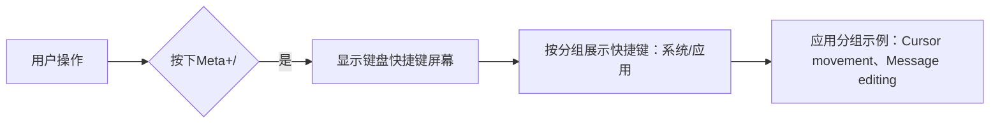

# 键盘快捷键辅助工具

原地址：<https://developer.android.google.cn/develop/ui/compose/touch-input/keyboard-input/keyboard-shortcuts-helper?hl=zh-cn>

## 一、工具概述

键盘快捷键辅助工具可帮助用户了解和打开应用的快捷键，提升工作效率和易用性，适用于Android 7.0（API级别24）及更高版本。

## 二、用户打开方式

用户可通过按下 **Meta+/** 组合键打开键盘快捷键屏幕。不同系统的Meta键对应如下：

- macOS：Command键
- Windows：Windows键
- ChromeOS：搜索键

## 三、提供快捷键的代码实现

通过覆盖 Activity 的 `onProvideKeyboardShortcuts()` 窗口回调，向键盘快捷键助手提供可用的键盘快捷键列表。

### 关键类说明

- `KeyboardShortcutInfo`：描述单个键盘快捷键，参数包括标签、键码、元键状态（如Ctrl、Shift）。
- `KeyboardShortcutGroup`：封装一组键盘快捷键，参数为组名和快捷键列表。

### 代码示例：添加单个快捷键组

```kotlin
class MainActivity : ComponentActivity() {
    override fun onProvideKeyboardShortcuts(
        data: MutableList<KeyboardShortcutGroup>?,
        menu: Menu?,
        deviceId: Int
    ) {
        // 创建光标移动快捷键组
        val shortcutGroup = KeyboardShortcutGroup(
            "Cursor movement", // 组名
            listOf(
                KeyboardShortcutInfo("Up", KeyEvent.KEYCODE_P, KeyEvent.META_CTRL_ON), // Ctrl+P
                KeyboardShortcutInfo("Down", KeyEvent.KEYCODE_N, KeyEvent.META_CTRL_ON), // Ctrl+N
                KeyboardShortcutInfo("Forward", KeyEvent.KEYCODE_F, KeyEvent.META_CTRL_ON), // Ctrl+F
                KeyboardShortcutInfo("Backward", KeyEvent.KEYCODE_B, KeyEvent.META_CTRL_ON) // Ctrl+B
            )
        )
        data?.add(shortcutGroup) // 将组添加到快捷键列表
    }
}
```

### 代码示例：添加多个快捷键组

```kotlin
override fun onProvideKeyboardShortcuts(
    data: MutableList<KeyboardShortcutGroup>?,
    menu: Menu?,
    deviceId: Int
) {
    // 光标移动组
    val cursorMovement = KeyboardShortcutGroup(
        "Cursor movement",
        listOf(
            KeyboardShortcutInfo("Up", KeyEvent.KEYCODE_P, KeyEvent.META_CTRL_ON),
            KeyboardShortcutInfo("Down", KeyEvent.KEYCODE_N, KeyEvent.META_CTRL_ON),
            KeyboardShortcutInfo("Forward", KeyEvent.KEYCODE_F, KeyEvent.META_CTRL_ON),
            KeyboardShortcutInfo("Backward", KeyEvent.KEYCODE_B, KeyEvent.META_CTRL_ON)
        )
    )
    
    // 消息编辑组
    val messageEdit = KeyboardShortcutGroup(
        "Message editing",
        listOf(
            KeyboardShortcutInfo("Select All", KeyEvent.KEYCODE_A, KeyEvent.META_CTRL_ON), // Ctrl+A
            KeyboardShortcutInfo("Send a message", KeyEvent.KEYCODE_ENTER, KeyEvent.META_SHIFT_ON) // Shift+Enter
        )
    )
    
    data?.addAll(listOf(cursorMovement, messageEdit)) // 添加多个组
}
```

## 四、使用群组整理快捷键

- **作用**：将快捷键按应用场景分组显示，便于用户查找，如“光标移动”“消息编辑”等组。
- **显示效果**：键盘快捷键助手会将每个 `KeyboardShortcutGroup` 显示为独立类别，如图2所示。

## 五、从代码打开键盘快捷键助手

通过调用 Activity 的 `requestShowKeyboardShortcuts()` 方法，可在应用内触发显示快捷键屏幕。

### Compose代码示例：按钮触发

```kotlin
val activity = LocalContext.current as Activity

Button(onClick = { activity.requestShowKeyboardShortcuts() }) {
    Text(text = "Show keyboard shortcuts") // 点击按钮显示快捷键屏幕
}
```

## 六、流程图


