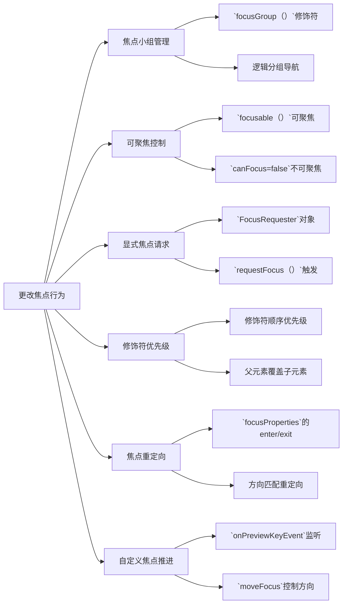

# 更改焦点行为

原地址：<https://developer.android.google.cn/develop/ui/compose/touch-input/focus/change-focus-behavior?hl=zh-cn>

## 一、通过焦点小组提供连贯一致的导航

### 核心需求

解决复杂布局中焦点导航顺序不符合预期的问题，如水平滚动标签页与列表内容的焦点切换逻辑。在复杂布局中，可以将多个子元素组合成一个焦点组，确保焦点在组内移动而非跳转到其他组件。

### 实现方式

- **`focusGroup()`修饰符**：将一组可组合项（如标签栏）包装在父容器中，使其在焦点搜索中视为一个整体。
- **行为变化**：
  - 焦点导航优先在组内按顺序进行，而非根据物理位置就近选择。
  - 组本身不获取焦点，焦点始终落在组内子项上。

### 示例代码

```kotlin
LazyVerticalGrid(columns = GridCells.Fixed(4)) {
    item(span = { GridItemSpan(maxLineSpan) }) {
        Row(modifier = Modifier.focusGroup()) { // 焦点小组
            FilterChipA() 
            FilterChipB() 
            FilterChipC() 
        }
    }
    items(chocolates) { SweetsCard(sweets = it) }
}
```

### 适用场景

- 标签页导航栏、水平滚动筛选栏等需要逻辑分组的焦点场景。
- 避免焦点因部分元素不可见而跳转到无关内容。

## 二、使可组合项可聚焦/不可聚焦

### 1. 使元素可聚焦

- **`focusable()`修饰符**：为非默认可聚焦元素（如`Box`）添加焦点能力。
- **示例**：

  ```kotlin
  var color by remember { mutableStateOf(Green) }
  Box(
      Modifier
          .background(color)
          .onFocusChanged { color = if (it.isFocused) Blue else Green }
          .focusable() // 使Box可聚焦
  ) {
      Text("Focusable 1")
  }
  ```

### 2. 排除元素参与焦点

- **`focusProperties { canFocus = false }`**：阻止元素成为焦点目标，但不影响点击事件。
- **示例**：

  ```kotlin
  var checked by remember { mutableStateOf(false) }
  Switch(
      checked = checked,
      onCheckedChange = { checked = it },
      modifier = Modifier.focusProperties { canFocus = false } // 不可聚焦
  )
  ```

## 三、使用`FocusRequester`请求焦点

### 核心功能

显式控制焦点转移，如表单提交后聚焦到首个输入框。

### 实现步骤

1. **创建`FocusRequester`对象**：

   ```kotlin
   val focusRequester = remember { FocusRequester() }
   ```

2. **关联到可组合项**：

   ```kotlin
   TextField(
       value = text,
       onValueChange = { text = it },
       modifier = Modifier.focusRequester(focusRequester) // 绑定焦点请求器
   )
   ```

3. **触发焦点请求**（在组合外调用）：

   ```kotlin
   Button(onClick = { focusRequester.requestFocus() }) { // 点击按钮请求焦点
       Text("Request focus on TextField")
   }
   ```

## 四、获取和释放焦点

### 场景

输入验证时强制保持焦点（如邮箱格式错误时不允许焦点离开）。

### 方法

- **`captureFocus()`**：强制保持焦点（需元素已获得焦点）。
- **`freeFocus()`**：释放焦点控制。

### 示例

```kotlin
val textField = FocusRequester()
TextField(
    value = text,
    onValueChange = { 
        text = it 
        if (it.length > 3) {
            textField.captureFocus() // 输入有效时捕获焦点
        } else {
            textField.freeFocus() // 输入无效时释放焦点
        }
    },
    modifier = Modifier.focusRequester(textField)
)
```

### 注意

- 需先通过`requestFocus`或用户点击使元素获得焦点，`captureFocus`才有效。

## 五、焦点修饰符的优先级（重点！！！）

先说结论：

1. `.focusable()` 放在所有焦点相关配置的最后，它等同于建造者模式的build(),其之后的焦点相关配置都不会生效。
2. `onFoucsChanged{}` 放在`.focusRequester()`之前，否则不会触发回调。

### 官网原文

Modifiers 可视为仅有一个子元素的元素，因此当您将 左侧（或顶部）的每个 Modifier 都会封装紧随其后的 Modifier 右侧（或下方）。这意味着，第二个 Modifier 包含在 第一个，以便在声明两个 focusProperties 时， 一个实例能起作用，因为下面这几个代码包含在最顶层。

如需进一步阐明此概念，请查看以下代码：

```kotlin
Modifier
    .focusProperties { right = item1 }
    .focusProperties { right = item2 }
    .focusable()
```

在本例中，将 item2 指示为右侧焦点的 focusProperties 将 因为它包含在前一个网址中；因此，item1 将是 其中一个。

>也就是 item2优先与item1去获取焦点，但不是替换。假如item2没有获取到，那么就让item1再去获取焦点。

利用此方法，父级发布商还可以将行为重置为默认值， 使用 FocusRequester.Default：

```kotlin
Modifier
    .focusProperties { right = Default }
    .focusProperties { right = item1 }
    .focusProperties { right = item2 }
    .focusable()
```

父级不必是同一修饰符链的一部分。家长 可组合项可以覆盖子级可组合项的焦点属性。例如： 请考虑使用会让该按钮无法聚焦的 FancyButton：

```kotlin
@Composable
fun FancyButton(modifier: Modifier = Modifier) {
    Row(modifier.focusProperties { canFocus = false }) {
        Text("Click me")
        Button(onClick = { }) { Text("OK") }
    }
}
```

用户可以通过将 canFocus 设置为 true 来重新将此按钮设为可聚焦：

```kotlin
FancyButton(Modifier.focusProperties { canFocus = true })
```

>注意 ：您可以使用Composable 低级别的 focusTarget() 修饰符，但不建议使用此修饰符。而应使用 更高级别的 focusable() 修饰符。

与每个 Modifier 一样，与焦点相关的项的行为会因顺序而异 您需要声明它们。例如，如下代码会使 Box 可聚焦，但 FocusRequester 与此可聚焦对象没有关联，因为它 在可聚焦对象之后声明。

```kotlin
Box(
    Modifier
        .focusable()
        .focusRequester(Default) //不生效
        .onFocusChanged {}//不生效
)
```

请务必注意，focusRequester 与第一个 位于层次结构中的其下方，因此此 focusRequester 指向 第一个可聚焦子项。如果没有可用的提供方，则它不会指向任何内容。 不过，由于 Box 可聚焦（得益于 focusable() 修饰符）， 则可以使用双向导航进行导航

再举一例，由于 onFocusChanged() 修饰符是指出现在 focusable() 或 focusTarget() 修饰符。

```kotlin
Box(
    Modifier
        .onFocusChanged {}//生效
        .focusRequester(Default)
        .focusable()
)
```

```kotlin
Box(
    Modifier
        .focusRequester(Default)
        .onFocusChanged {}//不生效,得在focusRequester之前调用
        .focusable()
)
```

### 注意

- `focusRequester`需在`focusable()`之前声明才能正确关联。

## 六、进入/退出时重定向焦点

### 场景

自定义跨列/跨区域的焦点导航逻辑（如左右两列按钮的焦点循环）。

### 实现方式

通过`focusProperties`的`enter`/`exit`回调，根据焦点方向（`FocusDirection`）重定向焦点。

### 示例

```kotlin
val otherComposable = remember { FocusRequester() }
Modifier.focusProperties {
    exit = { focusDirection ->
        when (focusDirection) {
            Right -> FocusRequester.Cancel // 阻止向右导航
            Down -> otherComposable // 向下时跳转到另一组件
            else -> FocusRequester.Default // 默认行为
        }
    }
}
```

### 效果

- 当焦点离开当前组件时，按指定方向跳转到目标组件（如从左列底部跳转到右列顶部）。

## 七、更改焦点推进方向

### 场景

自定义键盘导航逻辑（如替代默认的Tab键焦点顺序）。

### 实现方式

- **`onPreviewKeyEvent`**：监听键盘事件（如Tab键）。
- **`LocalFocusManager.moveFocus`**：手动控制焦点移动方向。

### 示例

```kotlin
val focusManager = LocalFocusManager.current
TextField(
    value = text,
    onValueChange = { text = it },
    modifier = Modifier.onPreviewKeyEvent {
        if (it.type == KeyEventType.KeyUp && it.key == Key.Tab) {
            focusManager.moveFocus(FocusDirection.Next) // 模拟Tab键焦点切换
            true // 消耗事件
        } else {
            false
        }
    }
)
```

## 流程图


