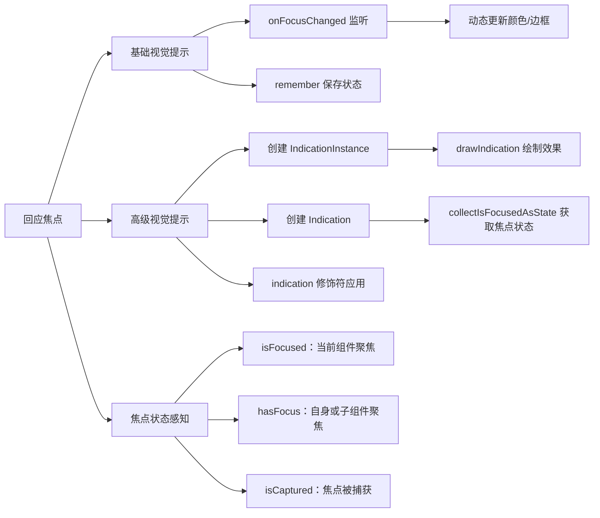

# 回应焦点

原地址：<https://developer.android.google.cn/develop/ui/compose/touch-input/focus/react-to-focus?hl=zh-cn>

## 一、提供视觉提示：直观呈现焦点状态

### 核心目标

通过视觉反馈让用户清晰感知焦点位置，提升可访问性。

### 实现方式

- **`onFocusChanged`修饰符**：监听焦点状态变化，动态更新元素外观。
- **颜色对比**：聚焦时切换高对比度颜色（如红色边框）。

### 示例代码

```kotlin
var color by remember { mutableStateOf(Color.White) } // 保存颜色状态
Card(
    modifier = Modifier
        .onFocusChanged { // 焦点变化监听
            color = if (it.isFocused) Red else White // 根据焦点状态切换颜色
        }
        .border(5.dp, color) // 绘制边框
) {
    // 内容
}
```

### 关键点

- **`remember`的作用**：确保状态在组件重组时保持，避免重复初始化。
- **适用场景**：按钮、输入框等基础组件的焦点反馈。

## 二、实现高级视觉提示：自定义复杂效果

### 需求场景

需要超出基础样式的动画或多层视觉反馈（如半透明遮罩、阴影渐变）。

### 实现步骤

#### 1. 创建`IndicationInstance`（视觉提示绘制逻辑）

```kotlin
private class MyHighlightIndicationInstance(isEnabledState: State<Boolean>) : IndicationInstance {
    private val isEnabled by isEnabledState // 解构焦点状态

    override fun ContentDrawScope.drawIndication() {
        drawContent() // 绘制原始内容
        if (isEnabled) { // 聚焦时绘制额外效果
            drawRect(
                size = size, 
                color = Color.White, 
                alpha = 0.2f // 半透明白色遮罩
            )
        }
    }
}
```

#### 2. 创建`Indication`（关联焦点状态）

```kotlin
class MyHighlightIndication : Indication {
    @Composable
    override fun rememberUpdatedInstance(interactionSource: InteractionSource): IndicationInstance {
        // 收集焦点状态（InteractionSource包含焦点信息）
        val isFocusedState = interactionSource.collectIsFocusedAsState() 
        return remember(interactionSource) { // 记忆实例，避免重复创建
            MyHighlightIndicationInstance(isEnabledState = isFocusedState)
        }
    }
}
```

#### 3. 应用到组件（通过`indication`修饰符）

```kotlin
val highlightIndication = remember { MyHighlightIndication() } // 记忆Indication实例
val interactionSource = remember { MutableInteractionSource() } // 管理交互状态

Card(
    modifier = Modifier
        .clickable(
            interactionSource = interactionSource, // 绑定交互源
            indication = highlightIndication, // 应用自定义提示
            enabled = true,
            onClick = {}
        )
) {
    // 内容
}
```

### 核心概念

- **`Indication`体系**：
  - `IndicationInstance`：具体的绘制逻辑，可包含动画或多层图形。
  - `Indication`：负责将焦点状态（通过`InteractionSource`）与`IndicationInstance`关联。
- **适用场景**：复杂组件（如自定义按钮、列表项）的焦点反馈，支持动画和分层绘制。

## 三、了解焦点状态：API详解

### 焦点状态参数

通过`onFocusChanged`回调的`FocusState`对象获取以下属性：

| 属性名        | 描述                                                                 |
|---------------|----------------------------------------------------------------------|
| `isFocused`   | 当前组件是否获得焦点（仅检查自身，不包含子组件）。                   |
| `hasFocus`    | 当前组件或其子组件是否获得焦点（递归检查整个层级）。                 |
| `isCaptured`  | 焦点是否被捕获（如输入框验证失败时强制保持焦点，阻止焦点转移）。     |

### 示例代码

```kotlin
Modifier.onFocusChanged { focusState ->
    // 解构焦点状态
    val isFocused = focusState.isFocused       // 当前组件聚焦
    val hasFocus = focusState.hasFocus         // 自身或子组件聚焦
    val isCaptured = focusState.isCaptured     // 焦点被捕获（如输入验证场景）
}
```

### 典型场景

- **`isFocused`**：单独组件的样式切换（如按钮聚焦时变色）。
- **`hasFocus`**：父容器需感知子组件焦点（如表单分组的整体状态）。
- **`isCaptured`**：输入验证逻辑（如邮箱格式错误时禁止焦点离开输入框）。

## 流程图


