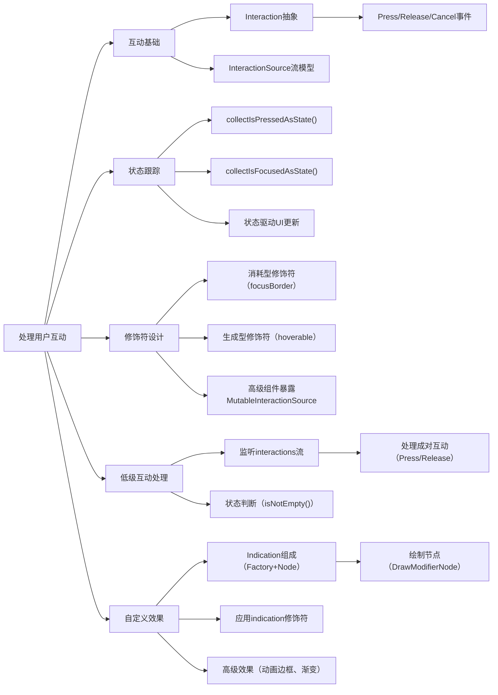

# 处理用户互动

原地址：<https://developer.android.google.cn/develop/ui/compose/touch-input/user-interactions/handling-interactions?hl=zh-cn>

## 一、互动基础：从低级事件到高级抽象

### 核心概念

- **互动（Interaction）**：表示用户与组件的交互行为，如按压、释放、悬停、聚焦等，以成对形式出现（如`PressInteraction.Press`和`Release`）。
- **抽象层级**：Compose 将低级别指针事件（如触摸移动）抽象为高级互动，例如`Modifier.clickable`自动处理“按压-释放”逻辑。

### 关键组件

- **`InteractionSource`**：只读流，用于收集互动事件，如`PressInteraction`、`HoverInteraction`。
- **`MutableInteractionSource`**：可发射新互动事件，扩展自`InteractionSource`，用于自定义组件。

## 二、互动状态跟踪：响应组件状态变化

### 状态获取方法

| 方法名                  | 描述                                   |
|-------------------------|----------------------------------------|
| `collectIsPressedAsState()` | 当前组件是否处于按压状态               |
| `collectIsFocusedAsState()` | 当前组件是否聚焦                       |
| `collectIsDraggedAsState()` | 当前组件是否被拖动                     |
| `collectIsHoveredAsState()` | 当前组件是否被悬停                     |

### 示例：按压状态切换文本

```kotlin
val interactionSource = remember { MutableInteractionSource() }
val isPressed by interactionSource.collectIsPressedAsState()

Button(
    onClick = { /* 操作 */ },
    interactionSource = interactionSource
) {
    Text(if (isPressed) "Pressed!" else "Not pressed")
}
```

## 三、使用和发出互动：修饰符与组件设计

### 1. 修饰符类型

- **消耗型修饰符**：仅监听互动，不发射新事件（如`focusBorder`）。

  ```kotlin
  fun Modifier.focusBorder(interactionSource: InteractionSource): Modifier {
      // 仅观察互动，绘制边框
  }
  ```

- **生成型修饰符**：发射新互动事件（如`hoverable`）。

  ```kotlin
  fun Modifier.hover(interactionSource: MutableInteractionSource, enabled: Boolean): Modifier {
      // 发射HoverInteraction事件
  }
  ```

### 2. 高级组件设计

- **暴露`MutableInteractionSource`**：如`Button`允许传入自定义互动源，便于统一管理状态。

  ```kotlin
  @Composable
  fun Button(
      // ...
      interactionSource: MutableInteractionSource? = null, // 暴露互动源
      // ...
  )
  ```

- **组合修饰符**：同时使用`hoverable`和`focusable`，共享同一互动源。

  ```kotlin
  val interactionSource = remember { MutableInteractionSource() }
  Box(
      Modifier
          .hoverable(interactionSource)
          .focusable(interactionSource) // 共享互动源
  )
  ```

## 四、低级互动处理：直接操作`InteractionSource`

### 收集互动事件

通过监听`interactionSource.interactions`流，处理原始互动事件（如按压开始/结束、拖动等）。

```kotlin
val interactionSource = remember { MutableInteractionSource() }
val interactions = remember { mutableStateListOf<Interaction>() }

LaunchedEffect(interactionSource) {
    interactionSource.interactions.collect { interaction ->
        when (interaction) {
            is PressInteraction.Press -> interactions.add(interaction) // 按压开始
            is PressInteraction.Release -> interactions.remove(interaction.press) // 按压结束
            // 处理其他互动类型
        }
    }
}
```

### 状态判断

通过互动列表判断组件当前状态（如是否处于按压或拖动状态）。

```kotlin
val isPressedOrDragged = interactions.isNotEmpty() // 非空表示有未结束的互动
```

## 五、自定义互动效果：使用`Indication`

### 核心概念

- **`Indication`**：定义可复用的视觉效果，分为两部分：
  - **`IndicationNodeFactory`**：创建绘制节点（`Modifier.Node`），负责渲染效果。
  - **`Modifier.indication`**：应用效果到组件，支持动画和自定义绘图。

### 示例：按压缩放效果

#### 1. 创建绘制节点（`Modifier.Node`）

```kotlin
private class ScaleNode(interactionSource: InteractionSource) : DrawModifierNode {
    private val animatedScale = Animatable(1f)
    
    init {
        interactionSource.interactions.collect {
            when (it) {
                is PressInteraction.Press -> animatedScale.animateTo(0.9f)
                is PressInteraction.Release -> animatedScale.animateTo(1f)
            }
        }
    }
    
    override fun ContentDrawScope.draw() {
        scale(animatedScale.value) { drawContent() } // 缩放内容
    }
}
```

#### 2. 创建`IndicationNodeFactory`

```kotlin
object ScaleIndication : IndicationNodeFactory {
    override fun create(interactionSource: InteractionSource): DelegatableNode {
        return ScaleNode(interactionSource)
    }
}
```

#### 3. 应用到组件

```kotlin
Box(
    Modifier
        .clickable(indication = ScaleIndication, interactionSource = remember { MutableInteractionSource() })
        .background(Color.Blue)
) {
    Text("Hello!")
}
```

## 六、高级`Indication`：动画边框效果

### 实现步骤

1. **定义带参数的`Indication`**：传入形状和边框宽度。

   ```kotlin
   data class NeonIndication(
       private val shape: Shape,
       private val borderWidth: Dp
   ) : IndicationNodeFactory {
       override fun create(interactionSource: InteractionSource): DelegatableNode {
           return NeonNode(shape, borderWidth * 2, interactionSource) // 双倍宽度增强效果
       }
   }
   ```

2. **绘制节点实现**：根据按压位置计算渐变方向，绘制动画边框。

   ```kotlin
   private class NeonNode(...) : DrawModifierNode {
       private val animatedProgress = Animatable(0f)
       
       override fun ContentDrawScope.draw() {
           val brush = linearGradient(
               colors = listOf(Blue, Purple, Pink, Orange, Yellow),
               start = pressPosition,
               end = oppositePosition // 计算对称点
           )
           drawOutline(shape, brush = brush, style = Stroke(borderWidth)) // 绘制边框
       }
   }
   ```

3. **应用效果**：

   ```kotlin
   ScaleButton(
       onClick = {},
       indication = NeonIndication(shape = CircleShape, borderWidth = 2.dp)
   ) {
       Text("Add to cart!")
   }
   ```

## 流程图


