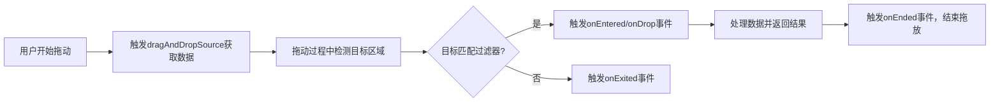

# 拖放

原地址：<https://developer.android.google.cn/develop/ui/compose/touch-input/user-interactions/drag-and-drop?hl=zh-cn>

## 一、核心概念

Jetpack Compose 通过两个核心修饰符实现拖放功能：

- **`dragAndDropSource`**：标记可组合项为拖动手势的起点，负责提供拖放数据。
- **`dragAndDropTarget`**：标记可组合项为拖放目标，负责接收并处理拖放数据。

**数据载体**：通过 `ClipData` 实现跨组件数据共享，支持文本、URI、文件等格式，可与原生 `View` 系统互操作。

**应用场景**：

- 组件间数据移动（如列表项拖拽排序）。
- 跨应用数据传输（如从文件管理器拖图片到编辑器）。

## 二、指定拖动来源（`dragAndDropSource`）

### 1. 基础用法

通过修饰符为组件添加拖动能力，返回 `DragAndDropTransferData` 对象封装数据：

```kotlin
Image(
    painter = painterResource(id = R.drawable.image),
    contentDescription = "Draggable Image",
    modifier = Modifier
        .size(100.dp)
        .dragAndDropSource { _ ->
            // 提供纯文本数据（图片URL）
            DragAndDropTransferData(
                ClipData.newPlainText("image_url", "https://example.com/image.jpg")
            )
        }
)
```

### 2. 跨应用拖放（全局标志）

通过 `flags` 参数设置拖放行为，例如允许跨应用拖动：

```kotlin
Modifier.dragAndDropSource { _ ->
    DragAndDropTransferData(
        ClipData.newPlainText("image_url", "https://example.com/image.jpg"),
        flags = View.DRAG_FLAG_GLOBAL // 允许数据在应用间传输
    )
}
```

### 支持的标志（`flags`）

| 标志常量               | 作用描述                     |
|------------------------|------------------------------|
| `DRAG_FLAG_GLOBAL`     | 允许跨应用拖放               |
| `DRAG_FLAG_LINK`       | 表示数据为链接，非复制/移动  |
| `DRAG_FLAG_OPAQUE`     | 拖动时显示完整预览           |
| `DRAG_FLAG_MULTIPLE`   | 支持多选拖放                 |

## 三、接收拖放数据（`dragAndDropTarget`）

### 1. 基础用法

通过修饰符为组件添加拖放目标能力，包含两个参数：

- `shouldStartDragAndDrop`：数据过滤器，判断是否接受当前拖放数据。
- `target`：回调对象，处理拖放事件。

```kotlin
Box(
    modifier = Modifier
        .size(200.dp)
        .background(Color.LightGray)
        .dragAndDropTarget(
            shouldStartDragAndDrop = { event ->
                // 仅接受纯文本数据
                event.mimeTypes().contains(ClipDescription.MIMETYPE_TEXT_PLAIN)
            },
            target = remember { // 记住回调实例避免重组重复创建
                object : DragAndDropTarget {
                    override fun onDrop(event: DragAndDropEvent): Boolean {
                        // 解析数据（例如提取文本）
                        val text = event.clipData?.getItemAt(0)?.text.toString()
                        Log.d("DragDrop", "Dropped text: $text")
                        return true // 返回true表示处理事件
                    }
                }
            }
        )
)
```

### 2. 事件回调说明

通过实现 `DragAndDropTarget` 接口，可监听拖放过程中的不同阶段：

```kotlin
object : DragAndDropTarget {
    override fun onStarted(event: DragAndDropEvent) {
        // 拖动开始时触发（如高亮目标区域）
    }

    override fun onEntered(event: DragAndDropEvent) {
        // 拖动项进入目标区域时触发
    }

    override fun onExited(event: DragAndDropEvent) {
        // 拖动项离开目标区域时触发
    }

    override fun onEnded(event: DragAndDropEvent) {
        // 拖动结束时触发（无论成功或取消）
    }

    override fun onDrop(event: DragAndDropEvent): Boolean {
        // 处理拖放数据，返回是否消费事件
        return true
    }
}
```

## 四、流程图：拖放流程示意图



## 五、关键注意事项

1. **数据类型匹配**：
   - 拖动源和目标需约定一致的 MIME 类型（如纯文本、图片 URI 等）。
   - 通过 `event.mimeTypes()` 检查拖放数据类型。

2. **性能优化**：
   - 使用 `remember` 缓存 `DragAndDropTarget` 回调实例，避免重组时重复创建。
   - 复杂界面中可通过轻量化 `ClipData` 减少内存开销。

3. **交互反馈**：
   - 在 `onEntered`/`onExited` 中添加视觉反馈（如背景色变化），增强用户体验。
   - `onDrop` 返回 `false` 时，事件会向上层组件传播。

4. **跨平台兼容性**：
   - 拖放功能在 Android 7.0（API 24）及以上版本完全支持，低版本需额外适配。

## 六、典型应用场景

1. **文件管理器**：从文件列表拖放文件到文件夹图标。
2. **任务列表**：拖拽任务项调整顺序或标记完成。
3. **图像编辑器**：从图库拖放图片到编辑区域。
4. **跨应用协作**：从浏览器拖放链接到笔记应用。
