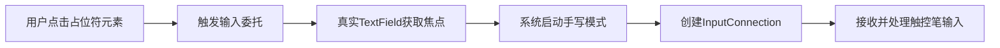

# 在文本字段中使用触控笔输入

原地址：<https://developer.android.google.cn/develop/ui/compose/touch-input/stylus-input/stylus-input-in-text-fields?hl=zh-cn>

## 一、依赖项配置

### 功能说明

默认启用触控笔手写输入需添加 `Jetpack Compose Material3` 相关库依赖，适用于 Android 14 及更高版本（需 `androidx.compose.foundation:foundation:1.7.0` 及以上）。

### 配置代码

```kotlin
// Kotlin 版本
dependencies {
    implementation "androidx.compose.foundation:foundation:LATEST_COMPOSE_VERSION"
}
android {
    buildFeatures {
        compose = true
    }
    composeOptions {
        kotlinCompilerExtensionVersion = "LATEST_EXTENSION_VERSION"
    }
    kotlinOptions {
        jvmTarget = "LATEST_JVM_VERSION"
    }
}
```

```groovy
// Groovy 版本
dependencies {
    implementation 'androidx.compose.foundation:foundation:LATEST_COMPOSE_VERSION'
}
android {
    buildFeatures {
        compose true
    }
    composeOptions {
        kotlinCompilerExtensionVersion = 'LATEST_EXTENSION_VERSION'
    }
    kotlinOptions {
        jvmTarget = 'LATEST_JVM_VERSION'
    }
}
```

## 二、TextField 组件特性

### 触控笔手写默认支持

- 系统为所有 `TextField` 组件默认启用触控笔手写功能（Android 14+）。
- 触控笔移动时，`TextField` 自动启动手写模式并触发相关事件。

### 手写边界范围

- **垂直内边距**：40 dp  
- **水平内边距**：10 dp  
- 手写输入区域为输入字段周围包含上述内边距的范围（见图 2）。

### 限制条件

- 当 `TextField` 使用 `KeyboardType.Password` 时，不支持触控笔手写输入（因涉及密码输入安全机制）。

## 三、输入委托机制

### 核心概念

- **占位符界面元素**：外观类似文本输入字段，但实际为静态元素（无输入功能），例如搜索栏。
- **转场逻辑**：点击占位符元素后，触发界面跳转至包含真实输入字段的新界面（见图 3）。

### 应用场景

适用于需要延迟加载输入功能的场景，避免界面初始加载时包含复杂输入组件，提升性能。

## 四、触控笔输入委托（手写委托 API）

### 关键组件

- `handwritingDetector`：检测触控笔手写输入。  
- `handwritingHandler`：处理手写内容并委托给目标输入字段。

### 工作流程

1. 占位符元素（如搜索图标）接收触控笔输入。  
2. 通过手写委托 API 将手写内容传递给真实的 `TextField`。  
3. 当 `TextField` 获得焦点时，系统自动启动触控笔手写模式并创建 `InputConnection`（见图 4）。

### 示例参考

可查阅 `HandwritingDetectorSample.kt` 示例代码，了解具体实现逻辑。

## 五、测试与模拟

### 支持条件

- 设备需运行 Android 14 及以上系统。  
- 具备兼容的触控笔输入设备。  
- 输入法编辑器（IME）需支持 Android 14 触控笔手写 API（推荐使用 Gboard Beta 版测试）。

### 无触控笔设备模拟方法

#### Android 14

```bash
adb shell setprop persist.debug.input.simulate_stylus_with_touch true && adb shell stop && adb shell start
```

#### Android 15 及更高版本

```bash
adb shell setprop debug.input.simulate_stylus_with_touch true
```

- **注意**：Android 15+ 需重启屏幕配置（如旋转屏幕）使属性生效。

## 六、其他资源

- [Material Design - 文本字段](https://m3.material.io/components/text-fields/overview)  
- [处理用户输入](https://developer.android.google.cn/develop/ui/compose/interactivity/handling-user-input)

## 七、流程图：触控笔输入委托流程


