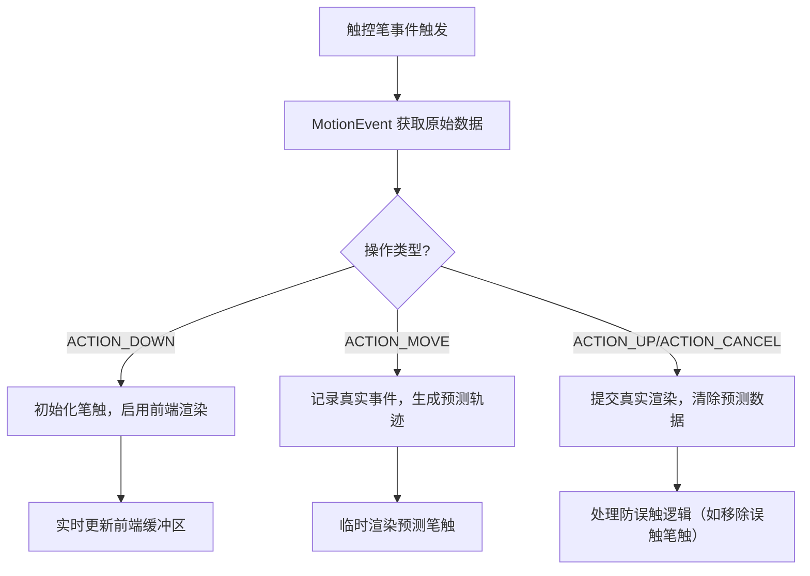

# 高级触控笔功能

原地址：<https://developer.android.google.cn/develop/ui/compose/touch-input/stylus-input/advanced-stylus-features?hl=zh-cn>

## 一、核心技术：MotionEvent 与触控笔数据获取

### 1. 事件监听与数据解析

通过 `pointerInteropFilter` 修饰符监听触控笔事件，解析 `MotionEvent` 获取交互数据：

```kotlin
@Composable
@OptIn(ExperimentalComposeUiApi::class)
fun DrawArea(modifier: Modifier = Modifier) {
    Canvas(
        modifier = modifier
            .clipToBounds()
            .pointerInteropFilter { event ->
                viewModel.processMotionEvent(event) // 委托 ViewModel 处理事件
            }
    ) { /* 绘图逻辑 */ }
}
```

### 2. 关键操作类型（ACTION）

| 操作常量          | 说明                                                                 |
|-------------------|----------------------------------------------------------------------|
| `ACTION_DOWN`     | 触控笔接触屏幕，开始新笔触                                           |
| `ACTION_MOVE`     | 触控笔移动，更新笔触轨迹                                             |
| `ACTION_UP`       | 触控笔离开屏幕，结束笔触                                             |
| `ACTION_CANCEL`   | 取消当前操作（如手掌误触或系统手势触发）                             |

### 3. 轴数据（Axis）解析

通过 `getAxisValue(axis, pointerIndex)` 获取触控笔状态：

| 轴常量          | 含义                                                                 | 示例代码                          |
|-----------------|----------------------------------------------------------------------|-----------------------------------|
| `AXIS_PRESSURE` | 压力（0-1，可大于1需归一化）                                         | `event.getAxisValue(AXIS_PRESSURE)`|
| `AXIS_TILT`     | 倾斜度（弧度，0=垂直，π/2=平行）                                     | `event.getAxisValue(AXIS_TILT)`    |
| `AXIS_ORIENTATION` | 笔尖方向（弧度，0至±π）                                           | `event.getAxisValue(AXIS_ORIENTATION)` |
| `AXIS_DISTANCE` | 悬停距离（0=接触屏幕，值越大距离越远）                               | `event.getAxisValue(AXIS_DISTANCE)`|

### 4. 指针类型检测

```kotlin
val pointerIndex = event.actionIndex // 当前操作的指针索引
val isStylus = event.getToolType(pointerIndex) == MotionEvent.TOOL_TYPE_STYLUS
val isEraser = event.getToolType(pointerIndex) == MotionEvent.TOOL_TYPE_ERASER
```

## 二、交互优化：防误触与导航处理

### 1. 手掌误触检测

- **`ACTION_CANCEL`**：系统检测到误触（如手掌接触）时触发，需清除对应指针的笔触。
- **`FLAG_CANCELED`**（Android 13+）：标记指针抬起为误触，通过 `event.flags and FLAG_CANCELED` 判断。

```kotlin
if (event.action == MotionEvent.ACTION_CANCEL || (event.flags and FLAG_CANCELED) != 0) {
    val pointerId = event.getPointerId(event.actionIndex)
    strokeHistory.remove(pointerId) // 移除误触指针的历史记录
    invalidate() // 重新渲染
}
```

### 2. 全屏手势冲突处理

通过 `WindowInsetsController` 配置系统栏行为，避免滑动手势触发误触：

```kotlin
windowInsetsController.systemBarsBehavior = 
    WindowInsetsControllerCompat.BEHAVIOR_SHOW_TRANSIENT_BARS_BY_SWIPE
```

## 三、性能优化：低延迟渲染与预测技术

### 1. 前端缓冲区渲染（低延迟库）

- **原理**：直接渲染到屏幕缓冲区，避免多缓冲区交换延迟。
- **依赖项**：

  ```gradle
  dependencies {
      implementation "androidx.graphics:graphics-core:1.0.0-alpha03"
  }
  ```

- **实现流程**：

  ```kotlin
  // 声明渲染器
  val renderer = GLFrontBufferRenderer<StrokeData>(surfaceView) { egl, buffer, transform, data ->
      // 前端缓冲区渲染（局部更新，如笔触实时绘制）
      drawStroke(data, transform)
  }

  // 触发渲染
  when (event.action) {
      MotionEvent.ACTION_MOVE -> renderer.renderFrontBufferedLayer(currentStroke)
      MotionEvent.ACTION_UP -> renderer.commit() // 提交到双缓冲区（全量更新）
  }
  ```

### 2. 动作预测库（MotionEventPredictor）

- **作用**：预测触控笔轨迹，补偿渲染延迟，提升流畅度。
- **依赖项**：

  ```gradle
  dependencies {
      implementation "androidx.input:input-motionprediction:1.0.0-beta01"
  }
  ```

- **使用步骤**：

  ```kotlin
  // 初始化预测器
  val predictor = MotionEventPredictor.newInstance(view)

  // 记录真实事件
  predictor.record(motionEvent)

  // 获取预测事件（在 ACTION_MOVE 中调用）
  val predictedEvent = predictor.predict()?.also {
      // 使用预测坐标临时渲染，后续用真实数据替换
      drawPredictedStroke(it.x, it.y)
  }
  ```

## 四、功能扩展：笔触模式与系统集成

### 1. 橡皮擦模式支持

通过 `TOOL_TYPE_ERASER` 检测触控笔是否处于橡皮擦模式：

```kotlin
if (isEraser) {
    // 切换为擦除逻辑
    canvas.drawPath(erasePath, eraserPaint)
} else {
    // 正常绘制逻辑
    canvas.drawPath(strokePath, paint)
}
```

### 2. 系统集成功能

- **ChromeOS 记事应用**：声明 `ACTION_CREATE_NOTE` intent，支持锁屏启动。
- **手写识别**：结合机器学习套件（ML Kit），将 `Ink.Stroke` 转换为文本：

  ```kotlin
  val stroke = Ink.Stroke.Builder()
      .addPoint(x1, y1, pressure1)
      .addPoint(x2, y2, pressure2)
      .build()
  val ink = Ink.Builder().addStroke(stroke).build()
  val result = textRecognizer.process(ink) // 调用 ML Kit 识别
  ```

## 五、流程图：触控笔输入处理全流程



## 六、关键注意事项

1. **性能优化**：
   - 避免在 `ACTION_MOVE` 中执行复杂计算，优先使用前端缓冲区渲染局部更新。
   - 预测数据仅用于临时显示，最终需用真实事件数据替换。

2. **兼容性**：
   - 低延迟库支持 Android 10+ 及 ChromeOS 设备。
   - 触控笔压力范围可能因设备而异，需做归一化处理：`pressure = min(max(pressure, 0f), 1f)`。

3. **用户体验**：
   - 悬停时提供视觉反馈（如预览笔触大小），通过 `hoverable` 修饰符实现。
   - 区分触控笔与手指输入，避免手势冲突（如双指缩放时禁用笔触）。
