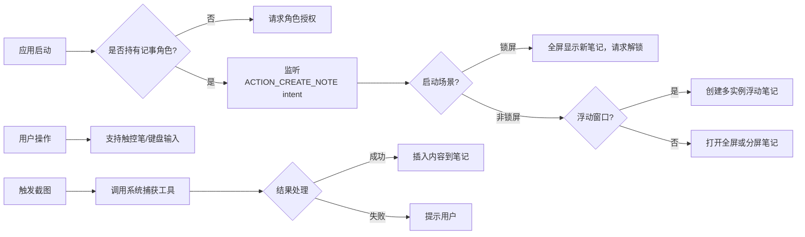

# 创建记事应用

原地址：<https://developer.android.google.cn/develop/ui/compose/touch-input/stylus-input/create-a-note-taking-app?hl=zh-cn>

## 一、核心功能与角色注册

### 1. 记事应用角色（Role）

- **作用**：通过系统认证为官方认可的记事应用，支持锁屏启动和全局快捷调用。
- **角色申请流程**：
  1. **检查角色可用性**：

     ```kotlin
     val roleManager = getSystemService(RoleManager::class.java)
     if (roleManager.isRoleAvailable(RoleManager.ROLE_NOTES)) {
         // 角色可用，请求授权
     }
     ```

  2. **创建角色请求Intent**：

     ```kotlin
     val intent = roleManager.createRequestRoleIntent(RoleManager.ROLE_NOTES)
     startActivityForResult(intent, REQUEST_ROLE_NOTES)
     ```

  3. **处理授权结果**：
     - 授权成功后，应用成为默认记事应用，响应`ACTION_CREATE_NOTE` intent。
     - 仅支持单应用持有该角色，用户可在系统设置中切换。

### 2. 应用清单配置

```xml
<activity
    android:name=".NoteActivity"
    android:exported="true"
    android:showWhenLocked="true"
    android:turnScreenOn="true">
    <intent-filter>
        <action android:name="android.intent.action.CREATE_NOTE" />
        <category android:name="android.intent.category.DEFAULT" />
    </intent-filter>
</activity>
```

- **关键属性**：
  - `showWhenLocked`：允许从锁屏启动应用。
  - `turnScreenOn`：启动时唤醒屏幕。
  - `ACTION_CREATE_NOTE`：声明响应系统创建记事的 intent。

## 二、核心功能实现

### 1. 触控笔支持

- **输入模式判断**：
  - 通过`EXTRA_USE_STYLUS_MODE` intent extra 确定输入模式：

    ```kotlin
    val useStylus = intent.getBooleanExtra(EXTRA_USE_STYLUS_MODE, true)
    if (useStylus) {
        // 启用触控笔手写模式
        showStylusInput()
    } else {
        // 启用键盘输入
        showKeyboard()
    }
    ```

### 2. 锁屏访问与隐私保护

- **全屏启动**：锁屏启动时强制全屏显示。
- **隐私控制**：
  - 锁屏状态下仅显示新笔记，不暴露历史记录。
  - 解锁设备后访问敏感内容：

    ```kotlin
    val keyguardManager = getSystemService(KeyguardManager::class.java)
    keyguardManager.requestDismissKeyguard(this, object : KeyguardDismissCallback() {
        override fun onDismissSucceeded() {
            // 解锁成功，加载历史笔记
        }
        override fun onDismissError() {
            // 解锁失败，保持新笔记界面
        }
    })
    ```

### 3. 浮动窗口与多实例

- **浮动窗口支持**：
  - 允许用户在悬浮窗口中快速创建笔记。
  - 支持多实例：用户可同时打开多个浮动窗口或分屏笔记。
- **检测启动模式**：

  ```kotlin
  // 判断是否从浮动窗口（气泡）启动
  val isBubble = activity?.isLaunchedFromBubble() == true
  ```

### 4. 内容截取功能

- **启动系统捕获工具**：

  ```kotlin
  private val captureLauncher = registerForActivityResult(
      ActivityResultContracts.StartActivityForResult()
  ) { result ->
      when (result.resultCode) {
          Intent.CAPTURE_CONTENT_FOR_NOTE_SUCCESS -> {
              val uri = result.data?.data // 截取内容URI
              insertImageIntoNote(uri)
          }
          Intent.CAPTURE_CONTENT_FOR_NOTE_FAILED -> {
              showError("截图失败")
          }
          // 处理其他结果码
      }
  }

  // 触发截图
  captureLauncher.launch(Intent(ACTION_LAUNCH_CAPTURE_CONTENT_ACTIVITY_FOR_NOTE))
  ```

- **限制条件**：
  - 仅在非锁屏的浮动窗口中提供截图功能。
  - 检查设备策略是否允许截图：

    ```kotlin
    val policyManager = DevicePolicyManager(context)
    val isCaptureBlocked = policyManager.getScreenCaptureDisabled(null)
    ```

## 三、流程图：记事应用核心流程



## 四、关键注意事项

1. **权限与隐私**：
   - 锁屏场景下严禁展示历史笔记，确保用户隐私。
   - 内容截取功能需遵循设备管理策略（如企业设备可能禁止截图）。

2. **多窗口适配**：
   - 浮动窗口需优化触控笔交互，避免与窗口拖拽冲突。
   - 支持平板等大屏设备的分屏模式，确保布局自适应。

3. **系统兼容性**：
   - `ACTION_CREATE_NOTE` intent 仅在Android 14+有效，需添加版本判断。
   - 浮动窗口功能依赖系统特性，需测试不同Launcher的兼容性。

4. **用户体验**：
   - 触控笔模式下提供实时笔迹预览和压力感应效果。
   - 浮动窗口支持快速关闭和最小化，避免遮挡主要界面。
