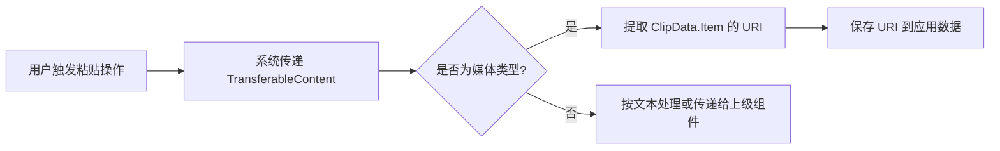

# 复制和粘贴

原地址：<https://developer.android.google.cn/develop/ui/compose/touch-input/copy-and-paste?hl=zh-cn>

## 一、剪贴板框架概述

Android 的复制粘贴框架支持以下数据类型：

- **基础类型**：文本字符串  
- **复杂类型**：复杂数据结构、文本/二进制流、应用资源  
- **存储方式**：简单文本直接存储在剪贴板，复杂数据以 URI 引用形式存储，通过 `ContentProvider` 解析。  
- **应用场景**：支持应用内和跨应用的数据传输，需结合 `Content Provider API` 使用。

## 二、文本复制与粘贴

### 1. 组件默认支持

| 组件            | 复制文本 | 粘贴文本 |
|-----------------|----------|----------|
| `BasicTextField`| ✅       | ✅       |
| `TextField`     | ✅       | ✅       |
| `SelectionContainer` | ✅     | ❌       |  

**示例代码**：  

```kotlin
val textFieldState = rememberTextFieldState()
Column {
    Card {
        SelectionContainer {
            Text("You can copy this text") // 可长按复制文本
        }
    }
    BasicTextField(state = textFieldState) // 支持粘贴（Ctrl+V）
}
```

### 2. 使用 `ClipboardManager` 手动操作

#### （1）复制文本

- **简单复制**：  

  ```kotlin
  val clipboardManager = LocalClipboardManager.current
  Button(onClick = {
      clipboardManager.setText("Hello, clipboard") // 直接复制字符串
  }) { Text("Click to copy a text") }
  ```

- **精细控制（含敏感内容）**：  

  ```kotlin
  val clipData = ClipData.newPlainText("label", "敏感内容")
  val clipEntry = ClipEntry(clipData)
  // 标记敏感内容（见下文“敏感内容”部分）
  clipData.description.extras = PersistableBundle().apply {
      putBoolean(ClipDescription.EXTRA_IS_SENSITIVE, true)
  }
  clipboardManager.setClip(clipEntry)
  ```

#### （2）粘贴文本

```kotlin
var textFieldState by remember { mutableStateOf(TextFieldState()) }
Column {
    TextField(state = textFieldState)
    Button(onClick = {
        val text = clipboardManager.getText() // 返回 AnnotatedString 或 null
        text?.let {
            textFieldState.edit { append(it.toString()) } // 追加到输入框
        }
    }) { Text("Click to paste") }
}
```

## 三、富媒体内容操作（图片/视频等）

### 1. 复制富媒体内容

**原理**：不直接存储媒体文件，而是通过 `URI` 引用 `ContentProvider` 中的资源。  

```kotlin
val context = LocalContext.current
Button(onClick = {
    val imageUri = Uri.parse("content://your.app.authority/0.jpg") // 图片 URI
    val clipData = ClipData.newUri(context.contentResolver, "Copied Image", imageUri)
    val clipEntry = ClipEntry(clipData)
    clipboardManager.setClip(clipEntry)
}) { Text("Copy a JPEG data") }
```

### 2. 粘贴富媒体内容

**使用 `contentReceiver` 修饰符处理粘贴事件**：  

```kotlin
var imageList by remember { mutableStateOf(mutableListOf<Uri>()) }
val receiveContentListener = remember {
    ReceiveContentListener { transferableContent ->
        // 处理图片 URI
        if (transferableContent.hasMediaType(MediaType.Image)) {
            transferableContent.consume { item -> // 标记已处理的 Item
                item.uri?.let { imageList.add(it) } // 提取 URI 并保存
                return@consume item.uri != null // 返回是否成功处理
            }
        }
        transferableContent // 未处理的数据传递给上级组件
    }
}

BasicTextField(
    state = rememberTextFieldState(),
    modifier = Modifier.contentReceiver(receiveContentListener) // 绑定粘贴监听器
)
```

## 四、复杂数据处理

- **复制**：与富媒体类似，通过 `URI` 和 `ContentProvider` 存储复杂数据引用。  
- **粘贴**：从 `TransferableContent` 中提取 URI，通过 `ContentProvider` 解析实际数据。  
- **场景**：自定义数据格式（如结构化数据、二进制文件）的跨应用传输。

## 五、复制内容的反馈机制

### 1. Android 13+ 自动反馈

系统默认显示复制内容的预览界面（如图 1），避免手动实现通知，但需注意重复通知问题。

### 2. Android 12L 及以下手动反馈

需通过 `Snackbar` 或 `Toast` 提示用户复制成功，例如：  

```kotlin
Button(onClick = {
    clipboardManager.setText("Copied")
    // 显示手动反馈
    LaunchedEffect(Unit) {
        snackbarHostState.showSnackbar("内容已复制")
    }
})
```

## 六、敏感内容处理

**需求**：避免剪贴板预览显示敏感信息（如密码）。  
**实现**：在 `ClipData` 中标记敏感标志：  

```kotlin
// 根据编译的 SDK 版本选择不同键值
val clipData = ClipData.newPlainText("secret", "敏感密码")
clipData.description.extras = PersistableBundle().apply {
    if (Build.VERSION.SDK_INT >= Build.VERSION_CODES.TIRAMISU) {
        putBoolean(ClipDescription.EXTRA_IS_SENSITIVE, true) // Android 13+ 标准键
    } else {
        putBoolean("android.content.extra.IS_SENSITIVE", true) // 旧版本兼容键
    }
}
clipboardManager.setClip(ClipEntry(clipData))
```

## 七、流程图：富媒体粘贴流程



## 八、关键知识点总结

| 功能场景         | 核心组件/方法                          | 注意事项                                  |
|------------------|-----------------------------------------|-------------------------------------------|
| 文本复制粘贴     | `ClipboardManager.setText()`/`getText()` | 组件默认支持，密码需标记敏感              |
| 富媒体复制       | `ClipData.newUri()` + `ContentProvider` | 不存储实际文件，仅存储 URI 引用           |
| 富媒体粘贴       | `Modifier.contentReceiver()`            | 使用 `consume()` 标记已处理的 Item         |
| 敏感内容处理     | `ClipDescription.EXTRA_IS_SENSITIVE`     | Android 13+ 需使用标准键，低版本用兼容键 |
| 反馈机制         | 系统自动预览（Android 13+）            | 低版本需手动实现提示                      |
