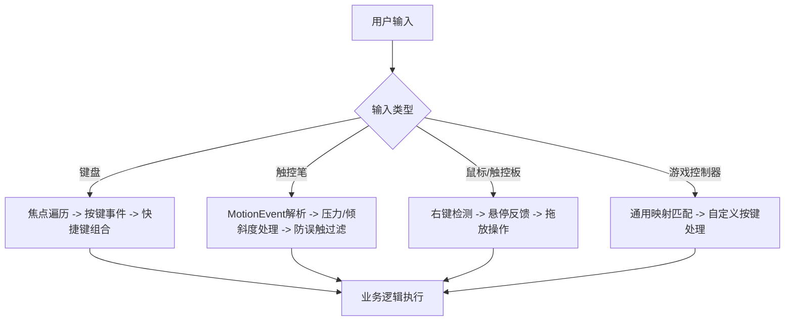

# 大屏幕上的输入兼容性

原地址：<https://developer.android.google.cn/develop/ui/compose/touch-input/input-compatibility-on-large-screens?hl=zh-cn>

## 一、大屏设备输入类型与核心目标

大屏设备（平板、可折叠设备、ChromeOS）用户常使用键盘、鼠标、触控笔、游戏控制器等交互。核心目标是确保应用在多种输入方式下：

- **无障碍**：支持键盘导航和快捷键，满足辅助功能需求。
- **交互一致**：触控笔与鼠标操作逻辑统一（如右键菜单、拖放）。
- **性能优化**：低延迟处理触控笔轨迹和键盘事件。

## 二、键盘输入兼容性

### 1. 键盘导航

- **自动支持**：`Button`、带`clickable`修饰符的组件默认可聚焦，按`Tab`键/箭头键遍历。
- **手动启用**：对自定义组件添加`focusable`修饰符：

  ```kotlin
  Box(
      Modifier.background(color)
          .onFocusChanged { color = if (it.isFocused) Blue else Green }
          .focusable() // 启用键盘聚焦
  ) { Text("Focusable 1") }
  ```

- **复杂布局控制**：使用`focusGroup`修饰符分组管理焦点遍历：

  ```kotlin
  Row {
      Column(Modifier.focusGroup()) { /* 组内焦点优先循环 */ }
      Column(Modifier.focusGroup()) { /* 组间按声明顺序切换 */ }
  }
  ```

### 2. 按键处理

- **单个按键监听**：通过`onKeyEvent`修饰符区分按下/松开事件：

  ```kotlin
  Box(Modifier.focusable().onKeyEvent {
      if (it.type == KeyEventType.KeyUp && it.key == Key.S) {
          saveNote() // 处理按键逻辑
          true // 消费事件
      } else {
          false
      }
  })
  ```

- **全局按键捕获**：重写Activity的`onKeyUp`处理特殊按键（如Enter发送消息）：

  ```kotlin
  override fun onKeyUp(keyCode: Int, event: KeyEvent): Boolean {
      return when (keyCode) {
          KeyEvent.KEYCODE_ENTER -> { sendMessage(); true }
          KeyEvent.KEYCODE_SPACE -> { togglePlay(); true }
          else -> super.onKeyUp(keyCode, event)
      }
  }
  ```

### 3. 快捷键支持

- **修饰键检测**：通过`KeyEvent`属性判断`Ctrl`/`Alt`/`Meta`键状态：

  ```kotlin
  Box(Modifier.onKeyEvent {
      if (it.isCtrlPressed && it.key == Key.S) { // Ctrl+S 保存
          saveFile()
          true
      } else {
          false
      }
  }.focusable())
  ```

- **系统默认快捷键**：如`Ctrl+Z`撤销、`Ctrl+C`复制，需自行实现业务逻辑。

## 三、触控笔输入优化

### 1. 事件获取与数据解析

- **原始数据获取**：通过`pointerInteropFilter`监听触控笔`MotionEvent`：

  ```kotlin
  @Composable
  fun DrawArea() {
      Canvas(Modifier.pointerInteropFilter { event ->
          // 解析触控笔类型、压力、倾斜度
          val isStylus = event.getToolType(0) == MotionEvent.TOOL_TYPE_STYLUS
          val pressure = event.getPressure(0)
          val tilt = event.getAxisValue(MotionEvent.AXIS_TILT)
          handleStylusEvent(event)
      })
  }
  ```

- **历史点处理**：获取高频采样点，平滑轨迹绘制：

  ```kotlin
  for (i in 0 until event.historySize) {
      val x = event.getHistoricalX(0, i)
      val y = event.getHistoricalY(0, i)
      val p = event.getHistoricalPressure(0, i)
      drawStroke(x, y, p) // 绘制历史轨迹
  }
  ```

### 2. 防手掌误触机制

- **Android 12及以下**：仅单指针时通过`ACTION_CANCEL`识别误触。
- **Android 13及以上**：通过`FLAG_CANCELED`标记判断，兼容多指针场景：

  ```kotlin
  when (event.action) {
      MotionEvent.ACTION_CANCEL, MotionEvent.ACTION_POINTER_UP -> {
          if (event.flags and KeyEvent.FLAG_CANCELED != 0) {
              cancelStroke() // 清除误触笔触
          }
      }
  }
  ```

- **模式切换**：提供“仅触控笔模式”，禁用手指输入：

  ```kotlin
  var isStylusOnly by remember { mutableStateOf(false) }
  if (isStylusOnly && event.getToolType(0) != MotionEvent.TOOL_TYPE_STYLUS) {
      return@pointerInteropFilter true // 忽略非触控笔事件
  }
  ```

## 四、鼠标与触控板支持

### 1. 右键点击与上下文菜单

- **原生组件适配**：通过`AndroidView`包装原生View监听右键事件：

  ```kotlin
  AndroidView(factory = { context ->
      val view = View(context)
      view.setOnContextClickListener { showContextMenu() }
      view
  })
  ```

- **Compose组件适配**：使用`pointerInput`检测右键按下（指针类型为鼠标，按键为Secondary）：

  ```kotlin
  Modifier.pointerInput(Unit) {
      detectPointerEventScope {
          while (true) {
              val event = awaitPointerEvent()
              if (event.type == PointerEventType.Press &&
                  event.changes.first().pointerType == PointerType.Mouse &&
                  event.changes.first().button == PointerButton.Secondary
              ) {
                  showContextMenu()
              }
          }
      }
  }
  ```

### 2. 悬停效果

- **视觉反馈**：通过`hoverable`修饰符监听悬停状态，改变组件样式：

  ```kotlin
  Image(
      painter = painterResource(id = R.drawable.icon),
      contentDescription = "Hover Icon",
      modifier = Modifier
          .size(48.dp)
          .hoverable()
          .scale(if (hoverState.isHovered) 1.2f else 1f)
  )
  ```

### 3. 拖放功能

- **基础实现**：使用`dragAndDropSource`和`dragAndDropTarget`修饰符（详见[拖放文档](https://developer.android.google.cn/develop/ui/compose/touch-input/user-interactions/drag-and-drop?hl=zh-cn)）：

  ```kotlin
  // 拖动源
  Box(Modifier.dragAndDropSource {
      DragAndDropTransferData(ClipData.newText(emptyClipData(), "text/plain", "drag item"))
  })

  // 目标区域
  Box(Modifier.dragAndDropTarget { event ->
      if (event.clipData?.getItemAt(0)?.text != null) {
          handleDrop(event)
          true
      } else {
          false
      }
  })
  ```

## 五、游戏控制器与其他设备

### 1. 游戏控制器支持

- **通用映射**：通过`GameController` API获取按钮状态，适配主流控制器：

  ```kotlin
  val controller = GameController.getConnectedControllers().firstOrNull()
  controller?.buttonB?.isPressed?.collect { isPressed ->
      if (isPressed) handleButtonB()
  }
  ```

- **自定义映射**：允许用户配置按键功能，提升兼容性。

### 2. ChromeOS特殊处理

- **输入转换模式**：默认启用，自动处理触控板滚动、鼠标坐标映射。如需自定义（如禁用双指缩放），在清单中声明：

  ```xml
  <uses-feature android:name="android.hardware.type.pc" android:required="false" />
  ```

- **记事应用注册**：响应ChromeOS专属intent，支持锁屏启动和截图标注：

  ```xml
  <intent-filter>
      <action android:name="org.chromium.arc.intent.action.CREATE_NOTE" />
      <category android:name="android.intent.category.DEFAULT" />
  </intent-filter>
  ```

## 六、流程图：大屏输入处理逻辑



## 七、关键测试与优化点

1. **全键盘操作测试**：确保无需触摸即可完成所有功能（如`Tab`+`Enter`导航）。
2. **触控笔延迟优化**：使用前端缓冲区渲染（`GLFrontBufferRenderer`）减少轨迹滞后。
3. **多设备并发测试**：同时连接键盘、鼠标、触控笔，验证输入冲突处理。
4. **无障碍工具适配**：配合TalkBack等屏幕阅读器，确保快捷键和焦点提示清晰。
