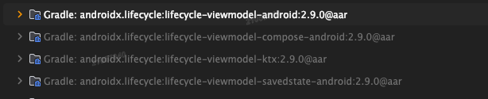
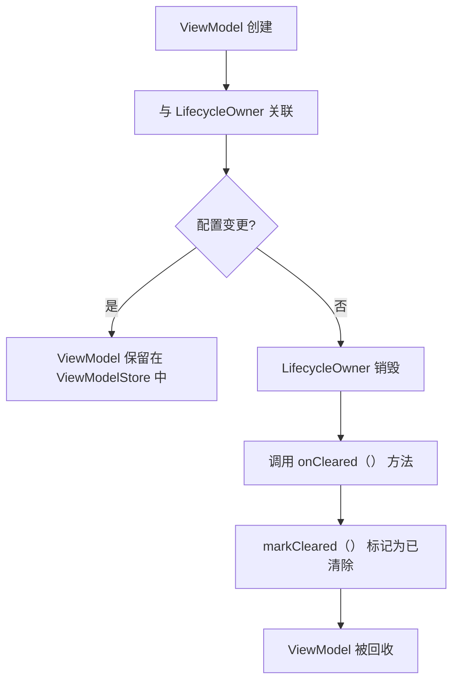
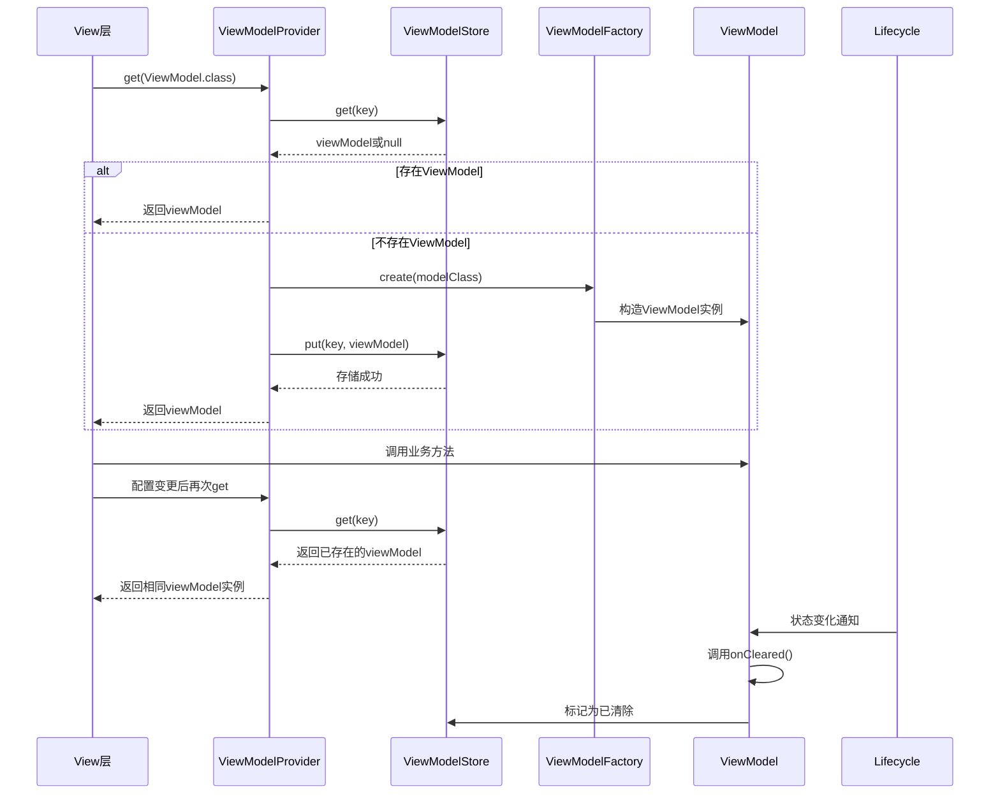
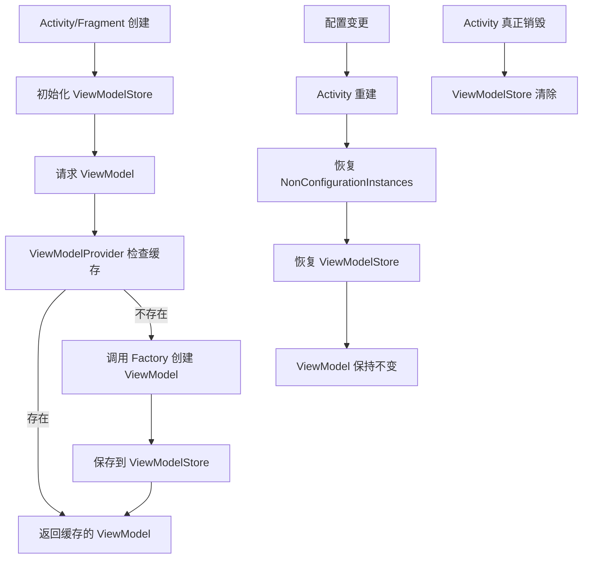

# 源码级解读 Android ViewModel

本文AI统计的是旧版本（源码有些完全不对，不要关注源码，只看设计理念，每个类的作用），新版本viewmodel完全不一样。仅供参考，明白其中的设计理念：创建、缓存、生命周期绑定
>没研究明白，写完项目再重新结合真正的源码学习一遍 - 2025/6/17 记录



- compose有专门的处理代码

[TOC]

## 一、ViewModel 核心类结构与生命周期

### 1. ViewModel 类定义与核心方法

```java
public class ViewModel {
    // 存储 ViewModel 相关的附加数据
    private final Map<String, Object> mBagOfTags = new HashMap<>();
    // 是否已被销毁的标记
    private boolean mIsCleared = false;
    // 关联的 Lifecycle 对象
    @Nullable
    private LifecycleOwner mLifecycleOwner;

    // 构造函数，允许子类扩展
    public ViewModel() {
    }

    // 获取附加数据
    @SuppressWarnings("unchecked")
    public <T> T getTag(String key) {
        return (T) mBagOfTags.get(key);
    }

    // 设置附加数据
    public <T> T setTag(String key, T value) {
        return mBagOfTags.put(key, value);
    }

    // 当 ViewModel 被销毁时调用，用于释放资源
    protected void onCleared() {
        // 子类可重写此方法
    }

    // 标记 ViewModel 为已清除状态
    void markCleared() {
        mIsCleared = true;
        // 清理附加数据
        mBagOfTags.clear();
    }

    // 检查 ViewModel 是否已被销毁
    public boolean isCleared() {
        return mIsCleared;
    }

    // 关联 LifecycleOwner，用于感知生命周期
    void setLifecycleOwner(@NonNull LifecycleOwner owner) {
        mLifecycleOwner = owner;
        // 当 LifecycleOwner 销毁时，清除 ViewModel
        owner.getLifecycle().addObserver(new LifecycleEventObserver() {
            @Override
            public void onStateChanged(@NonNull LifecycleOwner source,
                    @NonNull Lifecycle.Event event) {
                if (event == Lifecycle.Event.ON_DESTROY) {
                    // 注意：这里不是 Activity 的 ON_DESTROY，而是 Lifecycle 的 ON_DESTROY
                    // 对于 FragmentActivity，其 Lifecycle 的 ON_DESTROY 早于 Activity 的 onDestroy
                    onCleared();
                    source.getLifecycle().removeObserver(this);
                }
            }
        });
    }
}
```

### 2. ViewModel 的生命周期关键点



## 二、ViewModelProvider 与 ViewModelStore 源码解析

### 1. ViewModelProvider 核心实现

```java
public class ViewModelProvider {
    private final Factory mFactory;
    private final ViewModelStore mViewModelStore;

    // 构造函数，接收 ViewModelStore 和 Factory
    public ViewModelProvider(@NonNull ViewModelStoreOwner owner, @NonNull Factory factory) {
        this(owner.getViewModelStore(), factory);
    }

    // 核心构造逻辑
    public ViewModelProvider(@NonNull ViewModelStore store, @NonNull Factory factory) {
        mFactory = factory;
        mViewModelStore = store;
    }

    // 获取 ViewModel 的核心方法
    @NonNull
    @MainThread
    public <T extends ViewModel> T get(@NonNull Class<T> modelClass) {
        String canonicalName = modelClass.getCanonicalName();
        return get(DEFAULT_KEY + canonicalName, modelClass);
    }

    @NonNull
    @MainThread
    public <T extends ViewModel> T get(@NonNull String key, @NonNull Class<T> modelClass) {
        // 从 ViewModelStore 中查找已存在的 ViewModel
        ViewModel viewModel = mViewModelStore.get(key);

        if (modelClass.isInstance(viewModel)) {
            if (mFactory instanceof OnRequeryFactory) {
                ((OnRequeryFactory) mFactory).onRequery(viewModel);
            }
            return (T) viewModel;
        } else {
            // 清理不匹配的 ViewModel（防止内存泄漏）
            if (viewModel != null) {
                // TODO: log a warning
            }
        }

        if (mFactory instanceof KeyedFactory) {
            // 使用 KeyedFactory 创建 ViewModel
            viewModel = ((KeyedFactory) mFactory).create(key, modelClass);
        } else {
            // 使用普通 Factory 创建 ViewModel
            viewModel = mFactory.create(modelClass);
        }
        // 将新创建的 ViewModel 存入 ViewModelStore
        mViewModelStore.put(key, viewModel);
        return (T) viewModel;
    }

    // ViewModelProvider.Factory 接口定义
    public interface Factory {
        @NonNull
        <T extends ViewModel> T create(@NonNull Class<T> modelClass);
    }
}
```

### 2. ViewModelStore 实现原理

```java
public class ViewModelStore {
    private final HashMap<String, ViewModel> mMap = new HashMap<>();

    // 存储 ViewModel
    final void put(String key, ViewModel model) {
        ViewModel oldViewModel = mMap.put(key, model);
        if (oldViewModel != null) {
            oldViewModel.onCleared();
        }
    }

    // 获取 ViewModel
    final ViewModel get(String key) {
        return mMap.get(key);
    }

    // 清理所有 ViewModel
    public final void clear() {
        for (ViewModel vm : mMap.values()) {
            vm.clear(); // 调用 markCleared()
        }
        mMap.clear();
    }
}
```

### 3. ViewModelStoreOwner 与 ViewModelStore 的关联

```java
public interface ViewModelStoreOwner extends LifecycleOwner {
    @NonNull
    ViewModelStore getViewModelStore();
}

// FragmentActivity 中的实现
public class FragmentActivity extends ComponentActivity implements ViewModelStoreOwner {
    private ViewModelStore mViewModelStore;
    
    @NonNull
    @Override
    public ViewModelStore getViewModelStore() {
        if (mViewModelStore == null) {
            // 从 NonConfigurationInstances 中恢复 ViewModelStore
            NonConfigurationInstances nc =
                    (NonConfigurationInstances) getLastNonConfigurationInstance();
            if (nc != null) {
                // 配置变更时，ViewModelStore 会被保存到 NonConfigurationInstances 中
                mViewModelStore = nc.viewModelStore;
            }
            if (mViewModelStore == null) {
                mViewModelStore = new ViewModelStore();
            }
        }
        return mViewModelStore;
    }
    
    // 配置变更时保存 ViewModelStore
    @Nullable
    @Override
    public Object onRetainNonConfigurationInstance() {
        NonConfigurationInstances nc = new NonConfigurationInstances();
        nc.viewModelStore = mViewModelStore;
        return nc;
    }
    
    // 保存 ViewModelStore 的内部类
    private static class NonConfigurationInstances {
        ViewModelStore viewModelStore;
    }
}
```

## 三、ViewModel 与生命周期的集成机制

### 1. ViewModel 如何感知 Lifecycle 状态

```java
// ViewModel 与 Lifecycle 关联的核心逻辑
void setLifecycleOwner(@NonNull LifecycleOwner owner) {
    mLifecycleOwner = owner;
    owner.getLifecycle().addObserver(new LifecycleEventObserver() {
        @Override
        public void onStateChanged(@NonNull LifecycleOwner source,
                @NonNull Lifecycle.Event event) {
            if (event == Lifecycle.Event.ON_DESTROY) {
                // 当 LifecycleOwner 进入 ON_DESTROY 状态时，清理 ViewModel
                onCleared();
                source.getLifecycle().removeObserver(this);
            }
        }
    });
}
```

### 2. LifecycleOwner 的关键实现（以 Fragment 为例）

```java
public class Fragment implements LifecycleOwner {
    private final LifecycleRegistry mLifecycleRegistry = new LifecycleRegistry(this);
    
    @Override
    @NonNull
    public Lifecycle getLifecycle() {
        return mLifecycleRegistry;
    }
    
    // 在 Fragment 的生命周期方法中更新 Lifecycle 状态
    public void onAttach(@NonNull Context context) {
        super.onAttach(context);
        mLifecycleRegistry.handleLifecycleEvent(Lifecycle.Event.ON_ATTACH);
    }
    
    public void onDestroy() {
        super.onDestroy();
        mLifecycleRegistry.handleLifecycleEvent(Lifecycle.Event.ON_DESTROY);
        // Fragment 的 ON_DESTROY 会触发 ViewModel 的清理
    }
}
```

## 四、SavedStateHandle 与 ViewModel 的集成

### 1. SavedStateHandle 的核心类

```java
public class SavedStateHandle {
    private final Map<String, Object> mStates = new HashMap<>();
    private final SavedStateRegistry mRegistry;
    private final String mKey;
    private boolean mRestored = false;
    private boolean mHasNeverBeenUsed = true;

    // 构造函数，由 SavedStateViewModelFactory 创建
    SavedStateHandle(SavedStateRegistry registry, String key) {
        mRegistry = registry;
        mKey = key;
        // 注册到 SavedStateRegistry 以保存状态
        mRegistry.registerSavedStateProvider(key, new SavedStateProvider() {
            @NonNull
            @Override
            public Bundle saveState() {
                Bundle bundle = new Bundle();
                for (Map.Entry<String, Object> entry : mStates.entrySet()) {
                    bundle.putAll(convertToBundle(entry.getKey(), entry.getValue()));
                }
                return bundle;
            }
        });
    }

    // 获取保存的状态
    @Nullable
    public <T> T get(@NonNull String key) {
        mHasNeverBeenUsed = false;
        return (T) mStates.get(key);
    }

    // 设置状态
    public void set(@NonNull String key, @Nullable Object value) {
        mHasNeverBeenUsed = false;
        mStates.put(key, value);
    }
}
```

### 2. SavedStateViewModelFactory 实现

```java
public abstract class AbstractSavedStateViewModelFactory extends ViewModelProvider.KeyedFactory {
    private final Application mApplication;
    private final Bundle mDefaultArgs;
    private final SavedStateRegistryOwner mOwner;

    public AbstractSavedStateViewModelFactory(
            @NonNull Application application,
            @Nullable SavedStateRegistryOwner owner,
            @Nullable Bundle defaultArgs) {
        mApplication = application;
        mOwner = owner;
        mDefaultArgs = defaultArgs;
    }

    @NonNull
    @Override
    public <T extends ViewModel> T create(@NonNull String key, @NonNull Class<T> modelClass) {
        // 解析出 SavedStateHandle 的 key
        String[] split = key.split(":\\d+:\\d+:", 2);
        String name = split[0];
        // 创建 SavedStateHandle
        SavedStateHandle handle = createSavedStateHandle(name);
        // 调用重载的 create 方法，传递 SavedStateHandle
        return create(modelClass, handle, mDefaultArgs);
    }

    protected abstract <T extends ViewModel> T create(
            @NonNull Class<T> modelClass,
            @NonNull SavedStateHandle handle,
            @Nullable Bundle defaultArgs);

    private SavedStateHandle createSavedStateHandle(String name) {
        if (mOwner == null) {
            return new SavedStateHandle(SavedStateRegistry.createEmpty(), name);
        }
        return new SavedStateHandle(mOwner.getSavedStateRegistry(), name);
    }
}
```

## 五、ViewModel 内存泄漏预防机制

### 1. ViewModel 对 Activity 的引用方式

```java
// ViewModel 中绝不直接持有 Activity 引用
class UserViewModel extends ViewModel {
    private final Context mContext; // 正确：使用 Application Context
    
    public UserViewModel(@NonNull Application application) {
        mContext = application; // 持有 Application 上下文，而非 Activity
    }
}

// 错误示例（可能导致内存泄漏）
class BadViewModel extends ViewModel {
    private final Activity mActivity; // 错误：持有 Activity 引用
    
    public BadViewModel(@NonNull Activity activity) {
        mActivity = activity;
    }
}
```

### 2. ViewModelStore 的生命周期管理

```java
// ViewModelStore 在 Activity 销毁时的清理逻辑
public class ViewModelStore {
    public final void clear() {
        for (ViewModel vm : mMap.values()) {
            vm.clear(); // 调用 markCleared()
        }
        mMap.clear();
    }
}

// ViewModel 的 clear 方法
public class ViewModel {
    void clear() {
        markCleared();
        onCleared();
    }
}
```

## 六、ViewModel 与依赖注入框架的集成原理

### 1. Hilt 生成 ViewModelFactory 的原理

```java
// Hilt 自动生成的 ViewModelFactory 简化示意
class HiltViewModelFactory implements ViewModelProvider.Factory {
    private final ApplicationComponent mComponent;
    
    public HiltViewModelFactory(ApplicationComponent component) {
        mComponent = component;
    }
    
    @Override
    public <T extends ViewModel> T create(Class<T> modelClass) {
        // 解析 ViewModel 的注解 @HiltViewModel
        // 通过 Hilt 组件获取依赖
        return mComponent.injectViewModel(modelClass);
    }
}
```

### 2. Dagger 手动注入 ViewModel

```java
// Dagger 模块配置
@Module
public abstract class ViewModelModule {
    @Binds
    @IntoMap
    @ViewModelKey(HomeViewModel.class)
    abstract ViewModel bindHomeViewModel(HomeViewModel homeViewModel);
    
    // ViewModelKey 实现
    @Target({ElementType.METHOD})
    @Retention(RetentionPolicy.RUNTIME)
    @MapKey
    public @interface ViewModelKey {
        Class<? extends ViewModel> value();
    }
}

// ViewModelFactory 实现
class DaggerViewModelFactory implements ViewModelProvider.Factory {
    private final Map<Class<? extends ViewModel>, Provider<ViewModel>> mCreators;
    
    public DaggerViewModelFactory(Map<Class<? extends ViewModel>, Provider<ViewModel>> creators) {
        mCreators = creators;
    }
    
    @SuppressWarnings("unchecked")
    @Override
    public <T extends ViewModel> T create(Class<T> modelClass) {
        Provider<ViewModel> creator = mCreators.get(modelClass);
        if (creator == null) {
            for (Map.Entry<Class<? extends ViewModel>, Provider<ViewModel>> entry : mCreators.entrySet()) {
                if (modelClass.isAssignableFrom(entry.getKey())) {
                    creator = entry.getValue();
                    break;
                }
            }
        }
        if (creator == null) {
            throw new IllegalArgumentException("Unknown model class " + modelClass);
        }
        try {
            return (T) creator.get();
        } catch (Exception e) {
            throw new RuntimeException(e);
        }
    }
}
```

## 七、ViewModel 源码核心流程图



## 八、ViewModel 源码级最佳实践

1. **正确处理资源释放**

```java
class ImageViewModel extends ViewModel {
    private final BitmapLoader mLoader;
    private Bitmap mCurrentBitmap;
    
    public ImageViewModel(BitmapLoader loader) {
        mLoader = loader;
    }
    
    @Override
    protected void onCleared() {
        super.onCleared();
        // 释放 bitmap 资源
        if (mCurrentBitmap != null && !mCurrentBitmap.isRecycled()) {
            mCurrentBitmap.recycle();
        }
        // 取消正在进行的加载任务
        mLoader.cancel();
    }
}
```

2. **使用 Application Context**

```java
class ContextAwareViewModel extends ViewModel {
    private final Context mContext;
    
    // 注入 Application Context
    public ContextAwareViewModel(@NonNull Application application) {
        mContext = application;
    }
    
    void doWork() {
        // 使用 mContext 而非 Activity 上下文
        SharedPreferences prefs = mContext.getSharedPreferences("app", Context.MODE_PRIVATE);
        // ...
    }
}
```

3. **结合 Kotlin 扩展函数简化使用**

```kotlin
// ViewModelProvider 扩展函数
inline fun <reified T : ViewModel> ViewModelProvider.get(): T = get(T::class.java)

// 在 Fragment 中使用
val viewModel: UserViewModel by viewModels()
```

通过深入理解 ViewModel 的源码实现，我们可以更好地掌握其生命周期管理、状态保存和依赖注入机制，从而在实际开发中写出更健壮、可维护的代码。ViewModel 作为 MVVM 架构的核心组件，其设计思想（如生命周期感知、配置变更状态保持）对 Android 应用架构设计具有重要参考价值。### Android ViewModel 源码级深度解析

### 一、ViewModel 核心设计思想

ViewModel 的核心目标是在配置变更（如屏幕旋转）期间保留数据，同时遵循 Android 组件生命周期。其设计基于以下原则：

1. **生命周期感知**：ViewModel 的生命周期与宿主组件（Activity/Fragment）的生命周期分离
2. **数据保留**：配置变更时自动保留数据，无需手动处理
3. **解耦视图逻辑**：将视图逻辑从 Activity/Fragment 中分离，提高可测试性

### 二、ViewModel 源码结构概览

ViewModel 框架主要由以下核心类组成：

1. **ViewModel 基类**：所有 ViewModel 的父类
2. **ViewModelStore**：存储 ViewModel 实例的容器
3. **ViewModelProvider**：负责创建和获取 ViewModel 实例
4. **ViewModelProvider.Factory**：创建 ViewModel 的工厂接口
5. **SavedStateHandle**：管理 ViewModel 状态的持久化

### 三、ViewModel 生命周期管理机制

#### 1. 生命周期绑定原理

ViewModel 的生命周期由 `ViewModelStore` 管理，而 `ViewModelStore` 的生命周期与宿主组件关联：

```java
// ComponentActivity.java
public class ComponentActivity extends androidx.core.app.ComponentActivity implements
        ContextAware,
        LifecycleOwner,
        ViewModelStoreOwner,
        SavedStateRegistryOwner,
        OnBackPressedDispatcherOwner {
    
    private ViewModelStore mViewModelStore;
    
    @Override
    protected void onCreate(@Nullable Bundle savedInstanceState) {
        super.onCreate(savedInstanceState);
        // 初始化 ViewModelStore
        mViewModelStore = new ViewModelStore();
    }
    
    @Override
    public ViewModelStore getViewModelStore() {
        if (getApplication() == null) {
            throw new IllegalStateException("Your activity is not yet attached to the "
                    + "Application instance. You can't request ViewModel before onCreate call.");
        }
        return mViewModelStore;
    }
    
    @Override
    protected void onDestroy() {
        super.onDestroy();
        if (!isChangingConfigurations()) {
            // 非配置变更导致的销毁，清除 ViewModelStore
            mViewModelStore.clear();
        }
    }
}
```

#### 2. 配置变更时的实例保留

当发生配置变更（如屏幕旋转）时，Activity 会被销毁重建，但 `ViewModelStore` 会被保留：

```java
// NonConfigurationInstances.java
static final class NonConfigurationInstances {
    Object custom;
    ViewModelStore viewModelStore;
    FragmentManagerNonConfig fragments;
}

// ComponentActivity.java
@Override
protected void onCreate(@Nullable Bundle savedInstanceState) {
    // 从 NonConfigurationInstances 中恢复 ViewModelStore
    NonConfigurationInstances nc =
            (NonConfigurationInstances) getLastNonConfigurationInstance();
    if (nc != null && nc.viewModelStore != null) {
        if (mViewModelStore == null) {
            mViewModelStore = nc.viewModelStore;
        }
    }
}

@Override
public final Object onRetainNonConfigurationInstance() {
    // 保留 ViewModelStore 实例
    Object custom = onRetainCustomNonConfigurationInstance();
    
    ViewModelStore viewModelStore = mViewModelStore;
    if (viewModelStore == null) {
        // 尝试从 FragmentManager 获取
        NonConfigurationInstances nc =
                (NonConfigurationInstances) getLastNonConfigurationInstance();
        if (nc != null) {
            viewModelStore = nc.viewModelStore;
        }
    }
    
    if (viewModelStore == null && custom == null) {
        return null;
    }
    
    NonConfigurationInstances nci = new NonConfigurationInstances();
    nci.custom = custom;
    nci.viewModelStore = viewModelStore;
    return nci;
}
```

### 四、ViewModelProvider 工作原理

#### 1. ViewModelProvider 核心流程

```java
// ViewModelProvider.java
public class ViewModelProvider {
    private final Factory mFactory;
    private final ViewModelStore mViewModelStore;
    
    public <T extends ViewModel> T get(@NonNull Class<T> modelClass) {
        String canonicalName = modelClass.getCanonicalName();
        if (canonicalName == null) {
            throw new IllegalArgumentException("Local and anonymous classes can not be ViewModels");
        }
        return get(DEFAULT_KEY + ":" + canonicalName, modelClass);
    }
    
    @NonNull
    @MainThread
    public <T extends ViewModel> T get(@NonNull String key, @NonNull Class<T> modelClass) {
        // 从 ViewModelStore 中获取
        ViewModel viewModel = mViewModelStore.get(key);
        
        if (modelClass.isInstance(viewModel)) {
            if (mFactory instanceof OnRequeryFactory) {
                ((OnRequeryFactory) mFactory).onRequery(viewModel);
            }
            return (T) viewModel;
        } else {
            //noinspection StatementWithEmptyBody
            if (viewModel != null) {
                // TODO: log a warning.
            }
        }
        
        // 如果不存在，则创建新的 ViewModel 实例
        if (mFactory instanceof KeyedFactory) {
            viewModel = ((KeyedFactory) mFactory).create(key, modelClass);
        } else {
            viewModel = mFactory.create(modelClass);
        }
        
        // 存储到 ViewModelStore
        mViewModelStore.put(key, viewModel);
        return (T) viewModel;
    }
}
```

#### 2. 工厂模式实现

ViewModel 的创建由 `Factory` 接口控制：

```java
// ViewModelProvider.Factory.java
public interface Factory {
    @NonNull
    <T extends ViewModel> T create(@NonNull Class<T> modelClass);
}

// 示例：AndroidViewModelFactory 实现
public static class AndroidViewModelFactory extends ViewModelProvider.NewInstanceFactory {
    private static AndroidViewModelFactory sInstance;
    
    @NonNull
    public static AndroidViewModelFactory getInstance(@NonNull Application application) {
        if (sInstance == null) {
            sInstance = new AndroidViewModelFactory(application);
        }
        return sInstance;
    }
    
    private final Application mApplication;
    
    public AndroidViewModelFactory(@NonNull Application application) {
        mApplication = application;
    }
    
    @NonNull
    @Override
    public <T extends ViewModel> T create(@NonNull Class<T> modelClass) {
        if (AndroidViewModel.class.isAssignableFrom(modelClass)) {
            // 特殊处理 AndroidViewModel，传递 Application 实例
            try {
                return modelClass.getConstructor(Application.class).newInstance(mApplication);
            } catch (NoSuchMethodException e) {
                throw new RuntimeException("Cannot create an instance of " + modelClass, e);
            } catch (IllegalAccessException e) {
                throw new RuntimeException("Cannot create an instance of " + modelClass, e);
            } catch (InstantiationException e) {
                throw new RuntimeException("Cannot create an instance of " + modelClass, e);
            } catch (InvocationTargetException e) {
                throw new RuntimeException("Cannot create an instance of " + modelClass, e);
            }
        }
        // 普通 ViewModel 使用默认构造函数
        return super.create(modelClass);
    }
}
```

### 五、SavedStateHandle 实现原理

#### 1. SavedStateRegistry 机制

`SavedStateHandle` 依赖于 `SavedStateRegistry` 实现状态持久化：

```java
// SavedStateRegistry.java
public final class SavedStateRegistry {
    private static final String SAVED_COMPONENTS_KEY =
            "androidx.lifecycle.ViewModelProvider.SaveStateProvider.key";
    
    private SafeIterableMap<String, SavedStateProvider> mComponents =
            new SafeIterableMap<>();
    
    // 注册状态提供者
    public void registerSavedStateProvider(@NonNull String key,
            @NonNull SavedStateProvider provider) {
        SavedStateProvider previous = mComponents.putIfAbsent(key, provider);
        if (previous != null) {
            throw new IllegalArgumentException("SavedStateProvider with the given key is already registered");
        }
    }
    
    // 保存状态
    @NonNull
    Bundle performSave(@NonNull Bundle outBundle) {
        Bundle components = new Bundle();
        for (Map.Entry<String, SavedStateProvider> entry : mComponents) {
            components.putBundle(entry.getKey(), entry.getValue().saveState());
        }
        if (!components.isEmpty()) {
            outBundle.putBundle(SAVED_COMPONENTS_KEY, components);
        }
        return outBundle;
    }
}
```

#### 2. SavedStateHandle 与 ViewModel 的集成

```java
// SavedStateViewModelFactory.java
public final class SavedStateViewModelFactory extends ViewModelProvider.KeyedFactory {
    private final Application mApplication;
    private final SavedStateRegistry mSavedStateRegistry;
    private final Bundle mDefaultArgs;
    
    @NonNull
    @Override
    public <T extends ViewModel> T create(@NonNull String key, @NonNull Class<T> modelClass) {
        boolean isAndroidViewModel = AndroidViewModel.class.isAssignableFrom(modelClass);
        Constructor<T> constructor;
        
        // 查找合适的构造函数
        if (isAndroidViewModel) {
            constructor = findMatchingConstructor(modelClass, ANDROID_VIEW_MODEL_SIGNATURE);
        } else {
            constructor = findMatchingConstructor(modelClass, VIEW_MODEL_SIGNATURE);
        }
        
        // 创建 SavedStateHandle
        SavedStateHandleController controller = SavedStateHandleController.create(
                mSavedStateRegistry, mLifecycle, key, mDefaultArgs);
        
        try {
            T viewmodel;
            if (isAndroidViewModel) {
                viewmodel = constructor.newInstance(mApplication, controller.getHandle());
            } else {
                viewmodel = constructor.newInstance(controller.getHandle());
            }
            viewmodel.setTagIfAbsent(TAG_SAVED_STATE_HANDLE_CONTROLLER, controller);
            return viewmodel;
        } catch (IllegalAccessException e) {
            throw new RuntimeException("Failed to access " + modelClass, e);
        } catch (InstantiationException e) {
            throw new RuntimeException("A " + modelClass + " cannot be instantiated.", e);
        } catch (InvocationTargetException e) {
            throw new RuntimeException("An exception happened in constructor of "
                    + modelClass, e.getCause());
        }
    }
}
```

### 六、ViewModel 与 Compose 的集成

在 Jetpack Compose 中，ViewModel 通过 `ViewModelKt` 扩展函数提供支持：

```kotlin
// ViewModelKt.kt
@Composable
@NonNull
public inline fun <reified VM : ViewModel> viewModel(
    key: String? = null,
    factory: ViewModelProvider.Factory? = null,
    viewModelStoreOwner: ViewModelStoreOwner = checkNotNull(LocalViewModelStoreOwner.current) {
        "No ViewModelStoreOwner was provided via LocalViewModelStoreOwner"
    }
): VM {
    val store = viewModelStoreOwner.viewModelStore
    return if (factory != null) {
        if (key != null) {
            viewModel(store, key, factory)
        } else {
            viewModel(store, factory)
        }
    } else {
        if (key != null) {
            viewModel(store, key)
        } else {
            viewModel(store)
        }
    }
}
```

### 七、ViewModel 工作流程图



### 八、关键源码总结

1. **生命周期管理**：
   - 通过 `NonConfigurationInstances` 在配置变更时保留 ViewModelStore
   - 非配置变更销毁时才清除 ViewModel

2. **创建机制**：
   - 工厂模式实现 ViewModel 的参数化创建
   - 支持默认构造函数和带参数构造函数

3. **状态持久化**：
   - 通过 SavedStateRegistry 和 SavedStateHandle 实现状态保存与恢复
   - 自动处理 Bundle 数据的读写

4. **线程安全**：
   - ViewModelStore 使用 ConcurrentHashMap 存储实例，确保线程安全

通过源码分析，可以看出 ViewModel 设计的精妙之处在于将生命周期管理、依赖注入和状态持久化有机结合，为 Android 开发者提供了一个强大而简洁的架构组件。
