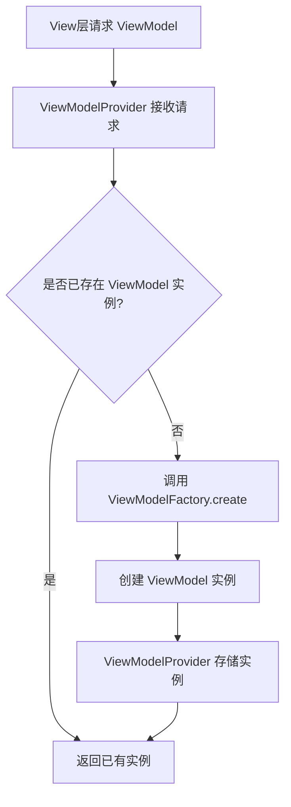

# Android ViewModelFactory 详解

## 一、ViewModelFactory 基本概念

### 1. 什么是 ViewModelFactory

`ViewModelFactory` 是 Jetpack ViewModel 组件中的一个接口，全称为 `ViewModelProvider.Factory`。它的核心作用是：

- 负责创建 `ViewModel` 实例
- 允许在创建 ViewModel 时传递参数
- 是实现 ViewModel 依赖注入的关键组件

### 2. 为什么需要 ViewModelFactory

- **参数传递需求**：当 ViewModel 需要构造参数（如数据库实例、网络服务）时，无法直接通过默认构造函数创建，需通过工厂传递
- **依赖管理**：实现依赖注入，解耦 ViewModel 与具体依赖的创建逻辑
- **生命周期管理**：配合 `ViewModelProvider` 确保 ViewModel 在配置变更（如屏幕旋转）时保持实例

### 3. 核心接口定义

```kotlin
interface Factory {
    fun <T : ViewModel> create(modelClass: Class<T>): T
}
```

## 二、ViewModelFactory 实现方式

### 1. 基础实现（手动传递参数）

```kotlin
class UserViewModel(
    private val userId: String,
    private val userRepository: UserRepository
) : ViewModel() {
    // ViewModel 逻辑...
}

// 实现 ViewModelProvider.Factory
class UserViewModelFactory(
    private val userId: String,
    private val userRepository: UserRepository
) : ViewModelProvider.Factory {
    @Suppress("UNCHECKED_CAST")
    override fun <T : ViewModel> create(modelClass: Class<T>): T {
        if (modelClass.isAssignableFrom(UserViewModel::class.java)) {
            return UserViewModel(userId, userRepository) as T
        }
        throw IllegalArgumentException("Unknown ViewModel class")
    }
}

// 使用方式
val factory = UserViewModelFactory("user123", userRepository)
val viewModel = ViewModelProvider(activity, factory).get(UserViewModel::class.java)
```

### 2. 带 SavedStateHandle 的工厂（与导航组件结合）

```kotlin
class ProfileViewModel(
    savedStateHandle: SavedStateHandle,
    private val userRepository: UserRepository
) : ViewModel() {
    private val userId = savedStateHandle.get<String>("userId") ?: ""
    // 基于 userId 加载数据...
}

// 集成 SavedStateViewModelFactory
class ProfileViewModelFactory(
    private val userRepository: UserRepository,
    private val defaultArgs: Bundle? = null
) : AbstractSavedStateViewModelFactory(activity as Application, null) {
    
    override fun <T : ViewModel> create(
        key: String,
        modelClass: Class<T>,
        handle: SavedStateHandle
    ): T {
        if (modelClass.isAssignableFrom(ProfileViewModel::class.java)) {
            // 从 SavedStateHandle 中获取参数
            defaultArgs?.let { handle.setArguments(it) }
            return ProfileViewModel(handle, userRepository) as T
        }
        throw IllegalArgumentException("Unknown ViewModel class")
    }
}

// 与 Navigation 组件结合使用
val navController = rememberNavController()
val viewModel by navController.currentBackStackEntryAsState().let { entry ->
    ViewModelProvider(
        entry!!.viewModelStore,
        ProfileViewModelFactory(userRepository, entry.arguments)
    ).get(ProfileViewModel::class.java)
}
```

### 3. Kotlin 扩展函数简化实现

```kotlin
// 扩展函数实现通用工厂
inline fun <reified T : ViewModel> ViewModelProvider.Factory.create(): T =
    create(T::class.java)

// 使用示例
val viewModel = ViewModelProvider(activity, factory).create<UserViewModel>()
```

## 三、ViewModelFactory 与依赖注入框架

### 1. 结合 Dagger Hilt

Hilt 会自动生成 ViewModelFactory，无需手动实现：

```kotlin
@HiltViewModel
class HomeViewModel @Inject constructor(
    private val postRepository: PostRepository
) : ViewModel()

// 在 Activity/Fragment 中直接获取
val viewModel: HomeViewModel by viewModels()
```

### 2. 结合 Koin

```kotlin
// 在 Module 中定义 ViewModel 依赖
val appModule = module {
    factory { UserRepository(get()) }
    viewModel { (userId: String) -> UserViewModel(userId, get()) }
}

// 在 Activity 中获取
val viewModel: UserViewModel by viewModel { "user123" }
```

## 四、最佳实践与注意事项

### 1. 避免 Activity/Fragment 上下文泄漏

- 正确做法：传递 Application 上下文而非 Activity 上下文
- 错误示例（可能导致内存泄漏）：

  ```kotlin
  class BadViewModel(activity: Activity) : ViewModel() // 错误，持有 Activity 引用
  ```

### 2. 线程安全

- 工厂方法应保证线程安全，尤其是在多线程环境中创建 ViewModel 时
- 推荐使用单例模式管理依赖实例

### 3. 与 Compose 结合使用

在 Compose 中，通过 `rememberViewModel` 或 `viewModel()` 扩展函数配合工厂：

```kotlin
@Composable
fun UserScreen(userId: String) {
    val userRepository = remember { UserRepository() }
    // 传递参数到 ViewModelFactory
    val viewModel: UserViewModel by viewModel(
        factory = UserViewModelFactory(userId, userRepository)
    )
    // ...
}
```

### 4. 配置变更时的状态保持

ViewModelFactory 配合 `ViewModelProvider` 可确保：

- 屏幕旋转等配置变更时 ViewModel 实例不重建
- 数据无需重新加载，提升用户体验

## 五、ViewModelFactory 工作流程图



## 六、常见问题与解决方案

### 1. "Cannot create an instance of class ViewModel" 错误

- 原因：未正确实现 ViewModelFactory，或缺少构造函数参数
- 解决方案：确保 Factory 正确处理 ViewModel 的构造参数，如使用 `@HiltViewModel` 配合依赖注入

### 2. ViewModel 中如何获取导航参数？

- 方案：通过 `SavedStateHandle`，需在 Factory 中传递 `SavedStateHandle`
- 示例：

  ```kotlin
  class DetailViewModel(
      savedStateHandle: SavedStateHandle,
      private val dataRepository: DataRepository
  ) : ViewModel() {
      private val itemId = savedStateHandle.get<String>("itemId")!!
      // ...
  }
  ```

### 3. 多个 ViewModel 共享依赖时的优化

- 方案：使用依赖注入框架（如 Hilt）管理单例依赖
- 优势：避免重复创建依赖实例，减少内存占用

通过合理使用 ViewModelFactory，可实现 ViewModel 的参数化创建、依赖管理和生命周期管理，是构建可维护、可测试 Android 应用的重要环节。在实际开发中，建议结合依赖注入框架（如 Hilt）简化工厂实现，提升开发效率。
