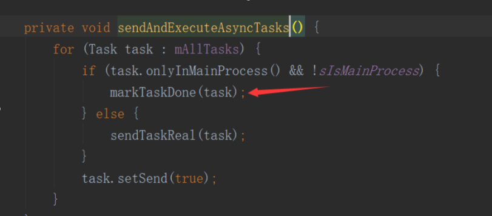

# 1-6学习问题解决自助手册

## 问题1：关于自建APM的面试题

在我经历的项目中，项目是趋于稳定运营阶段了，但是用户量不大，也就上万日活量，没有自建过APM，在面试中应该怎么说呢？

答：

1. 坦白说上万的日活量其实非常低了，面试过程中可以多说点，不然是个劣势，这个数量级多报点也不会细究的。
2. 可以持续学习我在课程中讲解的性能优化技术及APM建设方案，面试过程中你可以说自己在项目中做过性能优化相关工作或者是设计过APM，只要你吸收了课程中的技术点，能讲出来具体的优化案例，能让面试官感受到你的深度和广度属于同等水平的佼佼者面试通过的几率就大大增加。所以不用纠结于自己项目中没做过。

## 问题 2：关于性能优化之启动优化问题

在intentService初始化时，进入主界面，需要用到某个第三方的框架，但是这个框架还没有初始化完成，比如：第三方的网络请求框架，在intentService进行初始化，进入主界面，或者闪屏界面就要网络请求，没有初始化完成可能会出现崩溃的现象，这个问题怎么解决？

答：

这种场景下网络请求框架就是一个必须完成的Task，需要保证主界面打开前网络库必须在初始化完成。你可以在IntentService里加一个CountDownLatch，在主界面调用网络库之前await一下。这样可以解决，不过还是不够优雅！

## 问题3：如果运行项目时，崩溃，提示ThreadGroup.getName()空引用，怎么解决？

答：

这个应该是Hook框架有兼容性问题，在PerformanceApp类的attachBaseContext方法中，把这块代码DexposedBridge.hookAllConstructors 注释掉即可。

## 问题4：是否应该是列表最后一条数据而不是第一条绘制完成才应该算作真正的启动完成？

答:

这个看你具体怎么衡量这个指标了，我觉得最后一条有点过于苛刻。因为第一条要展示用户就能马上看到真实的界面了。当然这个是个开放性的，选一个项目组认可的方式就可以了。

## 问题5： 如果界面不是一个列表，而是一个没有列表的界面，那么是否应该监听最外面的布局来判断是否已经显示出来了呢？

答：

这个需要根据实际情况来判断，实际情况是根据数据返回会有所变化的这个布局来判断。

## 问题6：请问下this time 和 total time有什么区别呢？

因为这个命令似乎只能打开main activity,这样 this 和 total 指的都是main activity 的启动时间。什么情况下这两个参数会有差别

答：

1.比如App还有个Splash的时候就会有差别
2.这个命令可以打开别的，不过要在清单文件中配置Activity的export=true，应用的主Activity没有这个限制。

## 问题7：在com.optimize.performance看不到App.trace文件是怎么回事？


答：

可以先确认下路径：sdcard/Android/data/包名/files下是否有

## 问题8：demo运行报错怎么解决，Log如下

```txt
java.lang.UnsatisfiedLinkError: No implementation found for long me.weishu.epic.art.EpicNative.getMethodAddress(java.lang.reflect.Member) (tried Java_me_weishu_epic_art_EpicNative_getMethodAddress and Java_me_weishu_epic_art_EpicNative_getMethodAddress__Ljava_lang_reflect_Member_2)
at me.weishu.epic.art.EpicNative.getMethodAddress(Native Method)
at me.weishu.epic.art.method.ArtMethod.init(ArtMethod.java:96)
at me.weishu.epic.art.method.ArtMethod.(ArtMethod.java:83)
at me.weishu.epic.art.method.ArtMethod.of(ArtMethod.java:109)
at me.weishu.epic.art.Epic.hookMethod(Epic.java:83)
at com.taobao.android.dexposed.DexposedBridge.hookMethod(DexposedBridge.java:129)
at com.taobao.android.dexposed.DexposedBridge.hookAllConstructors(DexposedBridge.java:203)
at com.optimize.performance.PerformanceApp.attachBaseContext(PerformanceApp.java:88)
at android.app.Application.attach(Application.java:189)
at android.app.Instrumentation.newApplication(Instrumentation.java:1103)
at android.app.Instrumentation.newApplication(Instrumentation.java:1087)
at android.app.LoadedApk.makeApplication(LoadedApk.java:983)
at android.app.ActivityThread.handleBindApplication(ActivityThread.java:5715)
at android.app.ActivityThread.-wrap1(Unknown Source:0)
at android.app.ActivityThreadH.handleMessage(ActivityThread.java:1656)atandroid.os.Handler.dispatchMessage(Handler.java:106)atandroid.os.Looper.loop(Looper.java:164)atandroid.app.ActivityThread.main(ActivityThread.java:6494)atjava.lang.reflect.Method.invoke(NativeMethod)atcom.android.internal.os.RuntimeInitH.handleMessage(ActivityThread.java:1656) at android.os.Handler.dispatchMessage(Handler.java:106) at android.os.Looper.loop(Looper.java:164) at android.app.ActivityThread.main(ActivityThread.java:6494) at java.lang.reflect.Method.invoke(Native Method) at com.android.internal.os.RuntimeInitH.handleMessage(ActivityThread.java:1656)atandroid.os.Handler.dispatchMessage(Handler.java:106)atandroid.os.Looper.loop(Looper.java:164)atandroid.app.ActivityThread.main(ActivityThread.java:6494)atjava.lang.reflect.Method.invoke(NativeMethod)atcom.android.internal.os.RuntimeInitMethodAndArgsCaller.run(RuntimeInit.java:438)
at com.android.internal.os.ZygoteInit.main(ZygoteInit.java:807)
```

答：

应该是epic的兼容性问题，你把PerformanceApp类中的attachBaseContext方法DexposedBridge这个函数先注释掉试下。

## 问题9：Demo工程运行报错

```txt
Cause: tried to access method com.google.common.io.Files.fileTreeTraverser()Lcom/google/common/collect/TreeTraverser; from class me.ele.lancet.plugin.internal.context.DirectoryContentProvider
```

昨天Demo是可以正常运行的，今天更新了AndroidStudio到3.3，运行时报这个错误。
在工程中搜索不到TreeTraverser和DirectoryContentProvider。

```txt
API ‘variant.getJavaCompiler()’ is obsolete and has been replaced with ‘variant.getJavaCompileProvider()’.
```

编译时有这个警告，在工程同样也搜不到getJavaCompiler和javaCompiler。

答：

看样子是lancet对gradle新版本的适配问题，建议用你之前的那个AS来运行！

## 问题10：启动器里面的代码能细化讲下吗？



答：

这个的意思是如果这个任务是只是在主进程中执行，并且此时不是主进程那就直接标记这个任务已经执行完成了。`onlyInMainProcess()`是仅在主进程的意思

## 问题11：延迟初始化问题

我在想延迟初始化，是不是也要保证一定要初始化，只是在启动时可能用不到，才会选择延迟。视频中是放在第一个条目展现出来的时候做的初始化，真实项目中是不是还要在网络失败的时候，判断是否初始化，如果没有，还要再初始化一遍。

答：

你说的非常对！因为课程时间有限，不会把所有的异常情况都包含进来。
我们的做法是这样的两个条件下会执行：

1. Feed显示了会执行延迟初始化，这种是正常情况
2. Feed的显示没执行、超时了，也会执行延迟初始化
3. 1与2只会执行其一

## 问题12： IdleHandler用来做初始化这种耗时任务是否合适？

IdleHandler执行条件：当消息队列为空以及即将要执行的任务在当前时间之后
其执行条件很宽松，只是检查当前时刻的状态，哪怕1ms之后有主任务要执行，IdleHandler也会被先执行。也就是说IdleHandler只是当当前时刻空闲就会被执行，并不代表接下来有较长的一段时间是空闲的。
所以如果使用IdleHandler来执行这种耗时的初始化操作，比如视频中的JPush耗时500ms，那么接下来的500ms就会造成真实的UI交互卡顿。

**我的问题**是使用IdleHandler是否很容易造成得不偿失的后果？这是我猜测的情况，并没有大量数据支持我这个说法，请老师答疑。

答：

- 首先你的理解很正确：当前时刻空闲就会被执行！但是你可能没理解为什么要用IdleHandler来做延迟初始化。有些任务可能延迟到界面打开之后但是也必须在主线程执行，所以异步在这里无效。使用IdleHandler其实会极大的缓解真实的UI交互卡顿。比如Feed展示之后需要执行10个主线程任务（异步的就不说了，认为对UI线程没影响），每个主线程任务耗时100ms。如果不使用IdleHandler，那这10个任务就要在主线程执行1s，用户如果要是有滑动Feed的操作就需要卡1s了。如果使用IdleHandler：每个间隙执行一个任务，即便是用户有滑动Feed的操作阻塞的时间也是（100减去间隔时间），影响也较小。算这10个任务执行的时间，被阻塞的时间会远小于一次性的1s。

**追问**：这种耗时又必须放在主线程执行的初始化任务，似乎放在Splash页面来做更合适，造成的后果是启动时间会长一点，但如果采用延迟初始化的方案放在Feed页面来做，虽然启动时间短了一点，但很可能会使得用户真实的交互卡顿。

答：

- 这看取舍了，如果Splash页面这次启动不展示广告其实也没时间给UI线程。

## 问题13：CPU锁频的原理和优势我已经听你讲解的挺清楚了，但是有个问题就是，我们具体能怎么控制CPU的频率呢？还有就是，在不考虑耗电量的情况下，不仅仅是启动阶段，我们能否在应用中某些其他需要较多CPU资源的地方也采用这种高频CPU的方案呢？

答：

1. 这个频率只能拉升，没有发现拉升到具体多少的方法；
2. 确实是不考虑电量的情况下耗费CPU的地方都可以拉，一般只在低端机上这么做，比如App启动阶段其实也是会自己拉的，只不过低端机上启动慢，自动拉的时间结束了启动还没完成；

## 问题14：wall Duration 和CPU Duration 为什么IO操作可以发很多，不太理解wall druation时间中都是在执行什么操作，和cpu操作的具体差别

答：

二者的主要区别在于对CPU时间片的消耗。wall druation中包含了cpu duration而且还有IO、锁等导致的等待时间。IO操作因为对CPU的消耗少，比如8核的手机，你如果同时执行50个任务肯定会导致CPU频繁切换，反而降低执行效率，但是IO任务不消耗CPU你执行50个也不会对CPU带来问题！

## 问题15：什么是CI？

答：

CI是持续集成，是一种软件开发实践，通过自动化的构建（包括编译、发布和自动化测试）来验证，从而帮助尽快发现集成错误，一般项目如果比较正规的话都会用到CI。

## 问题16：关于垃圾回收算法效率的疑问

视频中说到标记-清除算法的效率比标记-复制的效率要低一些。我有一点疑问希望老师解答，Java内存回收的标记过程应该是使用的根搜索算法实现的。标记开始时，会先找到多个Root节点，当一个对象没有和Root节点形成任何引用链时，就表示这个对象可以被回收。视频中也说到了，内存中的对象分类三种类型：

1. 未分配的类型
2. 已分配不需要回收的类型
3. 已分配需要回收的类型

不管是哪种回收算法，相信第2和第3这两种类型的总的数量应该是相等的，而内存中未被分配的区域应该不会对根搜索算法的效率造成任何影响。也就是说，对于标记这个过程来说，两种算法所耗的时间应该是一致的。另外，标记-复制算法甚至还比标记-清除算法多了复制这个流程，所以我的结论是，标记-清除算法比标记-复制算法的效率要高。

答：

问题很好，分析也很有逻辑条理，这是个优点，注意在学习过程中继续保持哈！
可能有个注意点你忽略了：标记清除和标记复制两种算法的内存使用量是不一样的，标记清除对应的是几乎全部的内存，标记复制会拿出一半的内存空间出来。

## 问题17：怎么定制线上的LeakCanary？定制的LeakCanary如何监控模块内存占用情况？

答：

定制LeakCanary最主要的就是定制haha这个组件。
我说下修改haha库的原始流程：

1. 在过程中加上对大对象的分析过程；
2. 然后解决掉将hprof文件映射到内存中的时候可能内存暴涨的问题。

但这个确实是有难度的，建议同学可以先看下haha库的代码，熟悉下原始的流程。然后不懂的可以继续交流。

## 问题18：关于注解call和excution能再详细的解释下吗？ 感觉听起来都是在method执行的时候进行hook的，所以希望能再细分一下

答：

二者实际上并没有使用效果上的明显区别。call是调用的地方，而execution是执行的地方。比如我写了个方法在第100行，但是我调用的地方是在第15行，call就作用于第15行前后，而execution作用于100行前后。但使用效果上是没有差异。

## 问题19：如果直接在工作线程中使用内置的LayoutInflater是否可行？

测试代码如下：

```java
@Override
protected void onCreate(Bundle savedInstanceState)
{
super.onCreate(savedInstanceState);
new Thread(new Runnable()
{
@Override
public void run()
{
final View view =
getLayoutInflater().inflate(R.layout.activity_main, null);
runOnUiThread(new Runnable()
{
@Override
public void run()
{
setContentView(view);
}
});
}
}).start();
}
```

这里先不考虑直接new 一个Thread是否规范，上面的代码我测试过，运行是正常的。这样直接使用内置的LayoutInflater也就不存在兼容性问题了，因为Factory这些都是有的。
当然，多线程并发安全性的问题还是存在。如果非要使用AsyncLayoutInflater，应该也可以直接通过反射将其属性mInflater直接修改为内置的LayoutInflater，其兼容性问题应该就解决了。

答：

这样可以，但是觉得不如AsyncLayoutInflater规范，利用拷贝出来AsyncLayoutInflater的代码修改下（总共200行），这样更通用些。

## 问题20： 如何追踪线上一个很难复现的bug ，可能只在部分机型上出行 面试问到了

答 ：

实际项目中经常会遇到线上用户出现或者反馈的bug（崩溃或者是业务不正常），我们自己由于机型不够或者场景不满足等情况无法复现，这也是一大难题。这里我给大家提供解决这种难题的方案：

1. 收集出现这个问题时刻尽可能全面的信息
    - 崩溃的堆栈信息（如果是Crash的话），问题出现场景的详细信息、截图等
    - 用户的行为操作路径
    - 网络请求全部信息等（数据来源层面）
    - 当前设备信息如：手机版本信息、内存、电量、SD卡大小、是否Root等
    - App纬度：使用时长、发生问题时在前后台、具体使用某个组件的版本等

2. 分析这批用户和正常用户的差别（可能Apk没有差别），针对出现这个问题的这批用户定向推送一个Apk（包含以上采集能力或者尝试修复），提示用户升级安装，然后采集信息验证。
3. 如果我们以上采集的信息还是不能知道bug原因，可以更大规模的采集信息

- 线上问题出现场景Dump内存，然后上报
- 线上问题出现场景使用TraceView捕获所有线程的堆栈等

这两种方式可以知道用户真实环境下的App运行堆栈以及内存中的信息，基本上所有的信息我们都知道了，这样肯定可以分析出来问题原因。

以上我说的方案可以解决“追踪线上一个很难复现的bug”这个难题，但是大家要注意：这个流程还是比较长的，你需要发包给用户才能采集信息，多了一步也就会有用户流失（不配合升级安装），因此这个问题其实还考验了你们App的性能体系化建设成果，如果是建设了完善的性能体系化方案，我们就不需要发包让用户安装了：

- App已经具备了各种全面信息采集的基础能力
- App已经具备了接受远程指令然后执行特定任务的能力
- App已经具备了动态化能力（热修或者是插件化升级模块，动态跳转到临时页面等）

大家可以看到如果我们的App建设了完善的性能体系化方案，对于这种难题的跟踪就不会束手无策！这个也是性能体系化方案的价值所在！

## 问题21：Android 内存泄漏的八种可能，原文

<http://android.jobbole.com/83674/>
