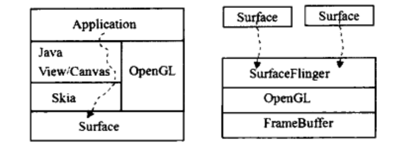

# Surface系统

本章节要学习什么？

答：

1. 明白程序与`Surface`的关系
2. 明白`Surface`与`SurfaceFlinger`的关系

图片展示：

左图是程序向`Surface`传递数据。\
右图是`Surface`模块向`SurfaceFlinger`传递数据，`SurfaceFlinger`会混合数据（`SurfaceFlinger`后面简称`SF`）。

## 目录

1. App程序的启动： 完整描述APP的启动流程包括 Application的启动、Activity的启动。
2.
