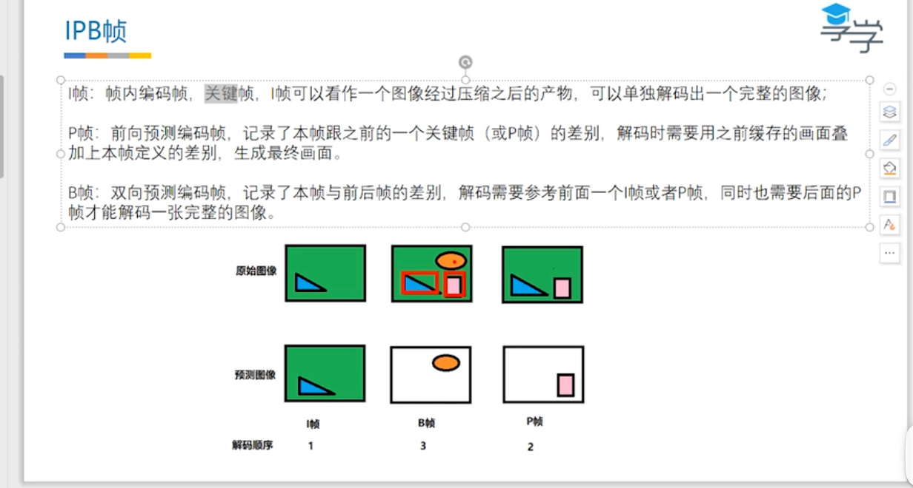
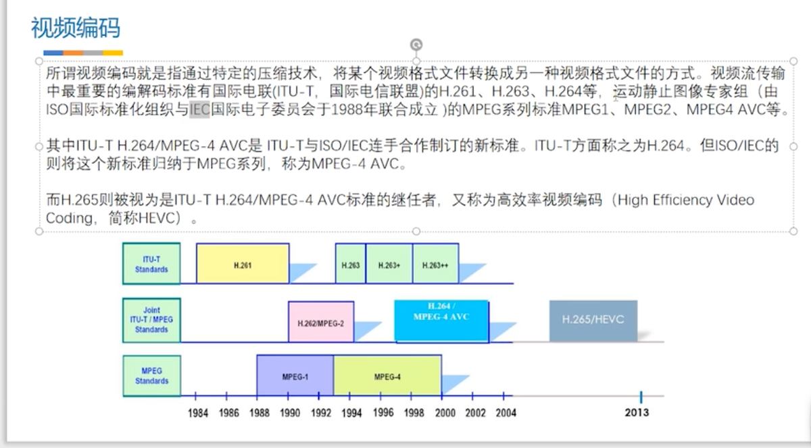

# 视频编码

视频是连续的图像序列，由连续的帧组成，一帧是一幅图像，当帧序列以一定速率播放时，我们看到的就是连续动作的视频。由于连续的图像数据很大，所以需要经过编码进行压缩，降低资源占用，以及加快网络播放的速度。

## IPB帧

[参考视频](https://www.bilibili.com/video/BV1ur4y1L7gu/?p=4&spm_id_from=333.1007.top_right_bar_window_history.content.click&vd_source=3509947f569e04aa5c144447e22d0ceb)

* I帧：关键帧，I帧可独立解码出一个完整图像，两个关键帧间隔叫GOP。同码率下，GOP越大，I间隔越大，表示两个I帧之间的P或B帧越多，细节越完善，画质越好。
* P帧：前向预测编码帧，P帧无法独立解码，其保存一个与前面的I帧或P帧的差异数据，需要结合前面的**I帧**或**P帧**进行解码才可以生成一个完整图像
* B帧：双向预测编码帧，B帧也无法独立解码，其保存一个与前面的I帧或P帧的差异数据，但与P帧区别是，B帧需要结合前面一个**I帧**或**P帧**，同时结合后面的**P帧** 才可以解码生成一个图像

## 编码目的

编码为了压缩，减小视频体积，有利于存储、传输，其核心思想就是 **去除冗余信息**

## 如何编码

减少冗余：

* 空间冗余：图像是由一个个像素点组成，如果某个局部像素点颜色都一样，其实可以使用一个数据规则来表示这个局部的数据，避免每个像素点都去占用数据，造成空间浪费
* 时间冗余：图像序列有相同部分造成的冗余。 可以采用只保留差异位置来去除时间冗余。
* 视觉冗余：人眼不能感知或不敏感的部分信息，这种冗余，可以直接去掉。
* 信息熵冗余：编码实现视频压缩的比特数，总会比理论的比特数多，将这部分多出来的压缩到最小，就是去掉信息熵冗余。（熵：一种热力学概念，是一个比值，代表物理系统的混乱度，熵越小代表越有序，具体百度，我个人也不清晰概念）[熵是什么](https://www.zhihu.com/question/304868952)

## 编码规范

