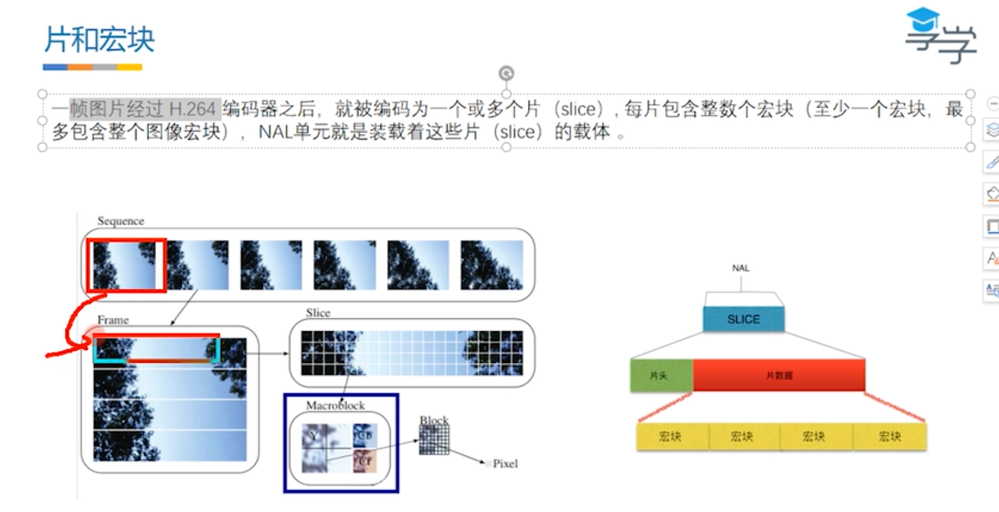

# H.264码流

分为两层：编码层VCL、传输层NAL  
视频传输流程：

## VCL

VCL 视频编码层，是将原图像序列压缩编码生成的数据格式

## NAL

网络提取层 负责以网络所要求的方式对数据进行打包盒传送，是传输层。不管是本地播放还是网络播放，都需要经过这一层，将VCL 打包变为NAL数据格式。就像是bean数据经过序列化转为流才可以传输一样。

## 片和宏块

一个图片可以分成多个片（slice），NAL 是装载这些片的载体，每个片有多个宏块（至少一个）。举例来说就是：一根黄瓜被切片多个，每个切片又被切成不同的小块。

## Annexb格式

一般H.264 编码器默认输出为：起始码+NALU(Nal单元)。  
起始码为：0x00000001 或 0x000001  

* 每个NALU包含 1个字节的Nal Header 与 若干整数字节的负荷数据 EBSP 构成。
* Nal Header占用1字节，此字节低5位表示NALU的类型（可以方便使用类型，进行相应处理）

## 码率和帧率

* 码率：视频码率就是数据传输时单位时间传送的数据位数，一般我们用的单位是kbps即千位每秒
* 帧率：单位时间内帧图像的个数。
