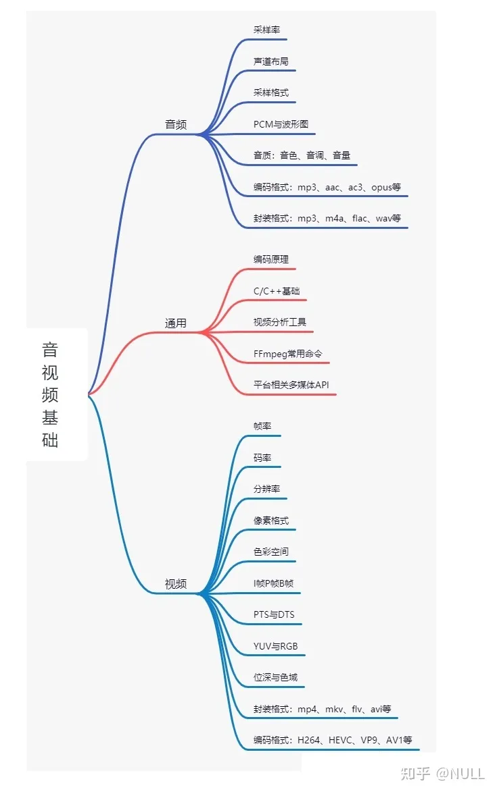
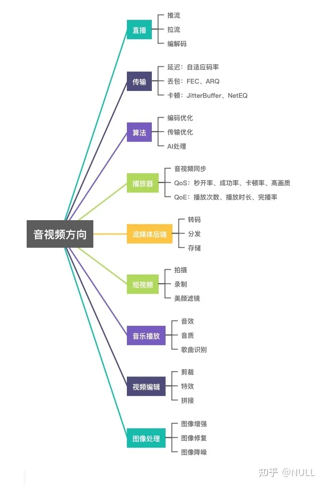

# Android音视频

>我以后不会走音视频路线，只了解了一点内容。

[享学课堂视频资料](https://www.bilibili.com/video/BV1ur4y1L7gu?p=3&vd_source=3509947f569e04aa5c144447e22d0ceb)

[知乎问答：如何学习音视频开发](https://www.zhihu.com/question/325943454)

[音视频码流工具](https://zhuanlan.zhihu.com/p/628124617?utm_id=0)

---

## 知乎大神推荐学习路线及资料

作者：NULL  
链接：https://www.zhihu.com/question/325943454/answer/2371309504  
来源：知乎
著作权归作者所有。商业转载请联系作者获得授权，非商业转载请注明出处。

音视频开发涉及知识面比较广，入门门槛相对较高，这是公认的。网上又信息量爆炸，寻找有用的学习资料很难，容易被带进坑里。音视频开发学习成本高、效率低，主要有两方面的原因，一是音视频知识庞杂，通俗易懂的资料非常少；二是网上充斥着大量的错误信息，使得很多初学者掉到坑里就爬不出来了。初学者可以从开源库（FFMEPG、WebRTC）入手，结合部分书籍和优秀的入门教程，了解音视频工程知识，逐步深入，学习音视频开发。

## 音视频基础

## 音视频工作方向

## 学习博客

[雷霄骅](http://blog.csdn.net/leixiaohua1020/) 简介：雷神，永远的闪耀明星，国内音视频blog第一人  

[卢俊](http://ticktick.blog.51cto.com/)  简介：直播，FFmpeg，Android音视频  

[xiejiashu](http://blog.csdn.net/xiejiashu/) 简介：EasyDarwin开源项目作者，音视频，FFmpeg，直播，流媒体技术

## 课程学习

[音视频流媒体高级开发-学习视频教程-腾讯课堂](https://ke.qq.com/course/3202131?flowToken=1031864#term_id=103329919)

## 书籍推荐

《视频技术内幕》\
《深入理解视频编解码技术:基于H.264标准及参考模型》\
《新一代视频压缩编码标准-H.264_AVC(第二版)》\
《基于H.264的视频编/解码与控制技术》\
《FFmpeg从入门到精通》\
《WebRTC权威指南》\
《FFmpeg从入门到精通 FFMPEG视音频编解码基础书籍 》\
《ffmpeg基础库编程开发》\
《音视频开发进阶指南：基于Android与iOS平台的实践》\
《视频编解码技术原理》\
《新一代视频压缩编码标准H.264(毕厚杰)》\
《h264和mpeg-4视频压缩：新一代多媒体的视频编码技术》\
《H264标准中文版》\
《MPEG-4_H.264视频编解码工程实践》
