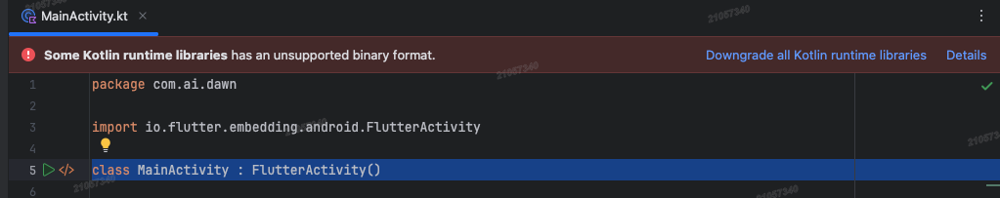

# 编译问题

请记住，Android里百分之99的编译问题都是Gradle版本与AGP版本兼容性导致的。

## 1.Installed Build Tools revision _.0.0 is corrupted

### 1.1. 问题

编译应用时遇到如下报错：

Installed Build Tools revision 33.0.0 is corrupted. Remove and install again using the SDK Manager.

### 1.2. 原因

在Sync project with gradle files时，会收到如下warning

```txt
Task :prepareKotlinBuildScriptModel UP-TO-DATE
Build-tool 33.0.0 is missing DX at D:\Programs\Android\sdk\build-tools\33.0.0\dx.bat
Build-tool 33.0.0 is missing DX at D:\Programs\Android\sdk\build-tools\33.0.0\dx.bat
```

这个warning说明build tools中缺少`dx.bat`这个批处理文件。
实际上是因为在31版本之后的build tools中，`dx.bat`被`d8.bat`替代了。

### 1.3. 解决

有如下两种方案：

* 更改批处理文件名称
  * 找到build tools目录中的d8.bat，将文件名修改为dx.bat。
  * 找到build tools目录中的lib/d8.jar，将文件名修改为dx.jar。
  * 回到Android Studio重新打包。

* 降级build tools
  * 打开项目的build.gradle，将buildToolsVersion降级到30.0.0或者更老的版本，targetSdkVersion与compileSdkVersion同理。

---

## 2. Android Studio 版本低，但AGP、Gradle版本高导致的编译问题

### 问题1：

```txt
The project is using an incompatible version (AGP 8.12.0) of the Android Gradle plugin. Latest supported version is AGP 8.7.3
See Android Studio & AGP compatibility options.
```

解决：

1. 修改settings.gradle文件的AGP版本

```txt
plugins {
    id("com.android.application") version "8.7.3" apply false  // 修改这个，由"8.12.0"改为"8.7.3"。 具体版本是ai结合Android studio版本给的意见。在kts方式配置中，"com.android.application"就是指Android Gradle Plugin (AGP) 
}
```

>apply false 告诉 Gradle：这个插件现在不要应用到声明它的项目上（通常指根项目）。
>作用：集中声明插件版本，让子项目可以在自己的 plugins 块中直接使用 id(...)，而无需再次指定版本。
>子项目是否真正使用该插件，由子项目自己决定。如果不写对应的 id(...)，插件就不会被应用到该子项目。

2. 同时修改gradle-wrapper.properties文件中的Gradle版本

```txt
distributionUrl=https\://mirrors.cloud.tencent.com/gradle/gradle-8.9-all.zip  //由gradle-9.1.0-all.zip改为gradle-8.9-all.zip
```

### 问题2



解决方案：

```txt
plugins {
  id("org.jetbrains.kotlin.android") version "2.0.21" apply false
}
```
