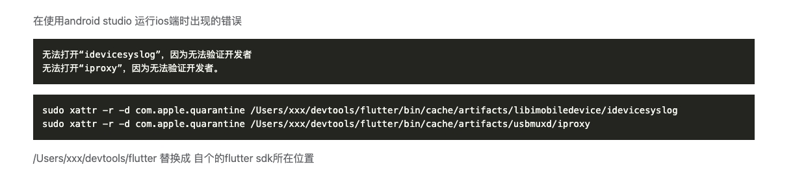

# iOS 开发环境

要在 Flutter 中配置 iOS 开发环境，需要完成一系列步骤，下面为你详细介绍：

## 1. 安装 Xcode

Xcode 是苹果公司提供的集成开发环境，它包含了开发 iOS 应用所需的工具和 SDK。

- **下载**：打开 Mac App Store，搜索“Xcode”，然后点击“获取”进行下载和安装。
- **配置命令行工具**：安装完成后，打开终端，执行以下命令来配置 Xcode 的命令行工具：

```bash
sudo xcode-select --switch /Applications/Xcode.app/Contents/Developer
```

- **同意许可协议**：在终端中运行以下命令以同意 Xcode 的许可协议：

```bash
sudo xcodebuild -license accept
```

## 2. 安装 CocoaPods

CocoaPods 是一个用于管理 iOS 项目依赖的工具，许多 Flutter 插件依赖于它。

- **安装 RubyGems**：CocoaPods 是用 Ruby 编写的，所以需要确保系统中安装了 RubyGems。大多数 macOS 系统已经预装了 RubyGems。
- **安装 CocoaPods**：打开终端，执行以下命令来安装 CocoaPods：

```bash
sudo gem install cocoapods
```

安装完成后，可以通过运行 `pod --version` 命令来验证是否安装成功。

## 3. 安装 Flutter SDK

- **下载 Flutter SDK**：访问 Flutter 官方网站（<https://flutter.dev/docs/get-started/install/macos），下载适用于> macOS 的 Flutter SDK。
- **解压 SDK**：将下载的压缩包解压到你选择的目录，例如 `~/development/flutter`。
- **配置环境变量**：打开终端，编辑 `~/.zshrc` 或 `~/.bash_profile` 文件，添加以下内容：

```bash
export PATH="$PATH:/path/to/flutter/bin"
```

将 `/path/to/flutter` 替换为你实际解压 Flutter SDK 的目录。保存文件后，执行以下命令使配置生效：

```bash
source ~/.zshrc
```

或者

```bash
source ~/.bash_profile
```

- **验证安装**：在终端中运行 `flutter doctor` 命令，检查 Flutter 环境是否安装正确。根据提示安装缺少的依赖项。

## 4. 配置 iOS 模拟器或真机

- **iOS 模拟器**：打开 Xcode，选择“Xcode” -> “Open Developer Tool” -> “Simulator” 来启动 iOS 模拟器。在模拟器中，你可以选择不同的 iOS 设备和版本。
- **iOS 真机**：如果你想在真机上测试应用，需要进行以下操作：
  - **注册开发者账号**：访问苹果开发者网站（<https://developer.apple.com/），注册一个开发者账号。>
  - **连接设备**：使用 USB 线将 iOS 设备连接到 Mac。
  - **信任设备**：在 iOS 设备上，点击“信任此电脑”。
  - **配置签名**：打开 Xcode，选择“Window” -> “Devices and Simulators”，选择你的设备，点击“Use for Development”。然后在 Xcode 中选择你的项目，在“Signing & Capabilities” 选项卡中配置签名证书。

## 5. 创建并运行 Flutter 项目

- **创建项目**：在终端中运行以下命令创建一个新的 Flutter 项目：

```bash
flutter create my_app
```

- **进入项目目录**：

```bash
cd my_app
```

- **运行项目**：如果你使用的是 iOS 模拟器，确保模拟器已经启动，然后在终端中运行以下命令：

```bash
flutter run
```

如果你想在真机上运行，确保设备已经连接并配置好签名，然后运行相同的命令。

## 注意事项

- 确保你的 macOS 系统版本符合 Flutter 和 Xcode 的要求。
- 在配置过程中，如果遇到权限问题，可以使用 `sudo` 命令来提升权限。
- 如果 `flutter doctor` 提示缺少某些依赖项，按照提示进行安装和配置。

通过以上步骤，你就可以完成 Flutter 的 iOS 开发环境配置，并开始开发 iOS 应用了。

---

## 问题记录


