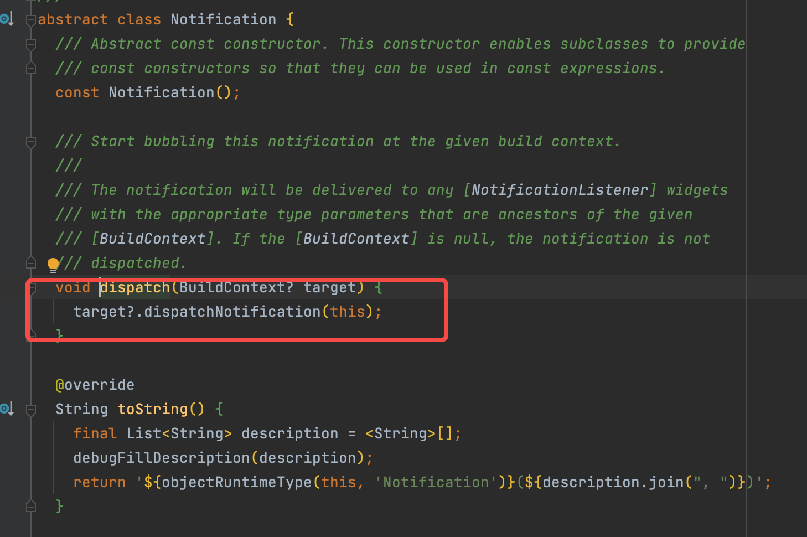
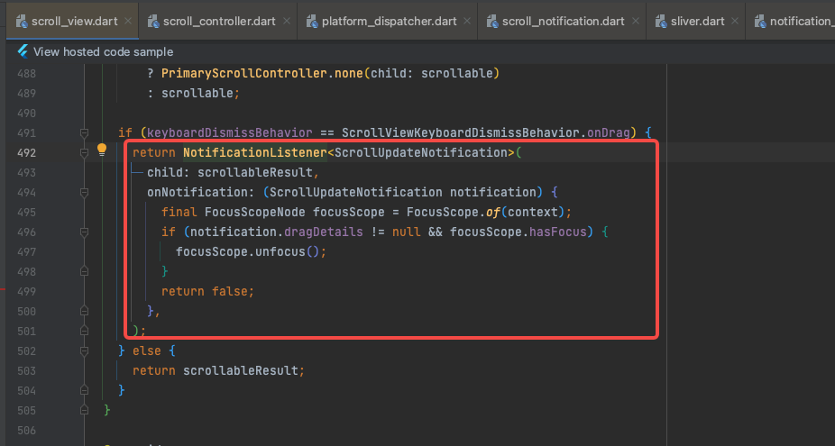
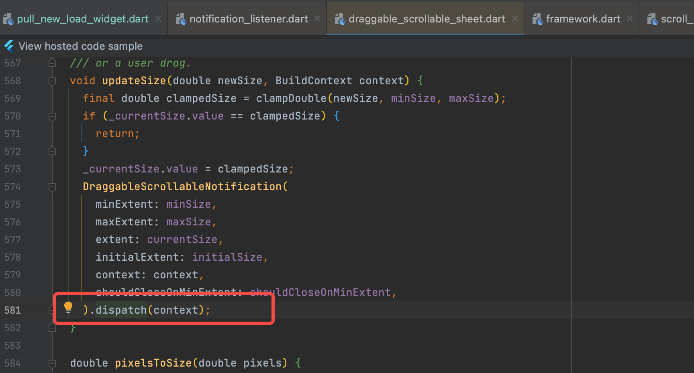
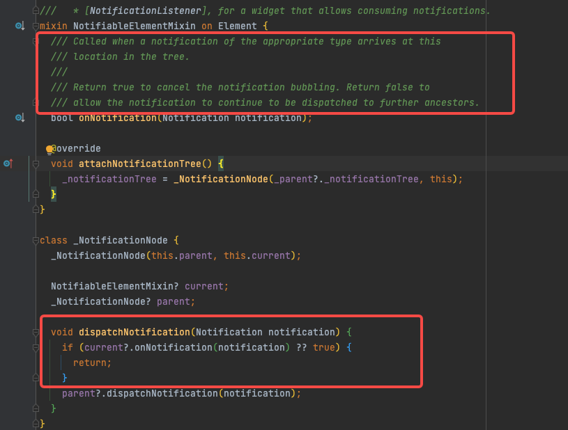

# NotificationListener

`NotificationListener` 在 Flutter 中是一个通用的监听组件，它利用了 Flutter 的通知（Notification）系统来监听和响应各种事件。以下是 `NotificationListener` 的工作原理：

## 1. 通知系统

Flutter 的通知系统是一种发布-订阅模式，允许组件发布通知，而其他组件可以订阅这些通知。这使得组件之间可以解耦，提高代码的灵活性和可维护性。

## 2. 通知（Notification）

通知是一种特殊的对象，它携带了有关某个事件的信息。Flutter 中有多种类型的通知，例如 `ScrollNotification`、`OverscrollNotification` 等，每种通知都带有其特定的数据和属性。自定义一个通知，需要继承`Notification`类，通过类中的`dispatch`方法分发通知

### 2.1 自定义通知

自定义一个通知，需要继承`Notification`类，通过类中的`dispatch`方法分发通知

示例：

```dart
///定义通知对象
class CustomNotification extends Notification{
}

///触发通知
CustomNotification.dispatch(target);//target 是BuildContext类型，指向需要接收的那个Widget

///NotificationListener回调中使用
NotificationListener(onNotification: (notification){
        print("notification:$notification");
        if(notification is CustomNotification){
          //使用CustomNotification类型的notification
        }
        return true;
},child:Text("1"));
```

## 3. NotificationListener

`NotificationListener` 是一个组件，它订阅特定类型的通知。它通过以下步骤工作：

- **订阅通知**：`NotificationListener` 在其构造函数中接收一个类型参数，该参数指定它要监听的通知类型。
- **监听通知**：当 `NotificationListener` 包裹的子组件（通过 `child` 属性指定）发送通知时，`NotificationListener` 会接收到这些通知。
- **处理通知**：`NotificationListener` 通过 `onNotification` 回调函数来处理接收到的通知。这个回调函数接收一个通知对象作为参数，并返回一个布尔值，指示是否应该继续传递通知。

## 4. 回调函数（onNotification）

`onNotification` 回调函数是 `NotificationListener` 的核心，它定义了如何处理接收到的通知。开发者可以在回调函数中实现自定义逻辑，例如：

- 检查通知的类型和属性。
- 执行特定的操作，如更新 UI、处理滚动事件等。
- 返回一个布尔值，决定是否继续传递通知。

## 5. 传递和停止传递通知

`NotificationListener` 的 `onNotification` 回调函数返回的布尔值决定了通知是否继续在 widget 树中向上传递：

- 返回 `false`：通知将继续传递给父组件。
- 返回 `true`：通知将停止传递。

### 5.1 内容补充

问题：从大模型搜索的结果是：返回 `true`：通知将继续传递给父组件，返回 `false`：通知将停止传递；但我看源码写的正好相反，是不是某个版本有改动？

针对上面的问题，我做了如下代码验证，结果符合源码内容即：`false`：通知将继续传递给父组件，`true`：通知将停止传递。
>由此可见，之前通过大模型搜到的结果可能也会有类似情况，用到时假如有问题要及时纠正修改。

```dart
/// 通知传递验证
class NotificationListenerTest extends StatefulWidget {
  @override
  State<StatefulWidget> createState() => NotificationListenerState();
}
class NotificationListenerState extends State<NotificationListenerTest> {
  @override
  Widget build(BuildContext context) {
    return NotificationListener(
        onNotification: (notification) {
          print("NotificationListener：1");
          return true;
        },
        child: NotificationListener(
          onNotification: (notification) {
            print("NotificationListener：2");
            return false;
          },
          child: NotificationListener(
            onNotification: (notification) {
              print("NotificationListener：3");
              return true;
            },
            child: ListView.separated(
              itemCount: 100,
              itemBuilder: (context, index) {
                return Container(
                  width: double.infinity,
                  height: 40,
                  child: Text("item $index"),
                );
              },
              separatorBuilder: (context, index) {
                return Container(
                  width: double.infinity,
                  height: 1,
                  color: Colors.black,
                );
              },
            ),
          ),
        ));
  }
}
```

## 示例代码

```dart
NotificationListener<ScrollNotification>(
  onNotification: (ScrollNotification notification) {
    if (notification is UserScrollNotification) {
      // 处理用户滚动事件
    }
    return false; // 继续传递通知
  },
  child: ListView.builder(//这里ListView继承自ScrollView，ScrollController会调用notifyListeners()将变化如滚动等发送出去
        itemCount: 100,
        itemBuilder: (BuildContext context, int index) {
          return ListTile(title: Text('Item $index'));
        },
  ),
)
```

## 6.触发通知

1. 自定义通知（Notification）
2. 调用Notification中的dispatch(目标BuildContext)，分发给具体监听者

## 注意事项

- `NotificationListener` 应该谨慎使用，避免过度使用导致性能问题。
- 确保正确处理通知，不要在 `onNotification` 回调中执行耗时操作。

通过理解 `NotificationListener` 的工作原理，你可以更有效地利用 Flutter 的通知系统来创建响应用户行为的交互式 UI。

---

## 原理解析

### 1.组件实现通知能力-继承

触发的组件继承`Notification`抽象类



大多组件其实都是使用NotificationListener作为子组件，例如ScrollView



### 2.触发通知

调用`dispatch`，触发事件



### 3.分发通知

执行分发逻辑，看下面红框代码可知，flutter是通过parent父控件向上检索依次回调，当回调返回值为`true`那么停止调用父控件的回调函数。


