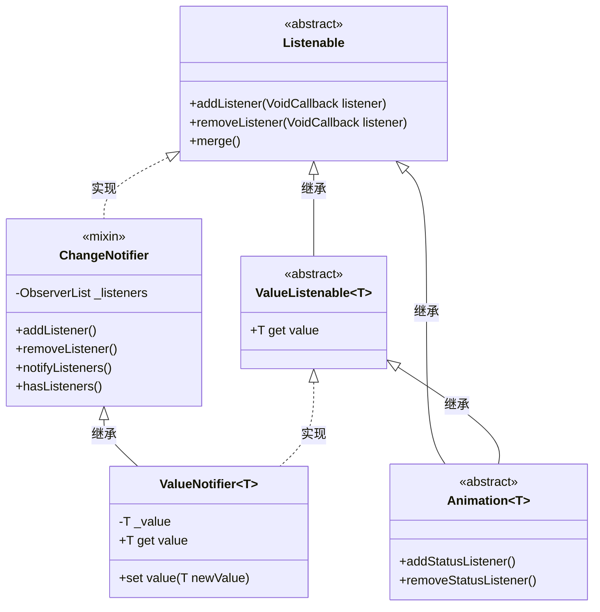

# Flutter 的“订阅-通知”机制

Flutter 的“订阅-通知”机制是一套基于观察者模式设计的原生响应式系统。它的核心是 **`Listenable`** 接口及其一系列实现类，共同构建了一个“订阅-通知”的通信网络。

>本质是FLutter 内置了一个观察者模式的数据监听体系。

---

## 🏛️ 核心类关系全景图

下图展示了这套机制中核心类与接口的关系：

> **注意**: `ChangeNotifier` 在较新版本的 Flutter 中是一个 `mixin class`，这意味着它既可以作为普通类被继承，也可以作为混入（mixin）被添加到其他类中，非常灵活。

---

## 🧩 核心角色逐个拆解

### 1. `Listenable`: 顶层接口（契约制定者）

`Listenable` 是一个抽象类，它定义了“可监听对象”的基本行为规范，但不提供具体实现。

* **核心契约**: 仅声明了两个方法：
  * `addListener(VoidCallback listener)`: 注册一个监听器（回调函数）。
  * `removeListener(VoidCallback listener)`: 移除一个已注册的监听器。
* **职责**: 它就像一个标准接口，规定一个对象必须提供“添加”和“移除”监听器的能力，至于如何存储和触发这些监听器，则交给子类去实现。
* **实用工具**: 提供了一个工厂方法 `Listenable.merge()`，可以将多个 `Listenable` 合并成一个。当其中任意一个发生变化时，合并后的 `Listenable` 都会触发通知。

### 2. `ChangeNotifier`: 核心实现（通知引擎）

`ChangeNotifier` 是 `Listenable` 接口最重要的 **具体实现类**。它是整个订阅-通知机制的核心引擎。

* **工作机制**: 它在内部维护了一个监听器列表，并实现了 `addListener` 和 `removeListener` 来操作这个列表。
* **核心方法**: `notifyListeners()` 是它的关键，调用此方法会遍历整个监听器列表，并逐个执行所有注册的回调函数。
* **使用方式**: 你可以通过 **继承 (`extends`)** 或 **混入 (`mixin`)** 的方式，让自定义的数据模型类获得 `ChangeNotifier` 的能力。
* **性能特点**:
  * 添加监听器是 O(1) 操作。
  * 移除和分发通知是 O(N) 操作。
  * 在较新版本的 Flutter 中，其内部实现经过了优化，通知时间从 O(N²) 降低到了 O(N)。

### 3. `ValueListenable<T>`: 扩展接口（带值的概念）

`ValueListenable` 是一个 **抽象接口**，它在 `Listenable` 的基础上进行了扩展，增加了一个“当前值”的概念。

* **新增契约**: 它要求实现类必须提供一个 `T get value` 的 getter 方法，用于获取当前持有的值。
* **职责**: 它定义了一种“**带有可读值的可监听对象**”，为那些既需要监听变化、又需要读取当前状态的对象提供了统一的接口。

### 4. `ValueNotifier<T>`: 特化实现（自动通知器）

`ValueNotifier` 是 `ChangeNotifier` 的一个 **特化子类**，同时实现了 `ValueListenable<T>` 接口。

* **工作机制**: 它内部包装了一个值 `_value`。当你通过 `.value = newValue` 为其赋值时，它会**自动调用 `notifyListeners()`**。
* **职责**: 它为“管理单一可变值”这个场景提供了最便捷的实现，开发者无需手动调用 `notifyListeners()`。

### 5. `Animation`: 另一个重要的实现者

`Animation` 接口同样继承自 `ValueListenable`，因此它也是一个可监听对象，并且拥有一个当前值（通常是 `double` 类型）。

* **工作机制**: 动画的每一帧数值变化时，都会自动触发通知。
* **职责**: 它代表了驱动 UI 动画的数据源，是 Flutter 动画系统的核心。

---

## ⚙️ 工作流程：从“订阅”到“通知”

这套机制的工作流程非常清晰，完美体现了 **观察者模式**：

1. **注册 (Subscribe)**: 一个“观察者”（通常是 UI 组件，如 `ListenableBuilder`）通过 `addListener` 方法向一个“被观察者”（一个 `Listenable` 对象，如 `ChangeNotifier`）注册自己的回调函数。

2. **变更 (Change)**: 当“被观察者”的内部状态发生改变时（例如，`ChangeNotifier` 中的数据被修改，或 `ValueNotifier` 的 `value` 被重新赋值），它会准备通知所有观察者。

3. **通知 (Notify)**: “被观察者”调用 `notifyListeners()` 方法。这个方法会遍历它内部维护的监听器列表，并依次执行每个观察者注册的回调函数。

4. **响应 (React)**: “观察者”（如 `ListenableBuilder`）在其回调函数被触发后，会执行相应的操作，最常见的就是调用 `setState()` 来重建 UI，从而完成一次完整的“状态驱动 UI 更新”的闭环。

## 🔗 关联的UI组件 (Widgets)

Flutter 提供了几个现成的 Widget，让你能轻松地将 `Listenable` 对象连接到 UI 上：

* **`ListenableBuilder`**: 通用的构建器，可以监听任何 `Listenable` 对象。当监听对象发出通知时，它会重建自己的 `builder` 部分。
* **`ValueListenableBuilder<T>`**: `ListenableBuilder` 的特化版本，专门配合 `ValueListenable<T>` 使用。它的 `builder` 会直接提供当前值，使用更方便。
* **`AnimatedBuilder`**: 专门为 `Animation` 对象设计的构建器，是动画相关 UI 的常用工具。
* **`InheritedNotifier<T extends Listenable>`**: 一个继承自 `InheritedWidget` 的抽象类。它能将 `Listenable` 对象沿 Widget 树向下传递，并在对象发出通知时，自动重建所有依赖它的子孙组件。这对于在应用深层传递可监听状态非常有用。

## ✍️ 如何选择？

1. **管理一个简单的、独立的值（如计数器、开关状态）**: 首选 **`ValueNotifier<T>`** + **`ValueListenableBuilder`**。这是最轻量、最直接的方式。
2. **管理包含多个属性的复杂状态（如用户信息、购物车）**: 创建一个自定义类，**`mixin`** 上 **`ChangeNotifier`**。在修改任何属性后，手动调用 `notifyListeners()`。配合 **`ListenableBuilder`** 使用。
3. **需要将状态在 Widget 树中向下传递**: 可以考虑使用 **`InheritedNotifier`**，或者像 Provider 这样的状态管理框架，它们底层也是对这套机制的封装。
4. **需要同时监听多个独立的状态**: 使用 `Listenable.merge()` 将它们合并成一个。
