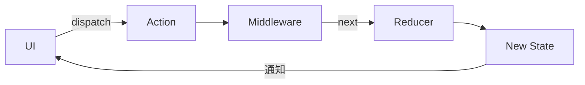

# Redux

redux 用于全局的状态管理，与Provider搭配使用，可以将数据及变化通知传给子组件。[库地址](https://pub.dev/packages/redux)

个人理解：

* redux 等同于状态机，且会将变化通知出去
* StoreProvider继承自InheritedWidget(InheritedWidget是flutter中的一个共享部件)
* 二者搭配，可以将状态传递给子组件，子组件可以根据收到的通知进行view的刷新
* redux来自react的redux模式，我认为redux的设计与MVI模式有相似之处。Reducer即缓冲器，进行数据的处理设置，生产出新的状态。状态变化引起UI变化。

## 作用

redux 可以解决flutter 组件树层级过多时，当状态变化需要层层向下传递会导致处理过于复杂的问题。总结就是简化数据变化需要UI刷新处理的复杂度。可以这样理解：redux作为全局状态数据统管工具，状态变化通知ui变化，不用关心「层级过多导致数据的复杂处理」问题。

## 结构了解

redux 是"单向流"，结构分为以下几块：

* Store : 对象，只存在一个，维护整个APP的状态，负责分发和接收Action
* Middleware：中间件，可以过滤处理 Store分发的数据，比如进行登录状态判断、网络接口请求等。
* Reducer:纯函数，接收State和Action，返回新的State
* State:对象，应用的状态树，不能直接修改，只能通过Action更新
* Action：对象，描述变化的载体
* View：视图层

数据单向传递图：


---

以下是 Flutter 中 **Redux** 状态管理框架的完整解析，涵盖核心概念、工作流程、代码实现及最佳实践：

---

## **一、Redux 核心概念**

| 概念            | 作用                                                                 | 对应 Flutter 组件/类       |
|-----------------|--------------------------------------------------------------------|--------------------------|
| **Store**       | 全局状态容器，保存应用唯一可信状态                                      | `Store<State>`           |
| **State**       | 应用状态的不可变数据对象                                               | 自定义类（如 `AppState`）  |
| **Action**      | 描述状态变化的事件，携带数据                                            | 普通 Dart 类或 Freezed 生成类 |
| **Reducer**     | 纯函数，根据 Action 和当前 State 生成新 State                          | 函数或 `combineReducers`    |
| **Middleware**  | 拦截 Action，处理副作用（如异步请求、日志）                               | 中间件函数                  |
| **StoreProvider** | 将 Store 注入 Widget 树，子组件可访问                                  | `StoreProvider<State>`    |
| **StoreConnector** | 连接 Store 与 UI，选择性订阅状态变化                                   | `StoreConnector<State, ViewModel>` |

---

## **二、Redux 工作流程**



1. **触发 Action**：UI 调用 `store.dispatch(action)`
2. **中间件处理**：Middleware 处理异步/日志等逻辑
3. **生成新状态**：Reducer 根据 Action 计算新 State
4. **状态更新**：Store 更新 State 并通知所有订阅的 UI
5. **UI 重建**：`StoreConnector` 根据新 State 重建相关 Widget

---

## **三、Flutter Redux 集成步骤**

### **1. 添加依赖**

```yaml
dependencies:
  flutter_redux: ^0.8.2
  redux: ^5.0.0
  redux_thunk: ^0.4.0  # 异步中间件
  freezed_annotation: ^2.2.0 # 可选，用于生成不可变类
```

### **2. 定义状态（State）**

```dart
// 使用 equatable 简化相等性判断
import 'package:equatable/equatable.dart';

class AppState extends Equatable {
  final int counter;
  final String data;
  final bool isLoading;

  const AppState({
    this.counter = 0,
    this.data = '',
    this.isLoading = false,
  });

  AppState copyWith({
    int? counter,
    String? data,
    bool? isLoading,
  }) {
    return AppState(
      counter: counter ?? this.counter,
      data: data ?? this.data,
      isLoading: isLoading ?? this.isLoading,
    );
  }

  @override
  List<Object?> get props => [counter, data, isLoading];
}
```

### **3. 定义 Action**

```dart
// 使用 Freezed 生成不可变 Action
@freezed
class AppAction with _$AppAction {
  // 同步 Action
  const factory AppAction.increment() = Increment;
  const factory AppAction.updateData(String data) = UpdateData;

  // 异步 Action
  const factory AppAction.loadData() = LoadData;
  const factory AppAction.dataLoaded(String data) = DataLoaded;
}
```

### **4. 实现 Reducer**

```dart
// 主 Reducer
AppState reducer(AppState state, AppAction action) {
  return action.when(
    increment: () => state.copyWith(counter: state.counter + 1),
    updateData: (data) => state.copyWith(data: data),
    loadData: () => state.copyWith(isLoading: true),
    dataLoaded: (data) => state.copyWith(
      data: data,
      isLoading: false,
    ),
  );
}
```

### **5. 创建 Middleware**

```dart
// 异步中间件（使用 redux_thunk）
final thunkMiddleware = thunkMiddleware<AppState>();

// 日志中间件
Middleware<AppState> loggingMiddleware = (store, action, next) {
  print('Action: $action');
  print('Prev State: ${store.state}');
  next(action);
  print('Next State: ${store.state}');
};
```

### **6. 初始化 Store**

```dart
void main() {
  final store = Store<AppState>(
    reducer,
    initialState: const AppState(),
    middleware: [
      loggingMiddleware,
      thunkMiddleware,
    ],
  );

  runApp(MyApp(store: store));
}

class MyApp extends StatelessWidget {
  final Store<AppState> store;

  const MyApp({super.key, required this.store});

  @override
  Widget build(BuildContext context) {
    return StoreProvider<AppState>(
      store: store,
      child: MaterialApp(
        home: HomeScreen(),
      ),
    );
  }
}
```

---

## **四、UI 与 Store 交互**

### **1. 读取状态：StoreConnector**

```dart
class CounterText extends StatelessWidget {
  @override
  Widget build(BuildContext context) {
    return StoreConnector<AppState, int>(
      converter: (store) => store.state.counter,
      builder: (context, count) => Text('Count: $count'),
    );
  }
}
```

### **2. 触发 Action**

```dart
FloatingActionButton(
  onPressed: () {
    StoreProvider.of<AppState>(context).dispatch(const AppAction.increment());
  },
  child: const Icon(Icons.add),
)
```

### **3. 处理异步操作**

```dart
// 定义 Thunk Action
ThunkAction<AppState> fetchData() {
  return (Store<AppState> store) async {
    store.dispatch(const AppAction.loadData());
    final data = await http.get('https://api.example.com/data');
    store.dispatch(AppAction.dataLoaded(data.body));
  };
}

// 触发异步 Action
ElevatedButton(
  onPressed: () {
    StoreProvider.of<AppState>(context).dispatch(fetchData());
  },
  child: const Text('Load Data'),
)
```

---

## **五、最佳实践**

### **1. 状态设计原则**

* **单一数据源**：整个应用只有一个 Store

* **状态只读**：只能通过 Action 修改
* **纯函数更新**：Reducer 必须无副作用
* **扁平化结构**：避免嵌套过深

### **2. 性能优化技巧**

| 技巧                      | 实现方式                                                                 |
|--------------------------|------------------------------------------------------------------------|
| **选择性订阅**             | 使用多个 `StoreConnector` 只监听需要的数据                                  |
| **`distinct: true`**      | 避免相同数据触发重建（需正确实现 `==` 和 `hashCode`）                         |
| **Memoization**           | 使用 `reselect` 缓存复杂计算结果                                           |
| **Immutable.js**          | 对于复杂集合操作，使用不可变数据结构库                                         |

### **3. 项目结构推荐**

```txt
lib/
├── models/
│   ├── app_state.dart     # 全局状态定义
│   └── user.dart          # 子状态模型
├── actions/
│   ├── app_actions.dart   # Action 定义
│   └── user_actions.dart
├── reducers/
│   ├── app_reducer.dart   # 主 Reducer
│   └── user_reducer.dart  # 子 Reducer
├── middleware/            # 中间件
├── selectors/             # 状态选择器
└── screens/               # UI 界面
```

---

## **六、Redux 适用场景**

| 场景                  | 优势                                                                 |
|-----------------------|--------------------------------------------------------------------|
| 复杂应用状态管理         | 集中式状态管理易于调试和维护                                             |
| 需要时间旅行调试         | 可记录 Action 历史，实现状态回滚                                          |
| 多组件共享状态           | 通过 StoreProvider 全局访问                                              |
| 严格的单向数据流         | Action → Reducer → UI 的明确流程                                        |

---

## **七、完整示例代码**

```dart
// 完整代码结构参考上文各模块实现
// 包含：
// - 状态定义
// - Action 定义
// - Reducer 实现
// - Middleware 配置
// - Store 初始化
// - UI 组件与 Store 交互
```

---

## **八、常见问题解答**

### **Q1：Redux 与 Provider 如何选择？**

* **Redux**：适合复杂应用，需要严格状态流控制、历史回溯

* **Provider**：轻量级场景，简单状态共享

### **Q2：如何处理深层嵌套状态？**

* 使用 `copyWith` 链式调用

* 引入 **Freezed** 或 **Immer** 简化不可变操作

### **Q3：如何调试 Redux 应用？**

* 使用 `redux_logging` 中间件

* 集成 **Redux DevTools** 进行时间旅行调试

---

通过以上详解，你可以在 Flutter 中高效使用 Redux 管理复杂应用状态，确保代码的可维护性和可扩展性。
