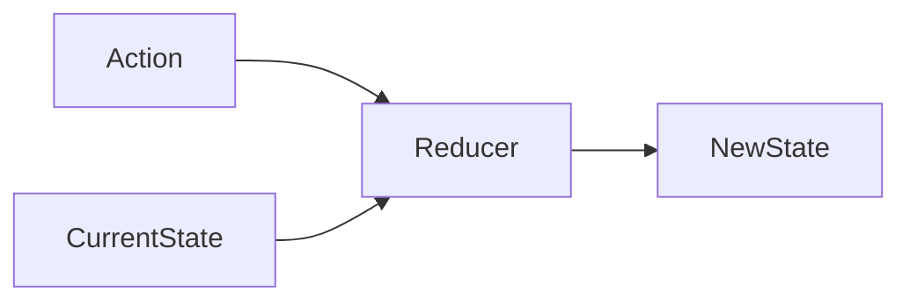

# reducer简介

在 Flutter 中使用 Redux 架构时，**Reducer（归约器）** 是状态管理的核心逻辑单元，负责根据接收到的 **Action** 生成新的应用状态（State）。它是 **纯函数**，具有明确的输入输出关系，确保状态变化的可预测性。以下是 Reducer 的完整解析：

---

## **Reducer 的核心特性**

| 特性                | 说明                                                                 |
|---------------------|--------------------------------------------------------------------|
| **纯函数**           | 相同的输入必然得到相同的输出，无副作用（不修改外部变量、不依赖外部状态） |
| **不可变性**         | 必须返回全新的状态对象，而非修改原状态                                 |
| **确定性逻辑**       | 根据 Action 类型和当前状态，决定如何生成新状态                          |

---

## **Reducer 的工作流程**



1. 组件通过 `store.dispatch(action)` 触发 Action
2. Redux 将所有注册的 Middleware 处理 Action
3. 最终 Action 传递给 Reducer
4. Reducer 根据 Action 类型和当前 State 生成新 State
5. Store 更新状态并通知所有订阅的 UI 组件

---

## **Reducer 的基本结构**

### 基础写法

```dart
// 状态类
class AppState {
  final int counter;
  final String data;

  AppState({this.counter = 0, this.data = ''});
}

// Reducer 函数
AppState reducer(AppState prevState, dynamic action) {
  if (action is IncrementAction) {
    return AppState(
      counter: prevState.counter + 1,
      data: prevState.data,
    );
  }

  if (action is UpdateDataAction) {
    return AppState(
      counter: prevState.counter,
      data: action.newData,
    );
  }

  return prevState; // 未处理的 Action 返回原状态
}
```

### 类型安全的改进写法（使用 sealed class）

```dart
// 使用 freezed 或 sealed_unions 定义 Action 类型
@freezed
abstract class AppAction with _$AppAction {
  const factory AppAction.increment() = Increment;
  const factory AppAction.updateData(String data) = UpdateData;
}

AppState reducer(AppState prevState, AppAction action) {
  return action.when(
    increment: () => prevState.copyWith(counter: prevState.counter + 1),
    updateData: (data) => prevState.copyWith(data: data),
  );
}
```

---

## **Reducer 组合技巧**

### 1. 拆分子 Reducer（模块化）

```dart
// 用户模块 Reducer
AppState _userReducer(AppState state, UserAction action) {
  if (action is UpdateUserAction) {
    return state.copyWith(user: action.newUser);
  }
  return state;
}

// 商品模块 Reducer
AppState _productReducer(AppState state, ProductAction action) {
  if (action is AddProductAction) {
    return state.copyWith(products: [...state.products, action.product]);
  }
  return state;
}

// 组合主 Reducer
AppState mainReducer(AppState state, dynamic action) {
  return _productReducer(
    _userReducer(state, action),
    action,
  );
}
```

### 2. 使用 `combineReducers`（官方推荐）

```dart
final appReducer = combineReducers<AppState>([
  TypedReducer<AppState, IncrementAction>(_handleIncrement),
  TypedReducer<AppState, UpdateDataAction>(_handleUpdateData),
]);

AppState _handleIncrement(AppState state, IncrementAction action) => 
  state.copyWith(counter: state.counter + 1);

AppState _handleUpdateData(AppState state, UpdateDataAction action) => 
  state.copyWith(data: action.newData);
```

---

## **不可变状态实现方案**

### 方案 1：手动实现 `copyWith`

```dart
class AppState {
  final int counter;
  final String data;

  AppState({this.counter = 0, this.data = ''});

  AppState copyWith({int? counter, String? data}) {
    return AppState(
      counter: counter ?? this.counter,
      data: data ?? this.data,
    );
  }
}
```

### 方案 2：使用 `equatable` 包（推荐）

```dart
import 'package:equatable/equatable.dart';

class AppState extends Equatable {
  final int counter;
  final String data;

  const AppState({this.counter = 0, this.data = ''});

  @override
  List<Object?> get props => [counter, data];

  AppState copyWith({int? counter, String? data}) {
    return AppState(
      counter: counter ?? this.counter,
      data: data ?? this.data,
    );
  }
}
```

---

## **异步 Reducer 处理**

虽然 Reducer 本身必须是同步的，但可以通过 Middleware 处理异步流程后触发新的 Action：

```dart
// Middleware 处理 API 请求
Middleware<AppState> apiMiddleware = (store, action, next) {
  if (action is FetchDataAction) {
    Future<void> fetch() async {
      try {
        final data = await http.get('/api/data');
        store.dispatch(FetchDataSuccessAction(data));
      } catch (e) {
        store.dispatch(FetchDataErrorAction(e));
      }
    }
    fetch();
  }
  next(action);
};

// Reducer 处理最终 Action
AppState reducer(AppState state, dynamic action) {
  if (action is FetchDataSuccessAction) {
    return state.copyWith(data: action.data);
  }
  return state;
}
```

---

## **Reducer 最佳实践**

1. **保持纯净性**  
   禁止在 Reducer 中执行以下操作：

   ```dart
   // ❌ 错误示范
   AppState reducer(AppState state, action) {
     state.counter++; // 直接修改原状态
     NetworkRequest.getData(); // 发起网络请求
     return state;
   }
   ```

2. **状态树扁平化**  
   避免嵌套过深的状态结构：

   ```dart
   // ✅ 推荐结构
   class AppState {
     final User user;
     final List<Product> products;
     final AppConfig config;
   }
   ```

3. **类型安全**  
   使用 Union Types（如 `freezed`）确保 Action 类型完备性：

   ```dart
   @freezed
   class AppAction with _$AppAction {
     const factory AppAction.login() = Login;
     const factory AppAction.logout() = Logout;
     const factory AppAction.loadUser(int userId) = LoadUser;
   }
   ```

4. **性能优化**  
   使用 `equatable` 或 `immer` 提升状态比较效率：

   ```dart
   // 使用 immer 简化不可变操作
   AppState reducer(AppState state, action) {
     return state.produce((draft) {
       if (action is Increment) draft.counter++;
     });
   }
   ```

---

## **完整示例代码**

```dart
import 'package:flutter/material.dart';
import 'package:flutter_redux/flutter_redux.dart';
import 'package:redux/redux.dart';
import 'package:equatable/equatable.dart';

// 状态类
class AppState extends Equatable {
  final int counter;
  final String data;

  const AppState({this.counter = 0, this.data = ''});

  AppState copyWith({int? counter, String? data}) {
    return AppState(
      counter: counter ?? this.counter,
      data: data ?? this.data,
    );
  }

  @override
  List<Object?> get props => [counter, data];
}

// Action 类型
@freezed
abstract class AppAction with _$AppAction {
  const factory AppAction.increment() = Increment;
  const factory AppAction.updateData(String data) = UpdateData;
}

// Reducer
final appReducer = combineReducers<AppState>([
  TypedReducer<AppState, Increment>(_handleIncrement),
  TypedReducer<AppState, UpdateData>(_handleUpdateData),
]);

AppState _handleIncrement(AppState state, Increment action) => 
  state.copyWith(counter: state.counter + 1);

AppState _handleUpdateData(AppState state, UpdateData action) => 
  state.copyWith(data: action.data);

void main() {
  final store = Store<AppState>(
    appReducer,
    initialState: const AppState(),
  );

  runApp(
    StoreProvider<AppState>(
      store: store,
      child: const MyApp(),
    ),
  );
}

class MyApp extends StatelessWidget {
  const MyApp({super.key});

  @override
  Widget build(BuildContext context) {
    return MaterialApp(
      home: Scaffold(
        body: Center(
          child: StoreConnector<AppState, String>(
            converter: (store) => store.state.data,
            builder: (context, data) => Text(data),
          ),
        ),
        floatingActionButton: FloatingActionButton(
          onPressed: () {
            final store = StoreProvider.of<AppState>(context);
            store.dispatch(const Increment());
          },
          child: const Icon(Icons.add),
        ),
      ),
    );
  }
}
```

---

## **常见问题解答**

### Q1：为什么 Reducer 必须是纯函数？

- **可预测性**：相同输入永远得到相同输出
- **易于测试**：无需模拟外部环境
- **时间旅行调试**：支持状态快照回滚

### Q2：如何处理复杂业务逻辑？

- 将逻辑拆分到 Middleware
- 使用 `redux_epic` 处理流式操作
- 通过 Thunk Action 封装异步流程

### Q3：如何调试 Reducer？

- 使用 `redux_logger` 中间件
- 打印 Action 和前后状态对比
- 编写单元测试验证状态变化

---

## **总结**

Reducer 是 Redux 架构中的状态转换引擎，通过：

- **纯函数设计** 保障状态变化的可追溯性
- **不可变状态** 确保数据一致性
- **模块化组合** 应对复杂业务场景

掌握 Reducer 的设计技巧，可以显著提升 Flutter 应用的状态管理质量，使代码更易维护和扩展。
