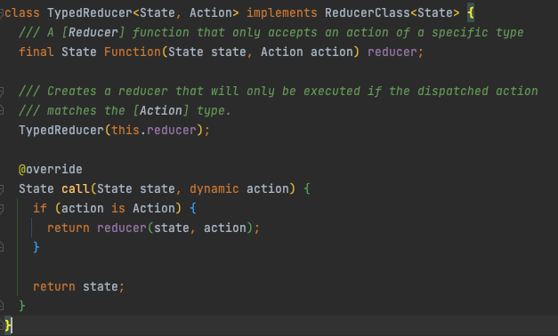

# combineReducers

在 Flutter 中使用 Redux 架构时，`combineReducers` 是一个非常重要的函数，它用于将多个 reducer 函数合并为一个单一的 reducer。这样，你可以将应用程序的状态分割成多个小的、可管理的部分，每个部分由一个专门的 reducer 处理。以下是 `combineReducers` 的详解：

## 基本概念

1. **Reducer**：
   Reducer 是一个纯函数，它接受当前的状态（state）和一个 action，返回一个新的状态。Reducer 必须始终保持一致性，不修改传入的状态，也不依赖于外部的副作用。

2. **combineReducers**：
   `combineReducers` 函数接收一个由多个 reducer 组成的映射，并返回一个新的 reducer。这个新的 reducer 会将传入的 action 分发到相应的子 reducer，并合并它们返回的状态。

## 使用方式

1. **定义子 reducer**：
   为应用程序状态的每个部分创建一个 reducer 函数。

   ```dart
   // 子 reducer 示例
   Reducer<PartOfStateA> reducerA;
   Reducer<PartOfStateB> reducerB;
   ```

2. **使用 combineReducers**：
   使用 `combineReducers` 将所有子 reducer 合并为一个总的 reducer。

   ```dart
   final appReducer = combineReducers<AppState>({
     'partA': reducerA,
     'partB': reducerB,
   });
   ```

   在这里，`AppState` 是应用程序的根状态类型，它可能是一个包含多个属性的对象，每个属性对应应用程序状态的一个部分。

3. **创建 Store**：
   使用合并后的 reducer 创建 Redux Store。

   ```dart
   final store = Store<AppState>(AppState.initialState(), reducer: appReducer);
   ```

## 特点

- **模块化**：`combineReducers` 允许你将应用程序的状态分割成多个模块化的 reducer，每个 reducer 只处理与其对应的状态部分。

- **可维护性**：模块化的 reducer 使得代码更易于维护和理解。

- **可扩展性**：随着应用程序的增长，你可以轻松添加更多的 reducer 来处理新的状态部分。

- **纯函数**：每个 reducer 都是一个纯函数，这意味着它们没有副作用，只依赖于输入的 state 和 action。

## 示例

假设你有一个应用程序状态 `AppState`，它包含用户登录状态和用户信息两个部分：

```dart
class AppState {
  bool? isLoggedIn;
  UserInfo? userInfo;
}

// 定义用户登录状态的 reducer
AppState loginReducer(AppState state, dynamic action) {
  if (action is LoginAction) {
    return state.copyWith(isLoggedIn: true);
  }
  if (action is LogoutAction) {
    return state.copyWith(isLoggedIn: false);
  }
  return state;
}

// 定义用户信息的 reducer
AppState userInfoReducer(AppState state, dynamic action) {
  if (action is UpdateUserInfoAction) {
    return state.copyWith(userInfo: action.userInfo);
  }
  return state;
}

// 使用 combineReducers 合并 reducers
final appReducer = combineReducers<AppState>({
  'isLoggedIn': loginReducer,
  'userInfo': userInfoReducer,
});
```

在这个示例中，我们创建了两个 reducer，`loginReducer` 处理登录状态，`userInfoReducer` 处理用户信息。然后我们使用 `combineReducers` 将它们合并为一个总的 reducer `appReducer`。

通过使用 `combineReducers`，你可以构建一个清晰、模块化的状态管理架构，使得在大型应用程序中维护和扩展状态逻辑变得更加容易。

---

## 代码解析

有以下这样一段代码，那它的意思是啥呢？

```dart
combineReducers<bool?>([
  TypedReducer<bool?, LoginSuccessAction>(_loginResult) ,
  TypedReducer<bool?, LogoutAction>(_logoutResult),
]);
```

答：

- `combineReducers<bool?>`:这表示你正在创建一个 reducer，它将处理可能为 null 的布尔类型的状态（bool? 在 Dart 中表示一个可选的布尔值，即 bool 或 null）。
- `TypedReducer<bool?, LoginSuccessAction>(_loginResult)`:
  - TypedReducer 是一个用于创建特定 action 类型的 reducer 的函数。
  
  - LoginSuccessAction 是一个 action 类，表示登录成功的操作。
  - _loginResult 是一个 reducer 函数，它处理 LoginSuccessAction 类型的 actions 并返回新的布尔状态（可能是 true 表示用户已登录，或者 null 表示用户未登录）。
- `TypedReducer<bool?, LogoutAction>(_logoutResult)`:
  - LogoutAction 是一个 action 类，表示用户登出的操作。
  - _logoutResult 是一个 reducer 函数，它处理 LogoutAction 类型的 actions 并更新状态（可能是设置状态为 null 或 false 表示用户已登出）。

示例：

```dart
import 'package:redux/redux.dart';

// 定义应用程序的状态类型
class AppState {
  bool? isLoggedIn;
}

// 定义登录成功的 action
class LoginSuccessAction {}

// 定义登出的 action
class LogoutAction {}

// 创建处理登录成功的 reducer
AppState _loginResult(AppState state, dynamic action) {
  if (action is LoginSuccessAction) {
    return state.copyWith(isLoggedIn: true);
  }
  return state;
}

// 创建处理登出的 reducer
AppState _logoutResult(AppState state, dynamic action) {
  if (action is LogoutAction) {
    return state.copyWith(isLoggedIn: null);
  }
  return state;
}

// 使用 combineReducers 合并 reducers
final appReducer = combineReducers<AppState>([
  TypedReducer<AppState, LoginSuccessAction>(_loginResult),
  TypedReducer<AppState, LogoutAction>(_logoutResult),
]);

// 应用 reducer 来更新状态
final store = Store<AppState>(AppState(), initialState: AppState(), reducer: appReducer);
```

在这个示例中，我们定义了 `AppState` 类来存储用户登录状态，创建了两个 action 类 `LoginSuccessAction` 和 `LogoutAction` 以及对应的 reducer 函数 `_loginResult` 和`_logoutResult`。然后我们使用 `combineReducers` 来合并这些 `reducer`，并创建了一个 `Redux store`。
