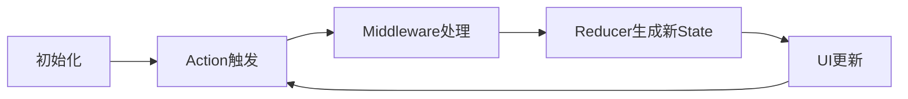

# State简介

在 Flutter 中使用 Redux 进行状态管理时，**State（状态）** 是整个应用的数据核心，它是唯一可信的数据源（Single Source of Truth）。以下是关于 Redux 中 State 的完整解析：

---

## **State 的核心特性**

| 特性                | 说明                                                                 |
|---------------------|--------------------------------------------------------------------|
| **不可变性**         | State 是只读的，只能通过 Reducer 生成新状态，禁止直接修改原状态         |
| **全局唯一性**       | 整个应用只有一个全局 State 对象，集中管理所有数据                        |
| **层级化结构**       | 可嵌套子状态（Sub-State），便于模块化开发                               |
| **可序列化**         | 推荐使用纯 Dart 对象（POJO），方便持久化或调试                          |

---

## **State 的设计原则**

### 1. 扁平化结构

避免深度嵌套，保持状态树简洁：

```dart
// ✅ 推荐结构
class AppState {
  final UserState user;    // 用户相关状态
  final ThemeState theme;  // 主题配置状态
  final CartState cart;    // 购物车状态
}

// ❌ 避免深层嵌套
class AppState {
  final Map<String, Map<String, List<Product>>> nestedData; // 难以维护
}
```

### 2. 领域模型分离

按业务模块拆分状态：

```dart
// 用户模块
class UserState {
  final String? token;
  final UserProfile? profile;
}

// 商品模块
class ProductState {
  final List<Product> list;
  final bool isLoading;
}
```

### 3. 不可变实现

使用不可变对象确保状态安全：

```dart
// 使用 equatable 简化相等性判断
class UserState extends Equatable {
  final String? token;
  final UserProfile? profile;

  const UserState({this.token, this.profile});

  UserState copyWith({String? token, UserProfile? profile}) {
    return UserState(
      token: token ?? this.token,
      profile: profile ?? this.profile,
    );
  }

  @override
  List<Object?> get props => [token, profile];
}
```

---

## **State 的生命周期**



---

## **State 的操作方法**

### 1. 读取 State

通过 `StoreConnector` 或 `StoreProvider` 获取：

```dart
// 在组件中获取当前状态
StoreConnector<AppState, UserProfile>(
  converter: (store) => store.state.user.profile,
  builder: (context, profile) => Text(profile.name),
);
```

### 2. 更新 State

只能通过 `dispatch(action)` 触发 Reducer 生成新状态：

```dart
// 触发更新
store.dispatch(UpdateProfileAction(newProfile));

// Reducer 处理
AppState reducer(AppState state, dynamic action) {
  if (action is UpdateProfileAction) {
    return state.copyWith(
      user: state.user.copyWith(profile: action.newProfile),
    );
  }
  return state;
}
```

---

## **复杂状态处理技巧**

### 1. 嵌套对象的更新

使用 `copyWith` 链式调用：

```dart
// 更新深层嵌套状态
state.copyWith(
  user: state.user.copyWith(
    profile: state.user.profile.copyWith(
      address: newAddress,
    ),
  ),
);
```

### 2. 集合类型操作

对 List/Map 等集合创建新实例：

```dart
// 添加元素（创建新列表）
state.copyWith(
  products: [...state.products, newProduct],
);

// 更新 Map 中的值
state.copyWith(
  config: Map.from(state.config)..['theme'] = 'dark',
);
```

### 3. 使用工具库简化

- **Freezed**：自动生成不可变类和 `copyWith` 方法
- **Immer**：以可变语法编写不可变逻辑

```dart
// 使用 Freezed 注解
@freezed
class AppState with _$AppState {
  factory AppState({
    required UserState user,
    required ProductState product,
  }) = _AppState;
}

// 使用 Immer 简化更新
AppState newState = produce(state, (draft) {
  draft.user.profile.name = 'New Name';
});
```

---

## **State 持久化方案**

### 1. 本地存储（如 SharedPreferences）

```dart
// 在 Middleware 中监听特定 Action
Middleware<AppState> persistenceMiddleware = (store, action, next) {
  next(action);
  if (action is UpdateUserAction) {
    SharedPreferences.getInstance().then((prefs) {
      prefs.setString('user', jsonEncode(store.state.user.toJson()));
    });
  }
};
```

### 2. 使用 `redux_persist` 库

```dart
// 配置持久化
final persistor = Persistor<AppState>(
  storage: FlutterStorage(),
  serializer: JsonSerializer<AppState>(fromJson: appStateFromJson),
);

// 初始化 Store 时加载
final store = Store<AppState>(
  reducer,
  initialState: await persistor.load() ?? AppState.initial(),
  middleware: [persistor.createMiddleware()],
);
```

---

## **性能优化策略**

### 1. 选择性重建

通过 `StoreConnector` 只订阅需要的子状态：

```dart
StoreConnector<AppState, String>(
  converter: (store) => store.state.user.name, // 只关注 name
  builder: (context, name) => Text(name),
);
```

### 2. 合理使用 `distinct`

避免不必要的 Widget 重建：

```dart
StoreConnector<AppState, UserProfile>(
  converter: (store) => store.state.user.profile,
  distinct: true, // 仅在 profile 变化时重建（需正确实现 == 和 hashCode）
  builder: (context, profile) => ProfileView(profile),
);
```

### 3. 状态缓存

对计算量大的派生数据使用 `Memoization`：

```dart
// 使用 reselect 库创建选择器
final totalPriceSelector = createSelector(
  (AppState state) => state.cart.items,
  (items) => items.fold(0, (sum, item) => sum + item.price),
);
```

---

## **常见问题与解决方案**

### 问题 1：直接修改状态导致异常

```dart
// ❌ 错误：直接修改原状态
state.user.profile.name = 'New Name';
return state;

// ✅ 正确：创建新对象
return state.copyWith(
  user: state.user.copyWith(
    profile: state.user.profile.copyWith(name: 'New Name'),
  ),
);
```

### 问题 2：状态树过于庞大

**解决方案**：

- 按模块拆分为多个子状态
- 使用惰性初始化

```dart
class AppState {
  final UserState user;
  final ProductState product;
  final _AnalyticsState? analytics; // 按需初始化

  AnalyticsState get analytics => _analytics ?? AnalyticsState.empty();
}
```

### 问题 3：UI 频繁重建

**排查步骤**：

1. 检查 `distinct` 参数是否设置为 `true`
2. 验证 ViewModel 的 `==` 和 `hashCode` 是否正确实现
3. 使用性能分析工具查看重建原因

---

## **完整示例代码**

```dart
import 'package:flutter/material.dart';
import 'package:flutter_redux/flutter_redux.dart';
import 'package:redux/redux.dart';
import 'package:equatable/equatable.dart';

// 子状态定义
class UserState extends Equatable {
  final String? name;
  final int? age;

  const UserState({this.name, this.age});

  UserState copyWith({String? name, int? age}) {
    return UserState(
      name: name ?? this.name,
      age: age ?? this.age,
    );
  }

  @override
  List<Object?> get props => [name, age];
}

// 主状态
class AppState extends Equatable {
  final UserState user;
  final int counter;

  const AppState({required this.user, this.counter = 0});

  AppState copyWith({UserState? user, int? counter}) {
    return AppState(
      user: user ?? this.user,
      counter: counter ?? this.counter,
    );
  }

  @override
  List<Object?> get props => [user, counter];
}

// Actions
class UpdateUserNameAction {
  final String newName;
  UpdateUserNameAction(this.newName);
}

class IncrementCounterAction {}

// Reducer
AppState reducer(AppState state, dynamic action) {
  if (action is UpdateUserNameAction) {
    return state.copyWith(
      user: state.user.copyWith(name: action.newName),
    );
  }

  if (action is IncrementCounterAction) {
    return state.copyWith(counter: state.counter + 1);
  }

  return state;
}

void main() {
  final store = Store<AppState>(
    reducer,
    initialState: const AppState(user: UserState()),
  );

  runApp(
    StoreProvider<AppState>(
      store: store,
      child: const MyApp(),
    ),
  );
}

class MyApp extends StatelessWidget {
  const MyApp({super.key});

  @override
  Widget build(BuildContext context) {
    return MaterialApp(
      home: Scaffold(
        body: Column(
          children: [
            StoreConnector<AppState, String?>(
              converter: (store) => store.state.user.name,
              builder: (context, name) => Text('Name: ${name ?? 'Unknown'}'),
            ),
            StoreConnector<AppState, int>(
              converter: (store) => store.state.counter,
              builder: (context, count) => Text('Count: $count'),
            ),
          ],
        ),
        floatingActionButton: FloatingActionButton(
          onPressed: () {
            final store = StoreProvider.of<AppState>(context);
            store.dispatch(IncrementCounterAction());
          },
          child: const Icon(Icons.add),
        ),
      ),
    );
  }
}
```

---

## **总结**

Redux 中的 State 设计需要遵循：

- **不可变原则**：通过 `copyWith` 和工具库实现安全更新
- **模块化组织**：按业务领域拆分状态
- **性能优先**：通过选择器、`distinct` 等机制优化重建效率

合理设计 State 结构，能够显著提升大型 Flutter 应用的可维护性和性能表现。
