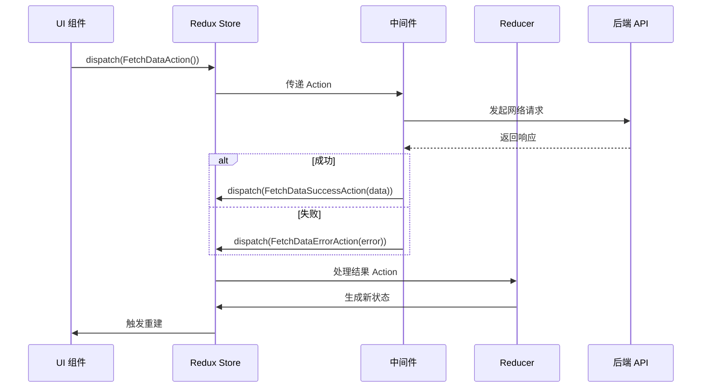

# Action

在 Flutter Redux 中，**Action** 是触发状态变化的唯一方式，它描述了应用中发生的事件，并携带了更新状态所需的数据。以下是 Action 的详细解析，涵盖其设计、使用场景和最佳实践：

---

## **Action 的核心概念**

| 特性               | 说明                                                                 |
|--------------------|--------------------------------------------------------------------|
| **不可变性**        | Action 是不可变对象，确保状态变化的可预测性                          |
| **纯数据载体**      | 仅包含描述事件的数据，不包含业务逻辑                                 |
| **类型明确性**      | 每个 Action 对应特定操作（如 `LoginSuccess`、`FetchDataError`）       |

---

## **Action 的设计与实现**

### **1. 基本结构**

每个 Action 是一个 `类`，通常包含：

- **类型标识**：通过类名明确操作意图（如 `IncrementCounter`）
- **数据字段**：携带必要的信息（如 `UpdateUserProfile` 需要 `newName`）

```dart
// 同步 Action 示例
class IncrementCounterAction {}

class UpdateUserProfileAction {
  final String newName;
  UpdateUserProfileAction(this.newName);
}
```

### **2. 使用 Freezed 简化定义**

通过 `freezed` 库生成类型安全的不可变 Action 类：

```dart
@freezed
class AppAction with _$AppAction {
  // 同步 Action
  const factory AppAction.increment() = Increment;
  const factory AppAction.updateProfile(String name) = UpdateProfile;

  // 异步 Action（由 Middleware 处理）
  const factory AppAction.fetchData() = FetchData;
  const factory AppAction.fetchDataSuccess(String data) = FetchDataSuccess;
  const factory AppAction.fetchDataError(String error) = FetchDataError;
}
```

---

## **Action 的分类**

| 类型               | 场景                     | 处理方式              | 示例                                 |
|--------------------|------------------------|---------------------|------------------------------------|
| **同步 Action**     | 直接修改状态              | Reducer             | `IncrementCounter`, `UpdateTheme`  |
| **异步 Action**     | 触发网络请求、文件操作等    | Middleware          | `LoginRequest`, `FetchProducts`    |
| **结果 Action**     | 异步操作的结果通知          | Reducer             | `LoginSuccess`, `FetchDataError`   |

---

## **异步 Action 处理流程**



---

## **Action 与 Reducer 的交互**

Reducer 根据 Action 类型生成新状态：

```dart
AppState reducer(AppState state, AppAction action) {
  return action.when(
    increment: () => state.copyWith(counter: state.counter + 1),
    updateProfile: (name) => state.copyWith(profile: name),
    fetchData: () => state.copyWith(isLoading: true),
    fetchDataSuccess: (data) => state.copyWith(
      isLoading: false,
      data: data,
    ),
    fetchDataError: (error) => state.copyWith(
      isLoading: false,
      error: error,
    ),
  );
}
```

---

## **最佳实践**

### **1. 单一职责原则**

每个 Action 只描述一个状态变化：

```dart
// ✅ 正确：拆分独立 Action
class UpdateUserNameAction {
  final String name;
  UpdateUserNameAction(this.name);
}

class UpdateUserAgeAction {
  final int age;
  UpdateUserAgeAction(this.age);
}

// ❌ 错误：一个 Action 修改多个字段
class UpdateUserAction {
  final String name;
  final int age;
  UpdateUserAction(this.name, this.age);
}
```

### **2. 类型安全**

避免使用 `dynamic` 类型，确保所有 Action 可追踪：

```dart
// 使用强类型 Reducer
final appReducer = combineReducers<AppState>([
  TypedReducer<AppState, IncrementCounterAction>(_handleIncrement),
  TypedReducer<AppState, UpdateProfileAction>(_handleUpdateProfile),
]);
```

### **3. 异步处理标准化**

使用中间件库（如 `redux_thunk`）统一管理异步逻辑：

```dart
// 定义 Thunk Action
ThunkAction<AppState> fetchUserData(int userId) {
  return (Store<AppState> store) async {
    store.dispatch(FetchDataLoadingAction());
    try {
      final data = await UserApi.fetch(userId);
      store.dispatch(FetchDataSuccessAction(data));
    } catch (e) {
      store.dispatch(FetchDataErrorAction(e.toString()));
    }
  };
}

// 触发异步 Action
store.dispatch(fetchUserData(123));
```

### **4. 命名规范**

- **同步 Action**：动词 + 名词（`UpdateProfile`, `AddTodoItem`）
- **异步 Action**：动词 + 名词 + 阶段（`FetchDataStart`, `FetchDataComplete`）
- **结果 Action**：操作 + 结果（`LoginSuccess`, `UploadFileFailure`）

---

## **高级技巧**

### **1. Action 的依赖注入**

在 Middleware 中注入服务（如 API Client），保持 Action 纯净：

```dart
Middleware<AppState> createApiMiddleware(ApiClient api) {
  return (Store<AppState> store, dynamic action, NextDispatcher next) {
    if (action is FetchDataAction) {
      api.fetchData().then((data) {
        store.dispatch(FetchDataSuccessAction(data));
      });
    }
    next(action);
  };
}
```

### **2. 批量 Action 处理**

通过 `redux_batch` 中间件同时处理多个 Action：

```dart
store.dispatch(BatchActions([
  UpdateProfileAction('New Name'),
  IncrementCounterAction(),
]));
```

### **3. 使用 `meta` 字段附加元数据**

为 Action 添加调试信息（不影响业务逻辑）：

```dart
class UpdateProfileAction {
  final String name;
  final String source; // 如 'settings_page'
  UpdateProfileAction(this.name, {this.source = 'unknown'});
}
```

---

## **完整示例**

```dart
import 'package:flutter/material.dart';
import 'package:flutter_redux/flutter_redux.dart';
import 'package:redux/redux.dart';
import 'package:redux_thunk/redux_thunk.dart';
import 'package:freezed_annotation/freezed_annotation.dart';

part 'actions.freezed.dart';

// 状态类
@freezed
class AppState with _$AppState {
  const factory AppState({
    required int counter,
    required String profile,
    required bool isLoading,
    required String? error,
  }) = _AppState;
}

// Action 定义
@freezed
class AppAction with _$AppAction {
  const factory AppAction.increment() = Increment;
  const factory AppAction.updateProfile(String name) = UpdateProfile;
  const factory AppAction.fetchData() = FetchData;
  const factory AppAction.fetchDataSuccess(String data) = FetchDataSuccess;
  const factory AppAction.fetchDataError(String error) = FetchDataError;
}

// Reducer
AppState reducer(AppState state, AppAction action) {
  return action.when(
    increment: () => state.copyWith(counter: state.counter + 1),
    updateProfile: (name) => state.copyWith(profile: name),
    fetchData: () => state.copyWith(isLoading: true, error: null),
    fetchDataSuccess: (data) => state.copyWith(
      isLoading: false,
      profile: data,
    ),
    fetchDataError: (error) => state.copyWith(
      isLoading: false,
      error: error,
    ),
  );
}

// Thunk Action
ThunkAction<AppState> fetchProfileData() {
  return (Store<AppState> store) async {
    store.dispatch(const AppAction.fetchData());
    await Future.delayed(Duration(seconds: 2)); // 模拟网络请求
    if (Random().nextBool()) {
      store.dispatch(const AppAction.fetchDataSuccess('New Profile Data'));
    } else {
      store.dispatch(const AppAction.fetchDataError('Request Failed'));
    }
  };
}

void main() {
  final store = Store<AppState>(
    reducer,
    initialState: const AppState(
      counter: 0,
      profile: '',
      isLoading: false,
      error: null,
    ),
    middleware: [thunkMiddleware],
  );

  runApp(
    StoreProvider<AppState>(
      store: store,
      child: const MyApp(),
    ),
  );
}

class MyApp extends StatelessWidget {
  const MyApp({super.key});

  @override
  Widget build(BuildContext context) {
    return MaterialApp(
      home: Scaffold(
        body: StoreConnector<AppState, Map<String, dynamic>>(
          converter: (store) => {
            'counter': store.state.counter,
            'profile': store.state.profile,
            'isLoading': store.state.isLoading,
            'error': store.state.error,
          },
          builder: (context, vm) => Column(
            children: [
              Text('Counter: ${vm['counter']}'),
              Text('Profile: ${vm['profile']}'),
              if (vm['isLoading']) const CircularProgressIndicator(),
              if (vm['error'] != null) Text('Error: ${vm['error']}'),
              ElevatedButton(
                onPressed: () => StoreProvider.of<AppState>(context)
                    .dispatch(const AppAction.increment()),
                child: const Text('Increment'),
              ),
              ElevatedButton(
                onPressed: () => StoreProvider.of<AppState>(context)
                    .dispatch(fetchProfileData()),
                child: const Text('Fetch Profile'),
              ),
            ],
          ),
        ),
      ),
    );
  }
}
```

---

## **总结**

在 Flutter Redux 中，Action 是状态管理的核心驱动力：

- **清晰描述意图**：通过强类型和命名规范明确操作目的
- **分离副作用**：同步 Action 由 Reducer 处理，异步逻辑由 Middleware 管理
- **确保可维护性**：模块化设计、类型安全、单一职责原则

合理设计 Action 体系，能够显著提升代码的可读性和可测试性，为复杂应用的状态管理奠定坚实基础。
