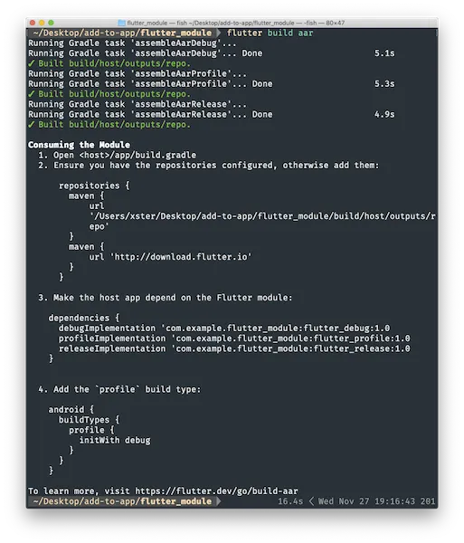

# 接入到现有应用

Flutter 与 Android 原生应用的交互和接入是一个常见的需求，尤其是在将 Flutter 作为现有 Android 应用的一部分进行集成时。以下是一些关键点，它们涵盖了 Flutter 和 Android 原生交互和接入的基本概念和步骤：

## 交互方式

* MethodChannel：用于方法调用的交互，允许 Android 原生代码和 Flutter 代码之间进行直接的方法调用和参数传递。

* EventChannel：用于数据流的交互，允许 Android 原生代码向 Flutter 发送数据流，Flutter 端通过监听这些数据流来响应数据变化。

* BasicMessageChannel：用于传递字符串或半结构化消息，如 JSON 对象。它支持异步消息传递，并且两端需要使用相同的编解码器。

## 接入步骤

将 Flutter 模块接入到现有的 Android 应用中，并实现数据互调，涉及到几个关键步骤。以下是详细的过程：

### 步骤 1: 创建 Flutter 模块

首先，创建一个 Flutter 模块，这可以是一个全新的 Flutter 项目，也可以是一个现有的 Flutter 项目，你打算将其集成到 Android 应用中。

```shell
flutter create -t module your_flutter_module
```

### 步骤 2: 集成 Flutter 模块到 Android 应用

选择将 Flutter 模块构建为 AAR 文件集成，或者直接依赖模块的源码。确保 Android 项目的 build.gradle 文件中已经包含了 Flutter 模块的依赖，并且设置了正确的 Java 版本兼容性。

1. **AAR 集成** ：AAR 机制可以为每个 Flutter 模块创建 Android AAR 作为依赖媒介。当你的宿主应用程序开发者不想安装 Flutter SDK 时，这是一个很好方案。但是每次修改都需要重新编译。
2. **模块源码集成**： 直接将 Flutter 模块的源码作为子项目的依赖机制是一种便捷的一键式构建方案，但此时需要另外安装 Flutter SDK，这是目前 Android Studio IDE 插件使用的机制。

#### AAR集成

这种方式会将 Flutter 库打包成由 AAR 和 POM artifacts 组成的本地 Maven 存储库。这种方案可以使你的团队不需要安装 Flutter SDK 即可编译宿主应用。之后，你可以从本地或远程存储库中分发更新 artifacts。

假设你在 `some/path/flutter_module` 下构建 Flutter 模块，执行如下命令：

```shell
cd some/path/flutter_module
flutter build aar
```

>也可以直接点击 Android Studio 菜单中的 Build > Flutter > Build AAR 为 Flutter 模块构建 AAR。

根据屏幕上的提示完成集成操作。



详细地说，该命令应用于创建（`debug/profile/release` 所有模式） **本地仓库**，主要包含以下文件：

```txt
build/host/outputs/repo
└── com
    └── example
        └── flutter_module
            ├── flutter_release
            │   ├── 1.0
            │   │   ├── flutter_release-1.0.aar
            │   │   ├── flutter_release-1.0.aar.md5
            │   │   ├── flutter_release-1.0.aar.sha1
            │   │   ├── flutter_release-1.0.pom
            │   │   ├── flutter_release-1.0.pom.md5
            │   │   └── flutter_release-1.0.pom.sha1
            │   ├── maven-metadata.xml
            │   ├── maven-metadata.xml.md5
            │   └── maven-metadata.xml.sha1
            ├── flutter_profile
            │   ├── ...
            └── flutter_debug
```

要依赖 AAR，宿主应用必须能够找到这些文件。

为此，需要在宿主应用程序中修改 `settings.gradle`文件，使其包含本地存储库和上述依赖项：

```gradle
dependencyResolutionManagement {
  repositoriesMode.set(RepositoriesMode.PREFER_SETTINGS)
  repositories {
    google()
    mavenCentral()

  // Add the new repositories starting on the next line...
    maven {
      url 'some/path/flutter_module/build/host/outputs/repo'
      // This is relative to the location of the build.gradle file
      // if using a relative path.
    }
    maven {
      url 'https://storage.googleapis.com/download.flutter.io'
    }
  // ...to before this line  
  }
}
```

##### 基于 Kotlin DSL 的 Android 项目

在基于 Kotlin DSL Android 项目的 aar 构建完成后，请按照以下步骤添加 flutter_module。

在 Android 项目的 `app/build.gradle` 文件中将 flutter module 列为依赖项。

`MyApp/app/build.gradle.kts`

```kotlin
android {
    buildTypes {
        release {
          ...
        }
        debug {
          ...
        }
        create("profile") {
            initWith(getByName("debug"))
        }
}
dependencies {
  // ...
  debugImplementation "com.example.flutter_module:flutter_debug:1.0"
  releaseImplementation 'com.example.flutter_module:flutter_release:1.0'
  add("profileImplementation", "com.example.flutter_module:flutter_profile:1.0")
}
```

`profileImplementation ID` 是在宿主项目的 `app/build.gradle` 文件中实施的自定义 `configuration`。

`host-project/app/build.gradle.kts`

```kotlin
configurations {
    getByName("profileImplementation") {
    }
}
MyApp/settings.gradle.kts
content_copy
include(":app")

dependencyResolutionManagement {
    repositories {
        maven(url = "https://storage.googleapis.com/download.flutter.io")
        maven(url = "some/path/flutter_module_project/build/host/outputs/repo")
    }
}
```

#### 模块源码集成

直接依赖源码示例：

修改 settings.gradle：确保在 Android 项目的 settings.gradle 文件中包含了 Flutter 模块。

```grovy
include ':app', ':your_flutter_module'
project(':your_flutter_module').projectDir = new File('path/to/your_flutter_module')
```

修改 build.gradle：在应用的 build.gradle 文件中添加 Flutter 模块的依赖。

```gradle
dependencies {
    implementation project(':your_flutter_module')
}
```

### 步骤 3: 创建 FlutterActivity

在 Android 应用中创建一个 `FlutterActivity` 来加载和显示 Flutter UI。

```java
// AndroidManifest.xml 中添加 FlutterActivity
<activity android:name=".YourFlutterActivity" />
// YourFlutterActivity.java
import io.flutter.embedding.android.FlutterActivity;

public class YourFlutterActivity extends FlutterActivity {
    // FlutterActivity 负责设置 Flutter Engine 和其他必要组件
}
```

### 步骤 4: 启动 FlutterActivity

在 Android 应用的原生代码中添加 `Intent` 来启动 `FlutterActivity`。

```java
Intent intent = new Intent(this, YourFlutterActivity.class);
startActivity(intent);
```

### 步骤 5: 实现数据互调

注册和使用 Channels：在 Android 原生代码中注册 MethodChannel、EventChannel 或 BasicMessageChannel，并在 Flutter 端进行相应的配置以实现数据交互。

示例：

使用 `MethodChannel`：创建一个 `MethodChannel` 来实现 Dart 代码和原生 Android 代码之间的通信。

在 Dart 端发送消息：

```dart
import 'package:flutter/services.dart';

const platformChannel = MethodChannel('com.yourdomain.flutter/method');

Future<void> sendToNative() async {
  try {
    final String result = await platformChannel.invokeMethod('greet', 'Hello');
    print(result);
  } on PlatformException catch (e) {
    print("Failed to invoke method: '${e.message}'");
  }
}
```

在 Android 端接收消息并响应：

```java
// YourFlutterActivity.java
import io.flutter.plugin.common.MethodChannel;

@Override
protected void onCreate(Bundle savedInstanceState) {
  super.onCreate(savedInstanceState);
  MethodChannel channel = new MethodChannel(getFlutterEngine().getDartExecutor().getBinaryMessenger(), "com.yourdomain.flutter/method");
  channel.setMethodCallHandler(
    (call, result) -> {
      if (call.method.equals("greet")) {
        String greeting = call.argument("greeting");
        result.success(greeting + " from the native side!");
      } else {
        result.notImplemented();
      }
    }
  );
}
```

### 步骤 6: 测试

构建并运行你的 Android 应用，在设备或模拟器上测试 Flutter 模块的集成和数据互调是否正常工作。

### 提示

确保在 Android 应用的 `Application` 类中正确初始化 Flutter，调用 `FlutterMain.startInitialization(this)` 并确保 `ensureInitializationComplete()` 在 `startInitialization` 之后被调用。

---

## 注意事项

* 确保 MethodChannel 的名称是唯一的，避免与其他应用或模块的 Channel 冲突。
* 在 Android 应用和 Flutter 模块之间传递复杂的数据结构时，可能需要序列化和反序列化操作。
* 测试数据互调功能时，要覆盖所有可能的使用场景，确保稳定性和可靠性。
* 性能优化：考虑使用带有缓存的 `FlutterEngine` 来减少页面切换时的预热时间。
* 样式和布局：可以通过自定义主题和样式来调整 Flutter 页面在 Android 应用中的显示效果。
* 平台视图：Flutter 允许将原生视图嵌入到 Flutter 应用中，这增加了两者交互的灵活性。

通过这些步骤，你可以将 Flutter 模块作为一个功能强大的组件集成到现有的 Android 应用中，并实现它们之间的数据互调。
