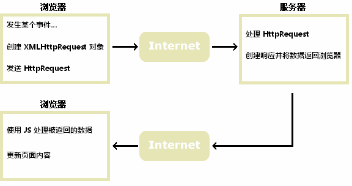

# AJAX是啥

 Asynchronous JavaScript and XML，中文意思是 **异步的JavaScript和XML**

## AJAX作用

 通过后台与服务器数据交换，在不重新加载整个页面情况下，更新部分页面的技术

## AJAX原理

### AJAX是基于现有的Internet标准

AJAX是基于现有的Internet标准，并且联合使用它们：

* XMLHttpRequest 对象 (异步的与服务器交换数据)
* JavaScript/DOM (信息显示/交互)
* CSS (给数据定义样式)
* XML (作为转换数据的格式)

>AJAX应用程序与浏览器和平台无关的！
