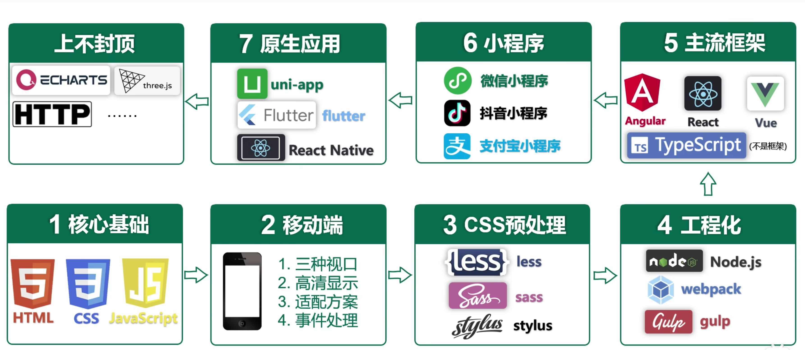

# web

## 学习资料

* 学习路线  
[尚硅谷学习路线](https://www.bilibili.com/video/BV1p84y1P7Z5?p=200&vd_source=3509947f569e04aa5c144447e22d0ceb)

* css+html  
[尚硅谷css+Html](https://www.bilibili.com/video/BV1p84y1P7Z5?p=105&vd_source=3509947f569e04aa5c144447e22d0ceb)  我学习的这个，其内容归类比较好，不过其内容中的某些概念讲的有点笼统，也可以对照看看下面黑马的视频。  
[黑马CSS & HTML](https://www.bilibili.com/video/BV14J4114768/?spm_id_from=333.788.recommend_more_video.1)  这个我没学过  
[黑马CSS-移动](https://www.bilibili.com/video/BV14J4114768?p=391&vd_source=3509947f569e04aa5c144447e22d0ceb)  

* javascript  
[黑马JS](https://www.bilibili.com/video/BV1Y84y1L7Nn/?spm_id_from=333.788.recommend_more_video.0&vd_source=3509947f569e04aa5c144447e22d0ceb)  
[es6菜鸟教程](https://www.runoob.com/w3cnote/es6-tutorial.html)

* typescript  
[typescript基础文档](https://www.tslang.cn/docs/handbook/basic-types.html)

* less  
[less官方文档](https://less.bootcss.com/#概览)

* vue  
[vue文档](https://cn.vuejs.org/guide/essentials/application.html)  
[尚硅谷vue2](https://www.bilibili.com/video/BV1Zy4y1K7SH/?p=2&spm_id_from=pageDriver&vd_source=3509947f569e04aa5c144447e22d0ceb) 这个只学vue2就行，vue3学下面的  
[尚硅谷vue3+ts+vite工程化](https://www.bilibili.com/video/BV1Za4y1r7KE?p=3&spm_id_from=pageDriver&vd_source=3509947f569e04aa5c144447e22d0ceb)  

* Axios网络框架

[官方文档](https://www.axios-http.cn/)

## 常用网站

### 学习网站

[MDN](https://developer.mozilla.org/zh-CN/docs/Learn)  
[w3school](https://www.w3school.com.cn/)

推荐使用**MDN**，内容较新较全  

### 三方框架

* [vant](https://vant-ui.github.io/vant/#/zh-CN)：轻量、可定制的移动端组件库

## 早知道

1. nodejs ： 基于Chrome V8 JavaScript引擎的JavaScript运行时环境，可以用js编译服务器代码，实现后端服务的开发。
2. vite、webpack ：前端程序化的打包工具。（类似android的gradle、javaweb的maven）
3. Axios：js网络框架
4. Typescript ：新语言，JS语言的超类，完全兼容JS，但又做了特性化处理。
