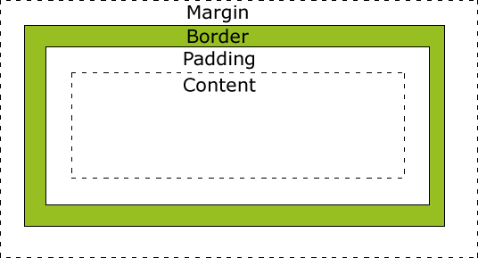

# 盒子模型

每个HTML元素都可以看做是一个盒子模型，他像是一个盒子内部有不同层次。具体如下

Margin(外边距) - 清除边框外的区域，外边距是透明的。  
Border(边框) - 围绕在内边距和内容外的边框。  
Padding(内边距) - 清除内容周围的区域，内边距是透明的。  
Content(内容) - 盒子的内容，显示文本和图像。

## 盒子模型宽高计算

重要: 当您指定一个 CSS 元素的宽度和高度属性时，你只是设置内容区域的宽度和高度。要知道，完整大小的元素，你还必须添加内边距，边框和外边距。

当指定了宽或高时，元素总宽高计算如下：

    元素总宽度 = 内容宽+左右内边距+左右边框宽+左右外边距  
    元素总高度 = 内容高+上下内边距+上下边框宽+上下外边距

当未指定宽或高，元素总宽高计算如下：

    元素总宽度 = 父元素内容宽 - 左右外边距
    元素总高度 = 父元素内容高 - 上下外边距

## margin

### 定义和用法

margin 简写属性在一个声明中设置所有外边距属性。该属性可以有 1 到 4 个值。

### 说明

这个简写属性设置一个元素所有外边距的宽度，或者设置各边上外边距的宽度。

块级元素的垂直相邻外边距会合并，而行内元素实际上不占上下外边距。行内元素的的左右外边距不会合并。同样地，浮动元素的外边距也不会合并。允许指定负的外边距值，不过使用时要小心。

>允许使用负值。

* 例子 1
    margin:10px 5px 15px 20px;

    上外边距是 10px
    右外边距是 5px
    下外边距是 15px
    左外边距是 20px
* 例子 2
    margin:10px 5px 15px;

    上外边距是 10px
    右外边距和左外边距是 5px
    下外边距是 15px
* 例子 3
    margin:10px 5px;

    上外边距和下外边距是 10px
    右外边距和左外边距是 5px
* 例子 4
    margin:10px;

    所有 4 个外边距都是 10px
