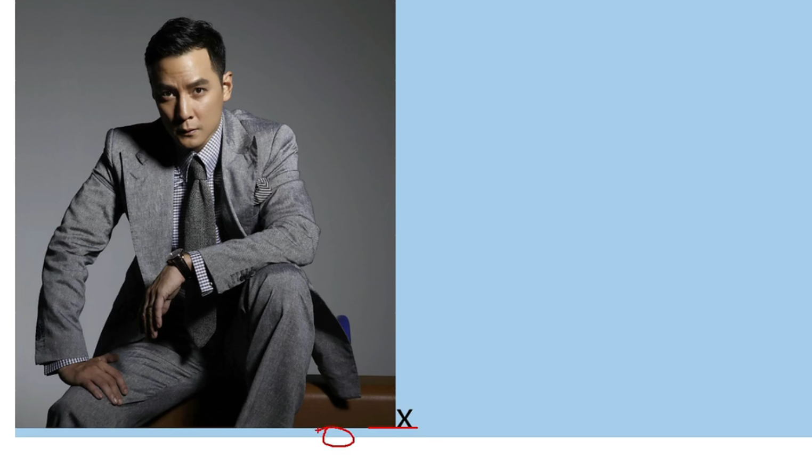

# 空白问题

## 元素空白问题

行内块元素、行内元素，彼此间的**换行**会被浏览器解析为一个空白字符。

解决办法：  
方案1：去掉换行和空格
方案2：给父元素设置font-size:0,再给元素单独设置字体大小。

## 行内块元素空白问题

行内块元素默认与文本基线对齐，基线与单行底部有距离，所以距离底部会有留白。

解决办法：  
方案1：给行内块设置vertical-align，值不为baseline即可
方案2：如果父元素只有这一张图片元素img(img元素是行内块元素)，可以将此图片元素直接设置为块元素，独占一行
方案3：给父元素设置font-size:0，如果该行内元素内部有其他文本，单独设置font-size
