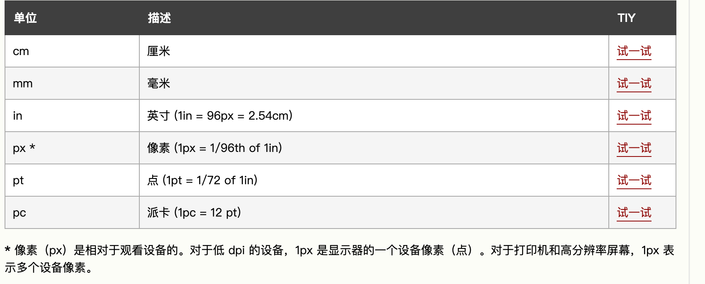
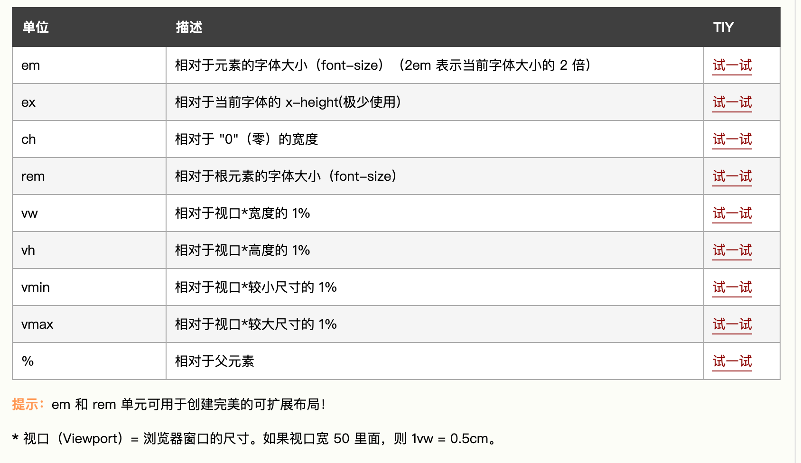

# css中的单位

参考资料：[css单位](https://www.w3school.com.cn/cssref/css_units.asp)

CSS 有几种表示长度的不同单位。

许多 CSS 属性接受“长度”值，诸如 width、margin、padding、font-size 等。

长度是一个后面跟着长度单位的数字，诸如 10px、2em 等。

## 绝对长度

绝对长度单位是固定的，用任何一个绝对长度表示的长度都将恰好显示为这个尺寸。

不建议在屏幕上使用绝对长度单位，因为屏幕尺寸变化很大。但是，如果已知输出介质，则可以使用它们，例如用于打印布局（print layout）。

## 相对长度

相对长度单位规定相对于另一个长度属性的长度。相对长度单位在不同渲染介质之间缩放表现得更好。（一般移动设备用）

