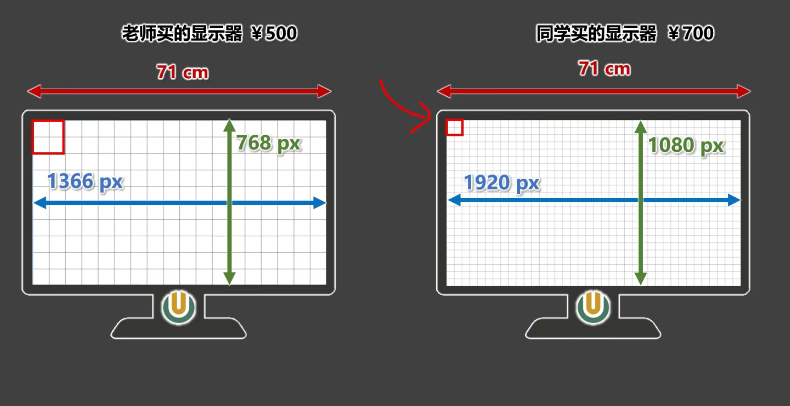

# 像素(web)

像素的概念所有带屏设备都一样。但每个语言用到的单位定义不同，这里我们只说web的。

参考资料：[像素](https://www.bilibili.com/video/BV1p84y1P7Z5/?p=88&spm_id_from=pageDriver&vd_source=3509947f569e04aa5c144447e22d0ceb)

## 像素单位

* px：（单位分辨率下物理像素单位） ，相同宽高屏，分辨率越高 ，物理像素点越小

