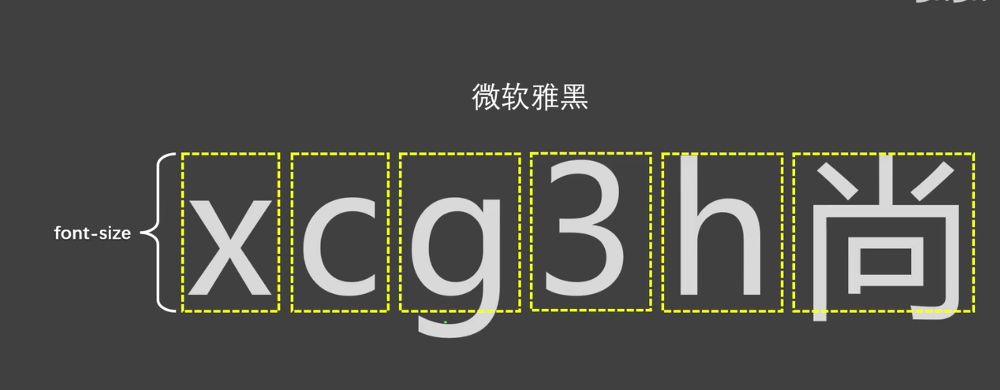
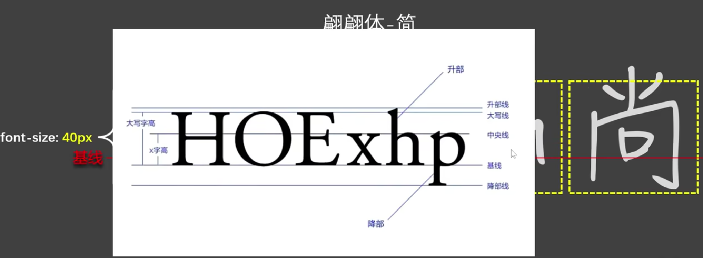

# font-size细解

>了解就行，知道文字不是垂直居中

参考资料：[尚硅谷：font-size细解](https://www.bilibili.com/video/BV1p84y1P7Z5/?p=103&spm_id_from=333.1007.top_right_bar_window_history.content.click&vd_source=3509947f569e04aa5c144447e22d0ceb)

## 总结视频内容

1. 字体设计时有字体框，同时依据基线：baseline 对齐。 学拼音4线格，第三条线就是基线。字体展示时依据基线进行水平对齐， 字母、汉字等可超出字体框。

2. 字体的设计会使得文字最终呈现的大小不一定与`font-size`设计大小一致，可能大也可能小。
3. 文字相对字体设计框，不是垂直居中，一般靠下一些。
