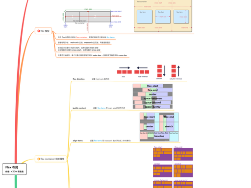

# Flex 布局速记脑图

## 文字版（便于复制检索）

### 一、Flex 容器（父元素）

**1.  display**

- `flex`：块级弹性容器
- `inline-flex`：行内弹性容器

**2.  方向与换行**

- `flex-direction`：主轴方向
  - `row`（默认）：左 → 右
  - `row-reverse`：右 → 左
  - `column`：上 → 下
  - `column-reverse`：下 → 上
- `flex-wrap`：换行
  - `nowrap`（默认）：不换行
  - `wrap`：自动换行
  - `wrap-reverse`：反向换行
- `flex-flow`：`flex-direction` + `flex-wrap` 简写

**3.  对齐**

- `justify-content`：主轴对齐
  - `flex-start`（默认）、`flex-end`、`center`
  - `space-between`：两端对齐
  - `space-around`：间距环绕
  - `space-evenly`：间距相等
- `align-items`：单行交叉轴对齐
  - `stretch`（默认）、`flex-start`、`flex-end`、`center`、`baseline`
- `align-content`：多行交叉轴对齐
  - 同 `justify-content`，仅换行后生效

**4.  间距**

- `gap`：行列间距（推荐）
  - `row-gap`、`column-gap`

### 二、Flex 项目（子元素）

**1.  伸缩**

- `flex-grow`：放大比例（默认 0）
- `flex-shrink`：缩小比例（默认 1）
- `flex-basis`：基准尺寸（默认 `auto`）
- `flex`：简写
  - `flex: initial` = `0 1 auto`
  - `flex: 1` = `1 1 0%`（平分）
  - `flex: auto` = `1 1 auto`
  - `flex: none` = `0 0 auto`（固定）

**2.  对齐与顺序**

- `align-self`：覆盖 `align-items`
  - `auto`（默认）、`stretch`、`flex-start`、`flex-end`、`center`、`baseline`
- `order`：排列顺序（默认 0，数值小排前）

### 三、常见坑点（必记）

- **float/clear/vertical-align** 失效
- **`flex-shrink:1`** 会压缩固定宽高
- **`flex-basis`** 优先级 > `width/height`
- **`min-width:auto`** 导致内容溢出
- **`space-between`** 最后一行对齐错乱
- **绝对定位**脱离 Flex 流
- **百分比 margin/padding** 相对父容器宽度

要不要我把这张脑图整理成一份可直接复制的 **Flex 常用布局代码片段**（水平垂直居中、宫格、导航、等高列、卡片流）？
