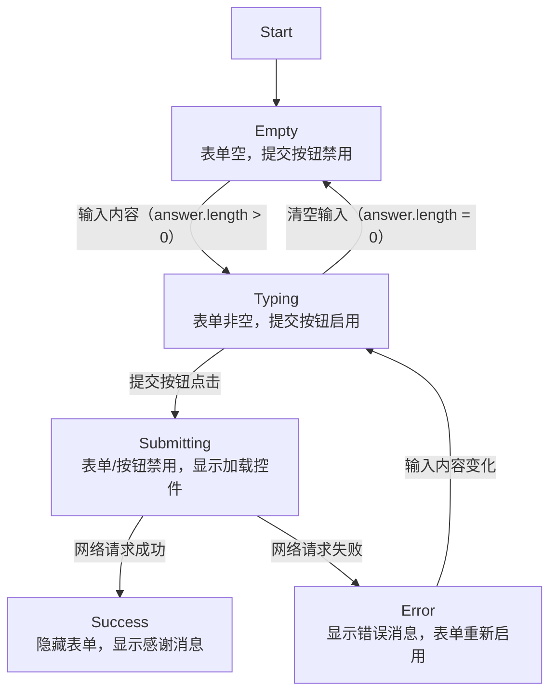

# 使用状态对输入做出反应

原地址：<https://react.nodejs.cn/learn/reacting-to-input-with-state>  

## 一、声明式 UI 与命令式 UI 的核心区别

在 UI 编程中，存在两种不同的范式，核心差异在于对 UI 交互的实现方式：

### 1. 命令式 UI 编程

- **核心思想**：直接操作 UI 元素，通过编写具体指令告诉计算机“如何做”。开发者需要针对每个用户操作或事件，精确控制 UI 元素的显示、隐藏、启用、禁用等状态。
- **举例**：对于表单交互，需手动编写代码禁用按钮、显示加载控件、隐藏错误消息等，如通过 `el.disabled = true`、`el.style.display = 'none'` 等直接操作 DOM。
- **缺点**：在复杂系统中，管理大量 UI 元素的状态变化会导致代码脆弱，新增元素或交互时需检查所有现有逻辑，易引入遗漏或错误。

### 2. 声明式 UI 编程（React 采用）

- **核心思想**：描述 UI 的不同状态，而非直接操作 UI。开发者只需定义“要显示什么”，由 React 自动处理“如何更新 UI”的细节。
- **举例**：对于表单，只需定义“提交时显示加载状态”“成功后显示感谢消息”等状态描述，React 会根据状态变化自动更新 UI。
- **优势**：降低代码复杂性，减少状态同步问题，便于扩展新状态或修改现有状态的显示逻辑。

## 二、React 中状态管理的核心步骤

在 React 中实现基于状态的 UI 交互，需遵循以下步骤：

### 步骤 1：识别组件的不同视觉状态

视觉状态是用户可能看到的 UI 表现形式，需提前枚举所有可能的状态。以表单为例，常见视觉状态包括：

- **Empty（空状态）**：表单输入为空，提交按钮禁用。
- **Typing（输入状态）**：表单输入非空，提交按钮启用。
- **Submitting（提交状态）**：表单和按钮禁用，显示加载控件（如 spinner）。
- **Success（成功状态）**：表单隐藏，显示“感谢”消息。
- **Error（错误状态）**：类似输入状态，但额外显示错误消息。

### 步骤 2：确定状态变化的触发因素

状态变化由两类输入触发，需明确每个状态转换的条件：

- **人工输入**：用户操作，如输入文本、点击按钮、导航链接等。例如：输入内容触发“空状态”→“输入状态”；点击提交按钮触发“输入状态”→“提交状态”。
- **计算机输入**：系统事件，如网络响应完成、超时、图片加载完成等。例如：网络请求成功触发“提交状态”→“成功状态”；请求失败触发“提交状态”→“错误状态”。

### 步骤 3：用 `useState` 表示内存中的状态

使用 React 的 `useState` Hook 在内存中存储状态变量，需确保状态能覆盖所有视觉状态。初始阶段可定义较多状态变量，例如：

```jsx
const [answer, setAnswer] = useState(''); // 存储输入内容
const [error, setError] = useState(null); // 存储错误消息
const [status, setStatus] = useState('typing'); // 存储状态标识（'typing'/'submitting'/'success'）
```

### 步骤 4：删除非必要状态变量

为避免状态冗余或悖论（如状态间冲突），需精简状态变量，原则包括：

- **避免悖论**：例如“正在输入”（typing）和“正在提交”（submitting）不能同时为真，可合并为一个 `status` 变量。
- **避免重复信息**：例如“输入是否为空”可通过 `answer.length === 0` 判断，无需单独定义 `isEmpty` 状态。
- **通过其他状态推导**：例如“是否有错误”可通过 `error !== null` 判断，无需单独定义 `isError` 状态。

精简后，表单示例保留 3 个核心状态变量：`answer`（输入内容）、`error`（错误消息）、`status`（状态标识）。

### 步骤 5：连接事件处理程序以设置状态

通过事件处理程序响应触发因素，更新状态变量，从而驱动 UI 变化。例如：

- **输入变化事件**：通过 `onChange` 监听输入，更新 `answer` 状态。
- **提交事件**：通过 `onSubmit` 触发提交逻辑，更新 `status` 为“submitting”，并处理网络请求结果（成功则更新为“success”，失败则更新 `error` 并恢复“typing”）。

示例代码片段：

```jsx
function handleTextareaChange(e) {
  setAnswer(e.target.value); // 更新输入内容
}

async function handleSubmit(e) {
  e.preventDefault();
  setStatus('submitting'); // 进入提交状态
  try {
    await submitForm(answer);
    setStatus('success'); // 成功状态
  } catch (err) {
    setStatus('typing'); // 恢复输入状态
    setError(err); // 存储错误消息
  }
}
```

## 三、表单状态转换流程图



## 四、核心总结

1. **声明式 vs 命令式**：声明式通过描述状态定义 UI，React 处理更新细节；命令式需手动操作 UI 元素，适用于简单场景但扩展性差。
2. **状态管理步骤**：识别视觉状态 → 确定触发因素 → 用 `useState` 建模状态 → 精简状态 → 连接事件更新状态。
3. **状态精简原则**：避免悖论、重复信息和冗余变量，通过核心状态推导派生信息，降低代码复杂性。

通过以上流程，可在 React 中构建健壮、可扩展的状态驱动 UI，轻松应对复杂交互场景。
