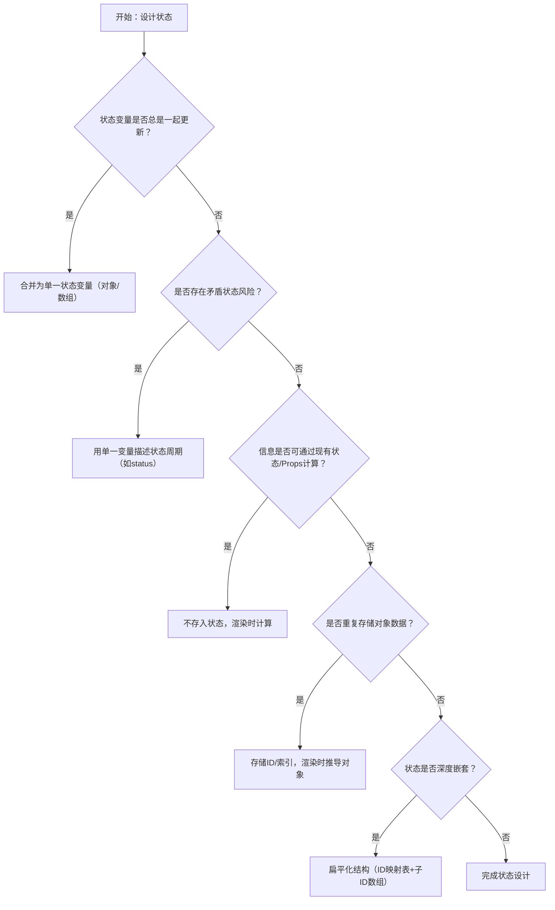

# 选择状态结构

原地址：<https://react.nodejs.cn/learn/choosing-the-state-structure>

良好地构建状态是区分易于维护组件与易出错组件的关键。本文详细介绍了React中构建状态的核心原则、实践案例及常见问题解决方案，帮助开发者设计更健壮的状态结构。

## 一、结构化状态的核心原则

构建状态的核心目标是使状态易于更新且减少错误，类似于数据库规范化的思想。以下是五大核心原则：

### 1. 分组相关状态

当多个状态变量总是同时更新时，应将其合并为单一状态变量，避免同步遗漏。

#### 原则说明

- 若两个状态变量的更新逻辑强关联（如坐标的x和y轴），合并为对象或数组可提升维护性。
- 对于数量不确定的状态（如动态表单字段），使用对象或数组更灵活。

#### 案例分析

**反例**：使用两个独立状态变量管理坐标，更新时需同步操作：

```javascript
const [x, setX] = useState(0);
const [y, setY] = useState(0);
// 更新时需分别调用setX和setY，易遗漏
```

**正例**：合并为`position`对象，统一更新：

```javascript
const [position, setPosition] = useState({ x: 0, y: 0 });
// 光标移动时同步更新x和y
onPointerMove={e => setPosition({ x: e.clientX, y: e.clientY })}
```

#### 注意事项

- 更新对象状态时需复制现有属性，避免覆盖：  
  `setPosition({ ...position, x: 100 })`（而非`setPosition({ x: 100 })`）。
- 若需单独频繁更新某字段，也可拆分为独立状态变量（如`setX(100)`）。

### 2. 避免状态矛盾

状态设计应避免出现“不可能”的状态组合，减少逻辑冲突风险。

#### 原则说明

- 多个状态变量若存在互斥关系（如“发送中”和“已发送”），可能因同步失误导致矛盾状态（如同时为`true`）。
- 应使用单一状态变量描述完整状态周期，限制取值范围。

#### 案例分析

**反例**：酒店反馈表单使用`isSending`和`isSent`两个状态：

```javascript
const [isSending, setIsSending] = useState(false);
const [isSent, setIsSent] = useState(false);
// 可能因代码疏漏导致isSending和isSent同时为true
```

**正例**：用`status`变量描述状态周期：

```javascript
const [status, setStatus] = useState('typing'); // 取值：'typing'|'sending'|'sent'
// 提交时更新为'sending'，完成后更新为'sent'，无矛盾
async function handleSubmit(e) {
  setStatus('sending');
  await sendMessage(text);
  setStatus('sent');
}
// 渲染时通过状态推导辅助变量
const isSending = status === 'sending';
const isSent = status === 'sent';
```

### 3. 避免冗余状态

若某信息可通过现有状态或props计算得出，则不应作为独立状态存储，减少同步成本。

#### 原则说明

- 冗余状态会增加更新逻辑复杂度，易因遗漏更新导致数据不一致。
- 渲染时计算的衍生数据更可靠，无需手动维护同步。

#### 案例分析

**反例**：表单中`fullName`作为状态变量，需在`firstName`和`lastName`变化时手动更新：

```javascript
const [firstName, setFirstName] = useState('');
const [lastName, setLastName] = useState('');
const [fullName, setFullName] = useState(''); // 冗余
// 需在两个 onChange 中分别更新fullName，易出错
```

**正例**：渲染时通过`firstName`和`lastName`计算`fullName`：

```javascript
const [firstName, setFirstName] = useState('');
const [lastName, setLastName] = useState('');
const fullName = firstName + ' ' + lastName; // 渲染时计算
// 无需手动更新，状态变化自动触发重新计算
```

#### 常见问题：镜像Props到状态

将props存入状态会导致props更新时状态不同步（状态仅初始化一次）：

```javascript
// 错误：镜像props到状态
function Message({ messageColor }) {
  const [color, setColor] = useState(messageColor); // 后续messageColor变化，color不变
}

// 正确：直接使用props或定义常量
function Message({ messageColor }) {
  const color = messageColor; // 始终与props同步
}
```

仅当需忽略props更新时，才用`initial`前缀的props初始化状态（如`initialColor`）。

### 4. 避免状态重复

当相同数据在多个状态变量或嵌套对象中重复时，易因同步疏漏导致不一致，应存储核心标识而非完整数据。

#### 原则说明

- 重复存储完整对象会导致一处更新时其他处未同步（如选中项与列表项重复）。
- 应存储唯一标识（如ID），渲染时通过标识从源数据中推导完整信息。

#### 案例分析

**反例**：菜单选择中`selectedItem`直接存储列表中的对象：

```javascript
const [items, setItems] = useState(initialItems);
const [selectedItem, setSelectedItem] = useState(items[0]); // 重复存储对象
// 编辑item时，selectedItem未更新，显示旧数据
```

**正例**：存储`selectedId`，渲染时通过ID查找对象：

```javascript
const [items, setItems] = useState(initialItems);
const [selectedId, setSelectedId] = useState(0); // 存储ID
const selectedItem = items.find(item => item.id === selectedId); // 渲染时推导

// 编辑item时，仅更新items，selectedItem自动同步
function handleItemChange(id, e) {
  setItems(items.map(item => 
    item.id === id ? { ...item, title: e.target.value } : item
  ));
}
```

### 5. 避免深度嵌套状态

深度嵌套的状态结构会增加更新难度（需逐层复制对象），应采用扁平化结构存储。

#### 原则说明

- 嵌套对象/数组更新时需复制整个嵌套链，代码冗长且易出错。
- 扁平化结构（如ID映射表+子ID数组）可简化更新逻辑，类似数据库表设计。

#### 案例分析

**反例**：旅行计划使用嵌套`childPlaces`：

```javascript
// 嵌套结构：更新需复制所有父级对象
const initialTravelPlan = {
  id: 0,
  childPlaces: [{
    id: 1,
    title: 'Earth',
    childPlaces: [{ id: 2, title: 'Africa', childPlaces: [...] }]
  }]
};
```

**正例**：扁平化结构（ID映射+子ID数组）：

```javascript
// 扁平化结构：每个对象存childIds，通过ID映射获取完整信息
const initialTravelPlan = {
  0: { id: 0, title: '(Root)', childIds: [1, 42, 46] },
  1: { id: 1, title: 'Earth', childIds: [2, 10, 19] },
  2: { id: 2, title: 'Africa', childIds: [3, 4, 5] },
  // ...其他对象
};

// 更新时仅需复制父对象和根对象，逻辑简洁
function handleComplete(parentId, childId) {
  const parent = plan[parentId];
  const nextParent = { ...parent, childIds: parent.childIds.filter(id => id !== childId) };
  setPlan({ ...plan, [parentId]: nextParent }); // 仅更新父对象
}
```

## 二、核心要点回顾

1. 相关状态合并管理：若状态变量总是同时更新，合并为单一变量。
2. 避免矛盾状态：用单一状态变量描述完整状态周期，限制取值范围。
3. 消除冗余状态：可通过现有状态/props计算的信息，不作为状态存储。
4. 减少重复状态：存储唯一标识（ID），而非完整对象，渲染时推导。
5. 扁平化嵌套状态：深层嵌套状态更新复杂时，采用ID映射表简化逻辑。
6. 慎用Props镜像：除非需忽略更新，否则不将props存入状态。

## 三、状态结构选择流程图


