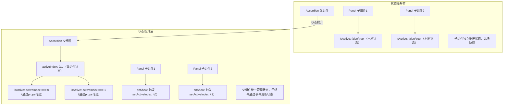

# 在组件之间共享状态

原地址：<https://react.nodejs.cn/learn/sharing-state-between-components>  

## 一、状态提升的概念与场景

当两个或多个组件需要**同步状态变化**（如协调行为、保持数据一致）时，需将它们的状态从子组件移动到最近的共同父组件，再通过属性（props）传递给子组件，这种方式称为**状态提升**（Lifting State Up）。这是React中实现组件间共享状态的核心模式。

### 示例场景

以手风琴（Accordion）组件为例，它包含两个面板（Panel）组件。初始时每个Panel独立维护自身的`isActive`状态（控制是否展开），但需求变更为“同一时间只能展开一个面板”。此时需通过状态提升协调两个Panel的状态。

## 二、状态提升的三步流程

通过手风琴示例详细说明状态提升的具体步骤：

### 步骤1：从子组件中删除状态

子组件（Panel）不再维护自身状态，转而由父组件通过属性控制其状态。  

- 移除Panel中的本地状态定义：`const [isActive, setIsActive] = useState(false);`  
- 为Panel添加`isActive`属性，接收父组件传递的状态：  

  ```jsx
  function Panel({ title, children, isActive }) { ... }
  ```  

此时Panel的状态完全由父组件控制。

### 步骤2：从公共父组件传递硬编码数据

找到子组件的最近共同父组件（此处为Accordion），通过属性向子组件传递硬编码的状态值，验证UI表现。  

- 在Accordion中为两个Panel分别传递`isActive`属性：  

  ```jsx
  export default function Accordion() {
    return (
      <>
        <Panel title="About" isActive={true} />  {/* 硬编码为true */}
        <Panel title="Etymology" isActive={false} />  {/* 硬编码为false */}
      </>
    );
  }
  ```  

通过修改硬编码值，可直接控制子组件的显示状态。

### 步骤3：在公共父组件添加状态并传递事件处理程序

父组件需维护状态并提供事件处理程序，允许子组件触发状态更新。  

1. **父组件添加状态**：由于一次只能展开一个面板，Accordion使用`activeIndex`记录当前活动面板的索引：  

   ```jsx
   const [activeIndex, setActiveIndex] = useState(0); // 初始激活第一个面板
   ```  

2. **传递状态给子组件**：根据`activeIndex`为每个Panel计算`isActive`属性：  

   ```jsx
   <Panel
     title="About"
     isActive={activeIndex === 0}  // 第一个面板激活条件
     onShow={() => setActiveIndex(0)}  // 点击时更新索引
   />
   <Panel
     title="Etymology"
     isActive={activeIndex === 1}  // 第二个面板激活条件
     onShow={() => setActiveIndex(1)}  // 点击时更新索引
   />
   ```  

3. **子组件触发状态更新**：Panel的按钮点击事件绑定父组件传递的`onShow`处理程序：  

   ```jsx
   function Panel({ title, children, isActive, onShow }) {
     return (
       <section>
         <h3>{title}</h3>
         {isActive ? <p>{children}</p> : <button onClick={onShow}>Show</button>}
       </section>
     );
   }
   ```  

## 三、状态提升流程图



## 四、受控组件与非受控组件

- **非受控组件**：自身维护本地状态，父组件无法直接控制其行为。例如初始的Panel组件（通过`useState`管理`isActive`）。  
  - 优势：使用简单，无需父组件配置。  
  - 局限：难以与其他组件协调。  

- **受控组件**：状态由父组件通过属性驱动，自身不维护关键状态。例如状态提升后的Panel组件（`isActive`由父组件传递）。  
  - 优势：灵活性高，可通过父组件协调多个子组件。  
  - 局限：需父组件通过props配置状态和事件处理程序。  

## 五、单一事实来源原则

对于应用中的每个状态，应指定一个“拥有”该状态的组件，即“单一事实来源”。  

- 避免在多个组件中复制相同状态，而是将共享状态提升到共同父组件，再通过props传递给需要的子组件。  
- 状态的位置可随应用需求调整（向上或向下移动），这是开发过程的正常部分。  

## 六、总结

1. **状态提升的核心场景**：当需协调多个组件的状态变化时，将状态移动到它们的共同父组件。  
2. **状态提升三步流程**：  
   - 移除子组件本地状态，改为接收props。  
   - 父组件传递硬编码props验证UI。  
   - 父组件添加状态并传递事件处理程序，允许子组件更新状态。  
3. **组件分类**：非受控组件（自身状态驱动）和受控组件（props驱动）各有适用场景。  
4. **设计原则**：遵循单一事实来源，避免状态重复，确保状态可追溯和维护。
