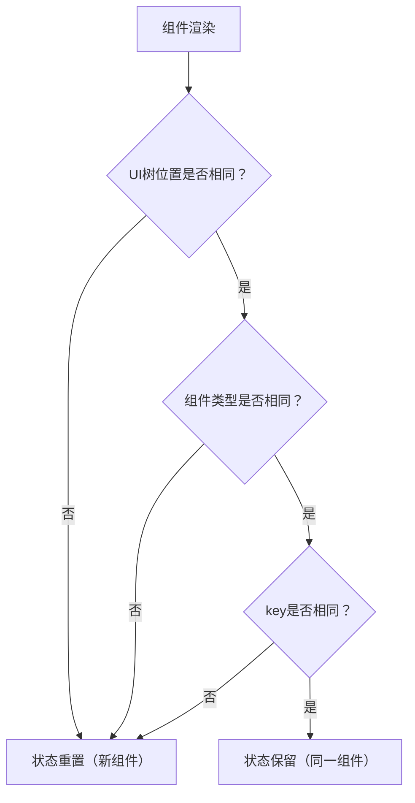

# 保留和重置状态

原地址：<https://react.nodejs.cn/learn/preserving-and-resetting-state>

在 React 中，状态的保留与重置由组件在 UI 树中的位置及组件类型决定。理解这一机制是构建可预测状态行为组件的关键。本文详细讲解了 React 状态保留与重置的核心逻辑、常见问题及解决方案。

## 一、状态保留的核心逻辑

React 并非将状态存储在组件本身，而是**根据组件在 UI 树中的位置**跟踪状态。只要组件在树中的位置和类型保持一致，其状态就会被保留；反之，状态会被销毁并重置。

### 1. 状态隔离：不同位置的组件状态独立

屏幕上的每个组件都拥有完全隔离的状态，即使是同一组件的多个实例，只要处于 UI 树的不同位置，状态也不会相互影响。

#### 案例说明

并排渲染两个 `Counter` 组件，点击各自的按钮，状态仅在当前组件内更新：

```javascript
export default function App() {
  return (
    <div>
      <Counter /> {/* 第一个位置的 Counter，状态独立 */}
      <Counter /> {/* 第二个位置的 Counter，状态独立 */}
    </div>
  );
}

function Counter() {
  const [score, setScore] = useState(0);
  return (
    <div>
      <h1>{score}</h1>
      <button onClick={() => setScore(score + 1)}>Add one</button>
    </div>
  );
}
```

**结论**：不同位置的相同组件，状态完全隔离。

### 2. 相同位置的相同组件：状态保留

只要组件在 UI 树中的位置不变且组件类型相同，即使 props 变化，状态也会保留。

#### 案例说明

通过复选框切换 `Counter` 的 `isFancy` 属性，计数器状态不会重置：

```javascript
export default function App() {
  const [isFancy, setIsFancy] = useState(false);
  return (
    <div>
      {/* 始终在 div 的第一个子位置渲染 Counter */}
      {isFancy ? <Counter isFancy={true} /> : <Counter isFancy={false} />}
      <label>
        <input type="checkbox" checked={isFancy} onChange={e => setIsFancy(e.target.checked)} />
        Use fancy styling
      </label>
    </div>
  );
}
```

**原理**：两种状态下，`Counter` 始终是根 `div` 的第一个子组件，位置和类型未变，因此状态保留。

### 3. 组件移除后状态销毁

当组件从 UI 树中移除（如条件渲染为 `false`），React 会销毁其状态；重新渲染时，状态会从头初始化。

#### 案例说明

通过复选框控制第二个 `Counter` 的渲染，移除后重新添加，状态重置为初始值：

```javascript
export default function App() {
  const [showB, setShowB] = useState(true);
  return (
    <div>
      <Counter /> {/* 始终渲染，状态保留 */}
      {showB && <Counter />} {/* 移除后重新添加，状态重置 */}
      <label>
        <input type="checkbox" checked={showB} onChange={e => setShowB(e.target.checked)} />
        Render the second counter
      </label>
    </div>
  );
}
```

**结论**：组件从树中移除后，状态会被永久销毁。

## 二、状态重置的触发条件

当组件在 UI 树中的位置、类型或标识发生变化时，React 会将其视为“新组件”，从而重置其状态。

### 1. 相同位置渲染不同类型组件：状态重置

若在同一位置通过条件渲染切换不同类型的组件（如 `Counter` 与 `p` 标签），原组件状态会被销毁，新组件状态从头初始化。

#### 案例说明

勾选复选框将 `Counter` 替换为 `p` 标签，再次切换回 `Counter` 时状态重置：

```javascript
export default function App() {
  const [isPaused, setIsPaused] = useState(false);
  return (
    <div>
      {isPaused ? (
        <p>See you later!</p> {/* 替换 Counter，原状态销毁 */}
      ) : (
        <Counter /> {/* 重新渲染时状态从头初始化 */}
      )}
      <label>
        <input type="checkbox" checked={isPaused} onChange={e => setIsPaused(e.target.checked)} />
        Take a break
      </label>
    </div>
  );
}
```

**原理**：`Counter` 与 `p` 是不同类型组件，同一位置切换时，React 会销毁原组件状态。

### 2. 父组件结构变化导致子组件位置变化：状态重置

若父组件的结构变化（如从 `section` 变为 `div`），即使子组件类型相同，其在 UI 树中的“位置路径”变化也会导致状态重置。

#### 案例说明

切换父容器类型（`section` 与 `div`），子组件 `Counter` 状态重置：

```javascript
export default function App() {
  const [isFancy, setIsFancy] = useState(false);
  return (
    <div>
      {isFancy ? (
        <div><Counter /></div> {/* 父容器为 div，子组件位置路径变化 */}
      ) : (
        <section><Counter /></section> {/* 父容器为 section，初始位置路径 */}
      )}
    </div>
  );
}
```

**结论**：父组件类型变化会改变子组件的位置路径，触发状态重置。

### 3. 嵌套组件定义：意外重置状态

若在组件内部嵌套定义子组件（如 `MyComponent` 内部定义 `MyTextField`），每次父组件重新渲染时，子组件会被视为“新函数实例”，导致状态频繁重置。

#### 案例说明

内部定义的 `MyTextField` 每次渲染都会被重新创建，输入状态随父组件渲染消失：

```javascript
export default function MyComponent() {
  const [counter, setCounter] = useState(0);

  // 错误：嵌套定义组件，每次渲染创建新函数
  function MyTextField() {
    const [text, setText] = useState('');
    return <input value={text} onChange={e => setText(e.target.value)} />;
  }

  return (
    <>
      <MyTextField /> {/* 每次渲染都是“新组件”，状态重置 */}
      <button onClick={() => setCounter(counter + 1)}>Clicked {counter} times</button>
    </>
  );
}
```

**解决方案**：始终在顶层声明组件函数，避免嵌套定义。

## 三、主动控制状态重置的方法

默认情况下，React 会保留同一位置相同组件的状态。但有时需主动重置状态（如切换用户、重置表单），可通过以下两种方式实现。

### 1. 在不同位置渲染组件

通过条件渲染在不同位置展示“逻辑独立”的组件，利用位置差异实现状态隔离与重置。

#### 案例说明

为两个玩家分别在不同位置渲染 `Counter`，切换玩家时状态自动重置：

```javascript
export default function Scoreboard() {
  const [isPlayerA, setIsPlayerA] = useState(true);
  return (
    <div>
      {isPlayerA && <Counter person="Taylor" />} {/* 位置 1：PlayerA 的计数器 */}
      {!isPlayerA && <Counter person="Sarah" />} {/* 位置 2：PlayerB 的计数器 */}
      <button onClick={() => setIsPlayerA(!isPlayerA)}>Next player!</button>
    </div>
  );
}
```

**原理**：两个 `Counter` 处于不同位置，切换时各自状态独立，无需手动重置。

### 2. 使用 `key` 属性标识组件

`key` 是 React 用于区分同一父组件下不同子组件的“标识”。同一位置的组件若 `key` 不同，会被视为“不同组件”，从而触发状态重置。`key` 仅在父组件范围内有效，无需全局唯一。

#### 核心作用

- `key` 作为组件在父级中的“身份标识”，替代默认的“位置顺序”标识。
- 不同 `key` → 组件被视为新实例 → 状态重置。
- 相同 `key` → 组件被视为同一实例 → 状态保留。

#### 案例 1：用 `key` 区分玩家计数器

为不同玩家的 `Counter` 分配不同 `key`，切换时状态自动重置：

```javascript
export default function Scoreboard() {
  const [isPlayerA, setIsPlayerA] = useState(true);
  return (
    <div>
      {isPlayerA ? (
        <Counter key="Taylor" person="Taylor" /> {/* key 为 Taylor */}
      ) : (
        <Counter key="Sarah" person="Sarah" /> {/* key 为 Sarah，与 Taylor 不同 */}
      )}
      <button onClick={() => setIsPlayerA(!isPlayerA)}>Next player!</button>
    </div>
  );
}
```

**效果**：切换玩家时，`Counter` 因 `key` 不同被视为新组件，状态重置为 0。

#### 案例 2：用 `key` 重置表单状态

在聊天应用中，为 `Chat` 组件添加基于收件人 ID 的 `key`，切换收件人时自动清空输入框：

```javascript
export default function Messenger() {
  const [to, setTo] = useState(contacts[0]);
  return (
    <div>
      <ContactList 
        contacts={contacts} 
        selectedContact={to} 
        onSelect={setTo} 
      />
      {/* 收件人变化时，key 变化 → Chat 状态重置 */}
      <Chat key={to.id} contact={to} />
    </div>
  );
}
```

**效果**：切换收件人后，输入框状态因 `Chat` 组件 `key` 变化而重置。

## 四、保留已删除组件状态的策略

若需保留已从 UI 树中移除组件的状态（如聊天草稿），可采用以下方案：

| 方法 | 适用场景 | 实现思路 |
|------|----------|----------|
| **CSS 隐藏而非删除组件** | 简单 UI，隐藏组件数量少 | 渲染所有组件，用 `display: none` 隐藏未激活组件，状态保存在树中 |
| **状态提升至父组件** | 复杂 UI，需集中管理状态 | 父组件存储所有子组件状态（如 `{ [contactId]: draftText }`），子组件从父组件获取并更新状态 |
| **使用 `localStorage` 持久化** | 需要跨页面保留状态（如草稿） | 组件卸载前将状态存入 `localStorage`，初始化时从 `localStorage` 读取 |

## 五、核心要点回顾

1. **状态与 UI 树位置绑定**：React 根据组件在 UI 树中的位置跟踪状态，位置不变则状态保留。
2. **组件类型影响状态**：同一位置切换不同类型组件，状态会重置。
3. **避免嵌套组件定义**：嵌套定义会导致每次渲染创建新组件，状态频繁重置。
4. **`key` 控制状态重置**：`key` 是父组件内组件的唯一标识，不同 `key` 触发状态重置，相同 `key` 保留状态。
5. **状态重置的合理场景**：切换用户、重置表单、刷新子树时，可通过 `key` 或位置变化主动触发状态重置。

## 六、状态保留与重置流程图


