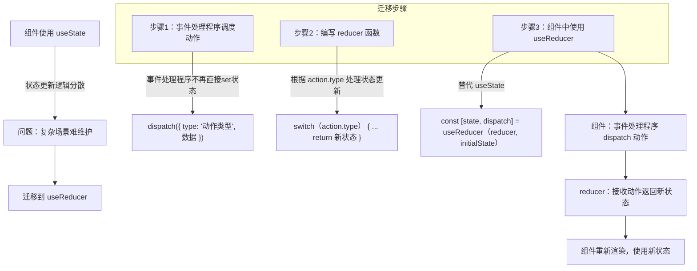

# 将状态逻辑提取到 Reducer 中

原地址：<https://react.nodejs.cn/learn/extracting-state-logic-into-a-reducer>  

## 一、为什么需要 Reducer？

当组件的状态更新逻辑分散在多个事件处理程序中时，代码会变得难以维护。例如，一个任务管理组件可能有添加、修改、删除任务等多个事件处理程序，每个处理程序都通过 `setTasks` 直接更新状态。随着功能扩展，这种分散的逻辑会增加调试和理解的难度。

**Reducer 的作用**：将所有状态更新逻辑整合到一个独立的函数中，使组件代码更清晰，状态变化更可预测。

## 二、从 `useState` 迁移到 `useReducer` 的三步流程

当状态更新逻辑复杂时，可通过以下步骤将 `useState` 迁移到 `useReducer`：

### 步骤 1：从设置状态转移到调度动作

事件处理程序不再直接调用 `setState` 更新状态，而是通过 `dispatch` 函数发送“动作”（action），描述用户的操作意图。  

- **原逻辑**：事件处理程序直接编写状态更新逻辑（如 `setTasks([...tasks, newTask])`）。  
- **迁移后**：事件处理程序仅调度动作，说明“用户做了什么”，状态更新逻辑将在 reducer 中实现。  

示例：  

```jsx
// 原事件处理程序（直接设置状态）
function handleAddTask(text) {
  setTasks([...tasks, { id: nextId++, text, done: false }]);
}

// 迁移后（调度动作）
function handleAddTask(text) {
  dispatch({
    type: 'added', // 动作类型，描述操作
    id: nextId++,  // 附加信息
    text: text     // 附加信息
  });
}
```

**动作（Action）**：一个包含 `type` 字段的 JavaScript 对象，`type` 描述用户操作的类型，其他字段携带操作所需的最小信息（如 ID、文本等）。

### 步骤 2：编写 Reducer 函数

Reducer 函数是状态更新逻辑的核心，它接收当前状态和动作对象，返回新的状态。  

- **参数**：`state`（当前状态）、`action`（动作对象）。  
- **返回值**：新的状态（必须是纯函数，不修改原状态，返回新对象/数组）。  

示例（任务管理的 reducer）：  

```jsx
function tasksReducer(tasks, action) {
  switch (action.type) {
    case 'added': // 处理“添加任务”动作
      return [
        ...tasks,
        { id: action.id, text: action.text, done: false }
      ];
    case 'changed': // 处理“修改任务”动作
      return tasks.map(t => 
        t.id === action.task.id ? action.task : t
      );
    case 'deleted': // 处理“删除任务”动作
      return tasks.filter(t => t.id !== action.id);
    default: // 处理未知动作
      throw Error('Unknown action: ' + action.type);
  }
}
```

**惯例**：使用 `switch` 语句根据 `action.type` 处理不同逻辑，每个 `case` 用大括号包裹以避免变量冲突，且必须以 `return` 结束。

### 步骤 3：在组件中使用 Reducer

通过 React 的 `useReducer` 钩子将 reducer 与组件连接，替代 `useState`。  

- **导入 `useReducer`**：`import { useReducer } from 'react'`。  
- **使用 `useReducer`**：接收 reducer 函数和初始状态，返回当前状态和调度函数（`dispatch`）。  

示例：  

```jsx
export default function TaskApp() {
  // 替代 const [tasks, setTasks] = useState(initialTasks);
  const [tasks, dispatch] = useReducer(tasksReducer, initialTasks);

  // 事件处理程序通过 dispatch 发送动作
  function handleAddTask(text) {
    dispatch({ type: 'added', id: nextId++, text: text });
  }

  function handleChangeTask(task) {
    dispatch({ type: 'changed', task: task });
  }

  function handleDeleteTask(taskId) {
    dispatch({ type: 'deleted', id: taskId });
  }

  return (/* 渲染逻辑 */);
}
```

## 三、Reducer 的命名由来

Reducer 名称源于数组的 `reduce()` 方法。`reduce()` 通过一个函数将数组“累积”为单个值，而 React Reducer 则通过累积一系列动作（随时间发生的用户操作），将初始状态逐步转换为当前状态。  

示例：通过 `reduce()` 模拟 Reducer 工作原理：  

```jsx
// 初始状态
let initialState = [];
// 动作列表
let actions = [
  { type: 'added', id: 1, text: 'Visit Kafka Museum' },
  { type: 'added', id: 2, text: 'Watch a puppet show' },
  { type: 'deleted', id: 1 }
];
// 通过 reduce() 和 reducer 计算最终状态
let finalState = actions.reduce(tasksReducer, initialState);
// finalState 结果：[{ id: 2, text: 'Watch a puppet show', done: false }]
```

## 四、`useState` 与 `useReducer` 的对比

| 维度         | `useState`                                  | `useReducer`                                  |
|--------------|---------------------------------------------|-----------------------------------------------|
| **代码大小** | 初始代码更少，无需额外函数。                | 需编写 reducer 函数和动作，初始代码更多。      |
| **可读性**   | 状态更新简单时清晰，复杂时代码臃肿。        | 分离“事件发生”与“状态更新逻辑”，复杂场景更易读。 |
| **调试**     | 难定位状态设置错误的位置和原因。            | 可在 reducer 中日志打印动作，追踪状态变化原因。 |
| **测试**     | 状态逻辑分散，难单独测试。                  | reducer 是纯函数，可独立导出测试。            |
| **个人偏好** | 适合简单状态，直观易懂。                    | 适合复杂状态，结构更严谨。                    |

**总结**：简单状态用 `useState`，复杂状态（多更新逻辑、多关联状态）用 `useReducer`，可在同一组件中混合使用。

## 五、编写优质 Reducer 的原则

1. **保持纯函数特性**：  
   - 相同输入（`state` 和 `action`）必须返回相同输出。  
   - 不执行副作用（如网络请求、定时器），不修改原状态（需返回新对象/数组）。  

2. **动作描述用户意图**：  
   每个动作应对应一次用户交互（如 `'added'`、`'deleted'`），即使导致多个状态变化，也用单个动作描述（如“重置表单”用 `'reset_form'` 而非多个字段更新动作）。  

## 六、使用 Immer 简化 Reducer 编写

Reducer 需避免直接修改状态（如 `state.push(...)`），需通过复制创建新状态（如 `[...state, newItem]`），这在复杂状态下繁琐。**Immer 库**允许以“可变风格”编写 reducer，内部自动转换为不可变更新。  

使用步骤：  

1. 安装依赖：`npm install immer use-immer`。  
2. 使用 `useImmerReducer` 替代 `useReducer`，直接修改 `draft` 对象：  

   ```jsx
   import { useImmerReducer } from 'use-immer';

   function tasksReducer(draft, action) { // draft 为可修改的临时状态
     switch (action.type) {
       case 'added':
         draft.push({ id: action.id, text: action.text, done: false }); // 直接修改
         break; // 无需 return，Immer 自动处理
       case 'deleted':
         const index = draft.findIndex(t => t.id === action.id);
         draft.splice(index, 1); // 直接删除
         break;
       // ...其他动作
     }
   }

   // 组件中使用
   const [tasks, dispatch] = useImmerReducer(tasksReducer, initialTasks);
   ```

## 六、迁移流程流程图



## 七、总结

1. **迁移步骤**：从事件处理程序调度动作 → 编写 reducer 函数 → 用 `useReducer` 替代 `useState`。  
2. **Reducer 核心**：纯函数，根据 `state` 和 `action` 返回新状态，整合分散的更新逻辑。  
3. **适用场景**：复杂状态更新、多关联状态变化、需提升代码可维护性时优先使用。  
4. **工具辅助**：通过 Immer 库简化 reducer 中的不可变更新操作。
