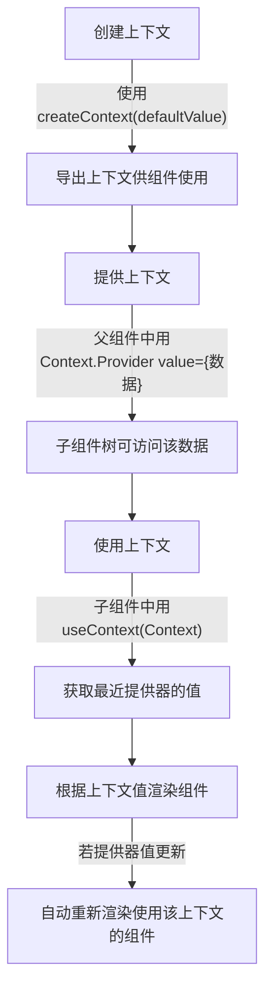

# 使用上下文深入传递数据

原地址：<https://react.nodejs.cn/learn/passing-data-deeply-with-context>

在 React 中，当需要在组件树中深层传递数据或多个组件需要共享相同信息时，传统的属性传递方式会变得冗长繁琐。上下文（Context）功能提供了一种无需显式传递属性即可在组件树中共享数据的方案，本文详细介绍了其使用方法、适用场景及注意事项。

## 一、上下文的核心作用

上下文允许父组件向其下方的整个组件树（无论层级多深）提供数据，避免了“属性钻取”（通过多层中间组件传递属性）的问题，简化了跨层级组件间的数据共享。

### 1. 属性传递的局限性

- **属性钻取问题**：当数据需要通过多个中间组件传递到深层子组件时，代码会变得冗长，且中间组件需额外处理无关属性。
- **维护成本高**：若数据传递路径发生变化，需修改所有中间组件的属性传递逻辑。

#### 示例：属性钻取的繁琐性

```javascript
// 父组件需传递level到深层Heading
<Section>
  <Heading level={3}>About</Heading>
  <Heading level={3}>Photos</Heading>
  <Heading level={3}>Videos</Heading>
</Section>

// 若Section嵌套多层，每层都需显式传递level
<Section level={1}>
  <Section level={2}>
    <Section level={3}>
      <Heading level={3}>...</Heading>
    </Section>
  </Section>
</Section>
```

### 2. 上下文的优势

- **跨层级传递**：父组件提供的数据可被任意深层的子组件直接访问，无需中间组件转发。
- **简化代码**：减少冗余的属性传递逻辑，使组件更专注于自身功能。
- **动态更新**：当上下文数据变化时，所有使用该数据的组件会自动重新渲染。

## 二、上下文的使用步骤

使用上下文需完成三个核心步骤：创建上下文、提供上下文、使用上下文。

### 1. 步骤1：创建上下文

通过 `createContext` 函数创建上下文，并指定默认值（当没有匹配的提供器时使用）。

```javascript
// LevelContext.js
import { createContext } from 'react';
// 创建上下文，默认值为1（最大标题级别）
export const LevelContext = createContext(1);
```

- **默认值的作用**：当组件使用上下文但未找到对应的提供器时，将使用默认值。
- **导出上下文**：需将上下文导出，以便其他组件导入使用。

### 2. 步骤2：提供上下文

通过上下文提供器（`Context.Provider`）在父组件中封装子组件树，并指定要共享的值。

```javascript
// Section.js
import { LevelContext } from './LevelContext.js';

export default function Section({ level, children }) {
  return (
    <section>
      {/* 提供LevelContext，值为当前section的level */}
      <LevelContext.Provider value={level}>
        {children} {/* 子组件树可访问该上下文 */}
      </LevelContext.Provider>
    </section>
  );
}
```

- **提供器的作用**：声明该组件的子树可以访问此上下文，值为 `value` 属性指定的数据。
- **嵌套提供器**：深层组件的提供器会覆盖上层提供器的值，子组件将使用最近的提供器的值。

### 3. 步骤3：使用上下文

在子组件中通过 `useContext` 钩子获取上下文的值，无需通过属性传递。

```javascript
// Heading.js
import { useContext } from 'react';
import { LevelContext } from './LevelContext.js';

export default function Heading({ children }) {
  // 从上下文中获取level值
  const level = useContext(LevelContext);
  // 根据level渲染对应级别的标题
  const Tag = `h${level}`;
  return <Tag>{children}</Tag>;
}
```

- **`useContext` 钩子**：接收上下文对象作为参数，返回最近的提供器提供的值。
- **使用限制**：`useContext` 只能在 React 组件的顶层调用（不能在循环、条件或嵌套函数中使用）。

### 4. 完整示例：标题级别上下文

通过上下文实现 `Section` 组件向深层 `Heading` 组件传递标题级别，无需显式传递 `level` 属性。

```javascript
// App.js
import Section from './Section.js';
import Heading from './Heading.js';

export default function Page() {
  return (
    <Section level={1}>
      <Heading>Title</Heading> {/* 使用level=1 */}
      <Section level={2}>
        <Heading>Heading</Heading> {/* 使用level=2 */}
        <Section level={3}>
          <Heading>Sub-heading</Heading> {/* 使用level=3 */}
        </Section>
      </Section>
    </Section>
  );
}
```

- **效果**：每个 `Heading` 自动从最近的 `Section` 提供的上下文中获取 `level`，渲染对应级别的标题。
- **优势**：若需修改标题级别，只需更新 `Section` 的 `level` 属性，无需逐个修改 `Heading`。

## 三、高级用法：组件同时使用和提供上下文

组件可以同时读取上层上下文的值，并提供新的上下文值给其子树，实现数据的“接力传递”。

### 示例：自动递增的标题级别

```javascript
// Section.js
import { useContext } from 'react';
import { LevelContext } from './LevelContext.js';

export default function Section({ children }) {
  // 读取上层提供的level值
  const parentLevel = useContext(LevelContext);
  // 为子树提供level+1的值
  const childLevel = parentLevel + 1;
  return (
    <section>
      <LevelContext.Provider value={childLevel}>
        {children}
      </LevelContext.Provider>
    </section>
  );
}
```

- **实现逻辑**：每个 `Section` 从上层上下文获取 `parentLevel`，并为子树提供 `childLevel = parentLevel + 1`。
- **使用方式**：无需手动传递 `level`，嵌套的 `Section` 会自动递增级别：

```javascript
// App.js
export default function Page() {
  return (
    <Section> {/* 提供level=2（默认值1+1） */}
      <Heading>Title</Heading> {/* 使用level=2 */}
      <Section> {/* 提供level=3（2+1） */}
        <Heading>Heading</Heading> {/* 使用level=3 */}
      </Section>
    </Section>
  );
}
```

## 四、上下文的特性与注意事项

### 1. 上下文穿透中间组件

上下文会自动穿透所有中间组件，无论层级多少，子组件都能获取最近的提供器的值。

```javascript
// 中间组件无需处理上下文，数据自动传递
function IntermediateComponent({ children }) {
  return <div>{children}</div>; // 上下文穿透此组件
}

// 使用时：
<LevelContext.Provider value={2}>
  <IntermediateComponent>
    <AnotherIntermediateComponent>
      <Heading /> {/* 可获取level=2 */}
    </AnotherIntermediateComponent>
  </IntermediateComponent>
</LevelContext.Provider>
```

### 2. 上下文与CSS继承的相似性

- **层级覆盖**：深层提供器会覆盖上层提供器的值，类似 CSS 中内层样式覆盖外层样式。
- **独立上下文**：不同上下文（如 `LevelContext`、`ThemeContext`）相互独立，不会相互干扰。

### 3. 避免过度使用上下文

上下文虽方便，但不应替代属性传递，以下情况更适合使用属性：

- 数据仅在少数层级传递。
- 中间组件需要使用该数据（而非仅转发）。
- 数据传递路径清晰，无需跨越多层无关组件。

**替代方案**：

- **提取组件并传递 `children`**：将需要数据的组件直接作为子组件传递，减少中间层级。

  ```javascript
  // 不佳：通过Layout传递posts
  <Layout posts={posts} />

  // 更好：直接传递包含posts的子组件
  <Layout>
    <Posts posts={posts} />
  </Layout>
  ```

## 五、上下文的适用场景

### 1. 主题切换

存储当前主题（如浅色/深色模式），供所有UI组件使用以调整样式。

```javascript
// ThemeContext.js
export const ThemeContext = createContext('light');

// 根组件提供主题
function App() {
  const [theme, setTheme] = useState('light');
  return (
    <ThemeContext.Provider value={theme}>
      <Button onClick={() => setTheme(theme === 'light' ? 'dark' : 'light')}>
        Toggle Theme
      </Button>
      <Content />
    </ThemeContext.Provider>
  );
}

// 子组件使用主题
function Content() {
  const theme = useContext(ThemeContext);
  return <div style={{ background: theme === 'light' ? 'white' : 'black' }} />;
}
```

### 2. 当前用户信息

存储登录用户信息，供需要用户身份的组件（如头像、权限校验）直接访问。

### 3. 路由管理

路由库内部使用上下文存储当前路由状态，使链接组件能判断自身是否为活跃状态。

### 4. 复杂状态管理

结合 `useReducer` 管理复杂状态，并通过上下文传递给深层组件，避免属性钻取。

## 六、核心要点回顾

1. **上下文的作用**：跨层级传递数据，避免属性钻取。
2. **使用步骤**：
   - 创建上下文：`createContext(defaultValue)`。
   - 提供上下文：`Context.Provider value={...}`。
   - 使用上下文：`useContext(Context)`。
3. **特性**：
   - 子组件获取最近的提供器的值。
   - 中间组件无需处理上下文。
   - 数据变化时自动更新使用该上下文的组件。
4. **适用场景**：主题、用户信息、路由、复杂状态管理等跨层级共享的数据。
5. **注意事项**：避免过度使用，优先考虑属性传递或组件提取。

## 七、上下文使用流程图


