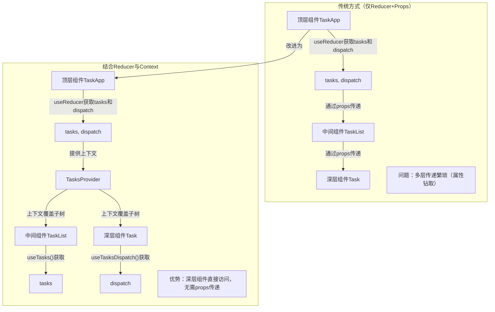

# 使用 Reducer 和上下文进行扩展

原地址：<https://react.nodejs.cn/learn/scaling-up-with-reducer-and-context>  

## 一、核心思想：Reducer 与 Context 的结合价值

Reducer 用于整合组件的状态更新逻辑，使状态变化更可预测；Context 用于解决“属性钻取”（prop drilling）问题，允许深层组件直接访问上层状态。两者结合可高效管理复杂页面的状态，既简化状态更新逻辑，又避免多层组件间重复传递属性。

## 二、结合 Reducer 与 Context 的步骤

以任务管理应用（`TaskApp`）为例，详细说明如何将两者结合：

### 步骤 1：创建上下文（Context）

由于状态数据（任务列表）和状态更新方法（`dispatch`）功能不同，需创建两个独立的上下文，分别管理状态读取和状态更新：

- **`TasksContext`**：用于提供当前任务列表（状态数据）。
- **`TasksDispatchContext`**：用于提供`dispatch`函数（状态更新方法）。

创建方式（通常在单独文件`TasksContext.js`中）：

```jsx
// TasksContext.js
import { createContext } from 'react';
export const TasksContext = createContext(null); // 默认值为null
export const TasksDispatchContext = createContext(null);
```

### 步骤 2：将状态和 Dispatch 放入上下文

在顶层组件（如`TaskApp`）中，通过`useReducer`获取状态（`tasks`）和`dispatch`函数，再通过上下文提供者（`Provider`）将它们传递给下层所有组件。

示例：

```jsx
// TaskApp.js
import { useReducer } from 'react';
import { TasksContext, TasksDispatchContext } from './TasksContext.js';
import tasksReducer from './tasksReducer.js'; // 假设reducer单独存放
import initialTasks from './initialTasks.js';

export default function TaskApp() {
  // 通过useReducer获取状态和dispatch
  const [tasks, dispatch] = useReducer(tasksReducer, initialTasks);

  return (
    // 提供上下文，覆盖整个子组件树
    <TasksContext.Provider value={tasks}>
      <TasksDispatchContext.Provider value={dispatch}>
        <h1>Day off in Kyoto</h1>
        <AddTask /> {/* 无需传递props */}
        <TaskList /> {/* 无需传递props */}
      </TasksDispatchContext.Provider>
    </TasksContext.Provider>
  );
}
```

**作用**：下层任何组件都可直接访问`tasks`和`dispatch`，无需通过`props`层层传递。

### 步骤 3：在任意组件中使用上下文

下层组件通过`useContext`钩子直接从上下文获取状态或`dispatch`，无需依赖上层传递的属性。

#### 示例 1：读取任务列表（`TaskList`组件）

```jsx
// TaskList.js
import { useContext } from 'react';
import { TasksContext } from './TasksContext.js';

export default function TaskList() {
  // 直接从上下文获取任务列表
  const tasks = useContext(TasksContext);

  return (
    <ul>
      {tasks.map(task => (
        <li key={task.id}>
          <Task task={task} />
        </li>
      ))}
    </ul>
  );
}
```

#### 示例 2：更新任务状态（`Task`组件）

```jsx
// Task.js（嵌套在TaskList中）
import { useContext, useState } from 'react';
import { TasksDispatchContext } from './TasksContext.js';

function Task({ task }) {
  const [isEditing, setIsEditing] = useState(false);
  // 直接从上下文获取dispatch函数
  const dispatch = useContext(TasksDispatchContext);

  return (
    <label>
      {/* 切换任务完成状态 */}
      <input
        type="checkbox"
        checked={task.done}
        onChange={e => {
          dispatch({
            type: 'changed',
            task: { ...task, done: e.target.checked }
          });
        }}
      />
      {/* 删除任务 */}
      <button onClick={() => {
        dispatch({ type: 'deleted', id: task.id });
      }}>
        Delete
      </button>
    </label>
  );
}
```

## 三、代码整理：统一管理上下文与 Reducer

为进一步简化组件逻辑，可将上下文、Reducer、状态管理逻辑整合到一个文件（如`TasksContext.js`），并创建专用的提供者组件和自定义钩子。

### 1. 创建`TasksProvider`组件

将`useReducer`和上下文提供逻辑封装到`TasksProvider`中，使顶层组件（如`TaskApp`）更简洁：

```jsx
// TasksContext.js
import { createContext, useReducer } from 'react';

// 定义上下文
export const TasksContext = createContext(null);
export const TasksDispatchContext = createContext(null);

// 定义reducer
function tasksReducer(tasks, action) {
  switch (action.type) {
    case 'added': return [...tasks, { id: action.id, text: action.text, done: false }];
    case 'changed': return tasks.map(t => t.id === action.task.id ? action.task : t);
    case 'deleted': return tasks.filter(t => t.id !== action.id);
    default: throw Error('Unknown action: ' + action.type);
  }
}

// 初始状态
const initialTasks = [
  { id: 0, text: 'Philosopher’s Path', done: true },
  { id: 1, text: 'Visit the temple', done: false }
];

// 提供者组件：整合reducer和上下文
export function TasksProvider({ children }) {
  const [tasks, dispatch] = useReducer(tasksReducer, initialTasks);
  return (
    <TasksContext.Provider value={tasks}>
      <TasksDispatchContext.Provider value={dispatch}>
        {children} {/* 子组件树 */}
      </TasksDispatchContext.Provider>
    </TasksContext.Provider>
  );
}
```

### 2. 创建自定义钩子

封装`useContext`调用为自定义钩子（如`useTasks`、`useTasksDispatch`），简化组件中上下文的使用，并便于后续扩展：

```jsx
// TasksContext.js（续）
import { useContext } from 'react';

// 自定义钩子：获取任务列表
export function useTasks() {
  return useContext(TasksContext);
}

// 自定义钩子：获取dispatch函数
export function useTasksDispatch() {
  return useContext(TasksDispatchContext);
}
```

**使用示例**（`TaskList`组件）：

```jsx
// TaskList.js
import { useTasks } from './TasksContext.js';

export default function TaskList() {
  const tasks = useTasks(); // 直接调用自定义钩子
  return (
    <ul>
      {tasks.map(task => (
        <li key={task.id}>
          <Task task={task} />
        </li>
      ))}
    </ul>
  );
}
```

### 3. 简化顶层组件

顶层组件（`TaskApp`）只需引入`TasksProvider`并包裹子组件，无需关心状态管理细节：

```jsx
// TaskApp.js
import { TasksProvider } from './TasksContext.js';
import AddTask from './AddTask.js';
import TaskList from './TaskList.js';

export default function TaskApp() {
  return (
    <TasksProvider> {/* 提供上下文 */}
      <h1>Day off in Kyoto</h1>
      <AddTask />
      <TaskList />
    </TasksProvider>
  );
}
```

## 四、优势总结

| 场景                | 传统方式（仅Reducer+Props）              | 结合Reducer与Context后                  |
|---------------------|------------------------------------------|-----------------------------------------|
| **状态传递**        | 需多层组件通过props传递，易产生“属性钻取” | 深层组件直接通过上下文获取，无需props   |
| **代码维护**        | 状态更新逻辑分散，传递链路复杂           | 状态逻辑集中在reducer，上下文使用简洁   |
| **扩展性**          | 新增组件需修改多层传递逻辑               | 新增组件直接使用自定义钩子，无需修改上层 |

## 五、流程图：从属性传递到上下文结合



## 六、核心结论

1. **组合价值**：Reducer 整合状态更新逻辑，Context 解决深层传递问题，两者结合是管理复杂状态的高效方案。
2. **实现步骤**：创建上下文（状态+更新方法）→ 提供上下文 → 组件通过自定义钩子使用上下文。
3. **最佳实践**：将上下文、Reducer、提供者组件、自定义钩子统一管理在单独文件，使业务组件专注于UI渲染。
4. **扩展性**：应用中可存在多个“Context-Reducer”对，分别管理不同模块的状态（如用户信息、购物车等）。
