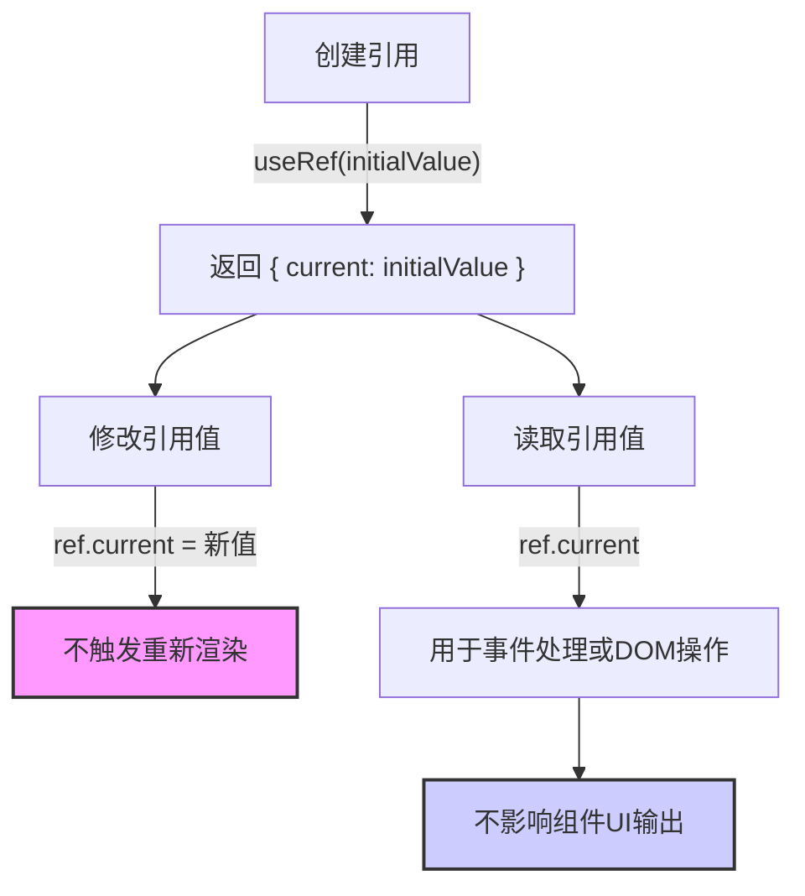

# 使用引用引用值

原地址：<https://react.nodejs.cn/learn/referencing-values-with-refs>

在 React 中，当需要组件“记住”某些信息但又不希望这些信息触发重新渲染时，引用（Refs）是一个重要的工具。本文详细介绍了引用的使用方法、与状态的区别、适用场景及最佳实践，帮助开发者正确运用引用处理非渲染相关的数据。

## 一、引用的基本概念与使用方法

引用是 React 提供的一种用于存储不影响组件渲染的数据的机制，通过 `useRef` 钩子创建，其核心特点是修改引用的值不会触发组件重新渲染。

### 1. 创建和使用引用

- **步骤1：导入 `useRef` 钩子**  
  从 React 中导入 `useRef` 以创建引用：

  ```javascript
  import { useRef } from 'react';
  ```

- **步骤2：初始化引用**  
  调用 `useRef` 并传入初始值，返回一个包含 `current` 属性的对象：

  ```javascript
  const ref = useRef(0); // 初始值为0，返回 { current: 0 }
  ```

- **步骤3：访问和修改引用的值**  
  通过 `ref.current` 读取或修改引用的值，此操作不会触发重新渲染：

  ```javascript
  // 读取值
  console.log(ref.current); // 输出：0

  // 修改值（无重新渲染）
  ref.current = ref.current + 1;
  ```

### 2. 示例：计数器（不触发渲染）

```javascript
import { useRef } from 'react';

export default function Counter() {
  const countRef = useRef(0);

  function handleClick() {
    countRef.current++; // 修改引用值，不触发重新渲染
    alert(`You clicked ${countRef.current} times!`);
  }

  return <button onClick={handleClick}>Click me!</button>;
}
```

- **特点**：点击按钮后，引用值更新，但组件不会重新渲染，仅通过 `alert` 显示最新值。

## 二、引用与状态的区别

引用和状态都能在组件重新渲染之间保留数据，但二者在行为和用途上有本质区别：

| **引用（Refs）** | **状态（State）** |
|------------------|------------------|
| 通过 `useRef(initialValue)` 创建，返回 `{ current: initialValue }` | 通过 `useState(initialValue)` 创建，返回 `[value, setValue]` |
| 修改 `current` 属性不会触发重新渲染 | 调用状态设置函数（如 `setValue`）会触发重新渲染 |
| 可变（可直接修改 `current` 的值） | 不可变（必须通过状态设置函数更新） |
| 不应在渲染期间读取或写入 `current` | 可在渲染期间安全读取，每个渲染快照独立 |
| 用于存储不影响渲染的数据 | 用于存储影响组件输出（UI）的数据 |

### 示例：状态与引用的对比

- **状态实现的计数器（会渲染更新）**：

  ```javascript
  import { useState } from 'react';

  export default function Counter() {
    const [count, setCount] = useState(0);
    return (
      <button onClick={() => setCount(count + 1)}>
        You clicked {count} times
      </button>
    );
  }
  ```

  - 点击按钮后，`setCount` 触发重新渲染，UI 显示最新计数。

- **引用实现的计数器（不会渲染更新）**：

  ```javascript
  import { useRef } from 'react';

  export default function Counter() {
    const countRef = useRef(0);
    return (
      <button onClick={() => countRef.current++}>
        You clicked {countRef.current} times
      </button>
    );
  }
  ```

  - 点击按钮后，`countRef.current` 更新，但组件不重新渲染，UI 始终显示初始值 `0`。

## 三、引用的典型使用场景

引用主要用于存储不影响组件渲染的数据，常见场景包括：

### 1. 存储计时器/间隔 ID

在需要启动和取消定时器（如 `setTimeout`、`setInterval`）时，引用可保存其 ID 以便后续操作。

#### 示例：秒表（结合状态和引用）

```javascript
import { useState, useRef } from 'react';

export default function Stopwatch() {
  const [startTime, setStartTime] = useState(null);
  const [now, setNow] = useState(null);
  const intervalRef = useRef(null); // 存储间隔 ID

  function handleStart() {
    setStartTime(Date.now());
    setNow(Date.now());
    // 清除之前的间隔，避免多重计时
    clearInterval(intervalRef.current);
    // 保存新的间隔 ID 到引用
    intervalRef.current = setInterval(() => {
      setNow(Date.now()); // 更新状态以触发渲染
    }, 10);
  }

  function handleStop() {
    clearInterval(intervalRef.current); // 使用引用中的 ID 停止计时
  }

  const secondsPassed = startTime && now 
    ? (now - startTime) / 1000 
    : 0;

  return (
    <>
      <h1>Time passed: {secondsPassed.toFixed(3)}</h1>
      <button onClick={handleStart}>Start</button>
      <button onClick={handleStop}>Stop</button>
    </>
  );
}
```

- **解析**：`intervalRef` 存储 `setInterval` 返回的 ID，用于在 `handleStop` 中取消计时，而 `startTime` 和 `now` 作为状态驱动 UI 更新。

### 2. 访问和操作 DOM 元素

引用可直接关联 DOM 元素，便于执行聚焦、滚动等 DOM 操作（详见“引用和 DOM”部分）。

### 3. 存储非渲染相关的对象

如第三方库实例、缓存数据等无需参与 UI 计算的值。

## 四、引用的最佳实践

为确保组件行为可预测，使用引用时需遵循以下原则：

### 1. 视为“应急方案”

引用应作为 React 数据流的补充，而非主要数据管理方式。若大量逻辑依赖引用，可能需要重新设计组件结构。

### 2. 避免在渲染期间读写 `ref.current`

- 渲染期间读取 `ref.current` 可能导致组件输出与实际数据不一致（因 React 无法跟踪引用变化）。
- 例外：首次渲染时初始化引用（如 `if (!ref.current) ref.current = new Object()`）。

### 3. 无需担心引用的可变性

与状态不同，修改引用的 `current` 属性或其内部值无需遵循不可变原则，因为引用不影响渲染。

## 五、引用和 DOM

引用最常见的用途之一是直接访问 DOM 元素。通过将引用传递给 JSX 的 `ref` 属性，React 会自动将对应的 DOM 元素赋值给 `ref.current`。

### 示例：聚焦输入框

```javascript
import { useRef } from 'react';

export default function InputFocus() {
  const inputRef = useRef(null);

  function handleFocus() {
    inputRef.current.focus(); // 调用 DOM 方法聚焦输入框
  }

  return (
    <>
      <input ref={inputRef} />
      <button onClick={handleFocus}>Focus Input</button>
    </>
  );
}
```

- **解析**：`inputRef` 关联 `<input>` 元素，`handleFocus` 通过 `inputRef.current` 调用 DOM 的 `focus()` 方法。

## 六、核心要点回顾

1. **引用的作用**：存储不影响渲染的数据，在组件重新渲染之间保留值。
2. **创建与使用**：通过 `useRef(initialValue)` 创建，通过 `ref.current` 读写值。
3. **与状态的区别**：引用修改不触发渲染，状态修改触发渲染；引用可变，状态不可变。
4. **适用场景**：存储计时器 ID、DOM 元素、非渲染相关对象等。
5. **最佳实践**：避免在渲染期间读写引用，仅作为应急方案使用。

## 七、引用使用流程图


